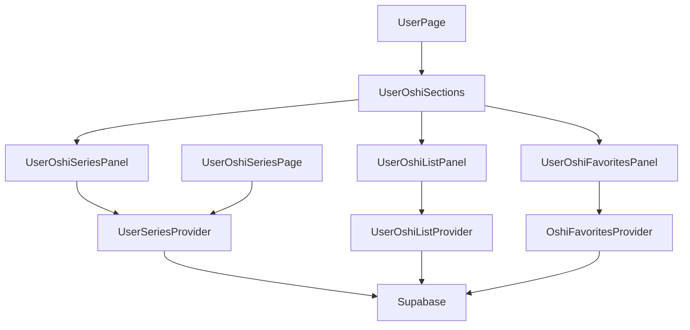
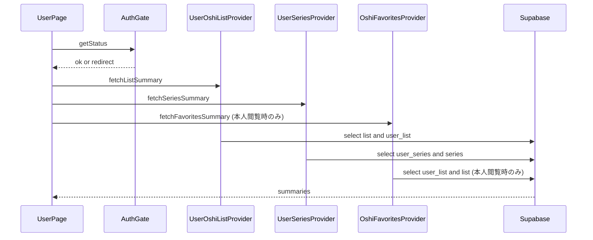

## Overview
本機能は、ユーザーマイページ内の推し関連セクション（推しリスト・推し作品・お気に入り推しリスト）を整理表示し、閲覧者が目的の一覧へ迷わず遷移できる状態を実現する。マイページの情報密度が高まる中で、各セクションの独立性と順序の一貫性を担保することが主な価値である。
対象ユーザーは閲覧者およびログインユーザーであり、閲覧者は公開範囲の概要から専用ページへ移動し、ログインユーザーは推し作品の管理操作やお気に入り推しリストの閲覧（本人限定）を行う。本設計は既存のReact + Provider分離パターンに沿って拡張し、公開/非公開の表示制御をアプリ側とSupabaseの両面で整合させる。

### Goals
- マイページに3セクションを一貫した順序で表示し、各セクションを独立領域として識別可能にする
- セクション概要（推しリスト/推し作品/お気に入り推しリスト）を表示し、専用ページへ遷移できる導線を提供する
- 公開/非公開設定に応じて他ユーザー閲覧時の表示可否と非公開表示を制御する

### Non-Goals
- 新規のバックエンドAPIやデータスキーマの追加
- 推しリスト/推し作品のUIデザイン刷新
- 推し作品サムネイル生成の自動化（既存データを利用）

## Requirements Traceability

| Requirement | Summary | Components | Interfaces | Flows |
|-------------|---------|------------|------------|-------|
| 1.1 | 3セクション表示 | UserPage, UserOshiSections, UserOshiListPanel, UserOshiSeriesPanel, UserOshiFavoritesPanel | UI State | UserPage Load |
| 1.2 | 見出し表示 | UserOshiListPanel, UserOshiSeriesPanel, UserOshiFavoritesPanel | UI State | - |
| 1.3 | 一貫した順序 | UserOshiSections | UI State | - |
| 1.4 | 独立領域 | UserOshiSections, 各パネル | UI State | - |
| 2.1 | 推しリスト概要 | UserOshiListPanel, UserOshiListProvider | Service, UI State | UserPage Load |
| 2.2 | 推し作品概要 | UserOshiSeriesPanel, UserSeriesProvider | Service, UI State | UserPage Load |
| 2.3 | お気に入り推しリスト概要 | UserOshiFavoritesPanel, OshiFavoritesProvider | Service, UI State | UserPage Load |
| 2.4 | 推し作品新着最大3件 | UserSeriesProvider | Service | UserPage Load |
| 2.5 | 項目名表示 | UserOshiSeriesPanel, UserOshiFavoritesPanel | UI State | - |
| 2.6 | 件数表示は任意 | UI各所 | UI State | - |
| 3.1 | 推しリスト空状態 | UserOshiListPanel | UI State | - |
| 3.2 | 推し作品空状態 | UserOshiSeriesPanel | UI State | - |
| 3.3 | お気に入り空状態 | UserOshiFavoritesPanel | UI State | - |
| 3.4 | 空状態文言 | 各パネル | UI State | - |
| 4.1 | 公開/非公開に従う | UserOshiSections, Providers | Service, UI State | UserPage Load |
| 4.2 | 非公開は見出しのみ表示 | UserOshiSections | UI State | UserPage Load |
| 4.3 | 公開は表示 | UserOshiSections | UI State | UserPage Load |
| 4.4 | 本人閲覧は変更なし | UserOshiSections, AuthGate | Service, UI State | UserPage Load |
| 4.5 | 他セクションへ影響なし | UserOshiSections | UI State | - |
| 4.6 | お気に入り推しリストは他ユーザー閲覧時は非表示 | UserOshiSections, UserOshiFavoritesPanel | UI State | UserPage Load |
| 5.1 | 推し作品導線表示 | UserOshiSeriesPanel | UI State | - |
| 5.2 | /users/{userId}/oshi-series/導線 | UserOshiSeriesPanel | UI State | - |
| 6.1 | お気に入り専用ページ導線 | UserOshiFavoritesPanel | UI State | - |
| 6.2 | お気に入り一覧グリッド | OshiFavoritesPage | UI State | - |
| 6.3 | 他ユーザーには導線非表示 | UserOshiFavoritesPanel | UI State | - |
| 7.1 | 推しリスト項目導線 | UserOshiListPanel | UI State | - |
| 8.1 | user_series+seriesで一覧表示 | UserOshiSeriesPage, UserSeriesProvider | Service, UI State | Series Page Load |
| 8.2 | series主要情報表示 | UserOshiSeriesPage, UserOshiSeriesPanel | UI State | Series Page Load |
| 8.3 | movie代表サムネイル表示 | UserOshiSeriesPage, UserSeriesProvider | Service, UI State | Series Page Load |
| 8.4 | 作品名表示 | UserOshiSeriesPanel | UI State | - |
| 8.5 | 作品ページ導線 | UserOshiSeriesPanel | UI State | - |
| 8.6 | リスト/グリッド切替 | UserOshiSeriesPage | UI State | Series Page Load |
| 9.1 | 登録操作でuser_series追加 | UserOshiSeriesPage, UserSeriesProvider | Service, UI State | Series Manage |
| 9.2 | 解除操作でuser_series解除 | UserOshiSeriesPage, UserSeriesProvider | Service, UI State | Series Manage |
| 9.3 | お気に入り数順の並べ替え | UserOshiSeriesPage, UserSeriesProvider | Service, UI State | Series Manage |
| 9.4 | 昇順/降順切替 | UserOshiSeriesPage | UI State | Series Manage |

## Architecture

### Existing Architecture Analysis (if applicable)
- UIはReactコンポーネントとCSSを並置し、データ取得はProviderで抽象化されている。
- `UserPage`はプロフィール/外部リンク/推しリスト/推し作品の取得を統括し、`authGate`で認証状態を確認する。
- 推し作品の専用ページは`UserOshiSeriesPage`で実装され、`UserOshiSeriesPanel`を再利用している。
- お気に入り推しリストは`OshiFavoritesPage`で実装されているが、マイページにサマリー表示する構成は未整備。

### Architecture Pattern & Boundary Map



**Architecture Integration**:
- Selected pattern: UIコンポーネント + Provider分離（既存パターン継続）
- Domain/feature boundaries: UIは表示/状態管理、ProviderはSupabaseアクセスとデータ正規化
- Existing patterns preserved: `createXProvider`による依存注入、`authGate`による認証判定
- New components rationale: `UserOshiSections`で順序/表示制御を集約、`UserOshiFavoritesPanel`でサマリー追加
- Steering compliance: React + Supabase構成、UIとデータ層の責務分離を維持

### Technology Stack & Alignment

| Layer | Choice / Version | Role in Feature | Notes |
|-------|------------------|-----------------|-------|
| Frontend | React 18.3.1 | マイページとセクションUI | 既存構成を継続 |
| Routing | react-router-dom 6.30.1 | `/users/:userId/`と専用ページ導線 | 既存構成を継続 |
| Data / Storage | Supabase (PostgreSQL) | list/user_list/user_series/series/movie | 既存スキーマを利用 |
| Client SDK | @supabase/supabase-js 2.90.1 | Providerからのデータ取得 | 新規依存なし |

## System Flows



**Key Decisions**:
- 認証状態に応じて表示制御を行い、非公開セクションは他ユーザー閲覧時に見出しのみ表示する。
- 推し作品サマリーは最大3件をProviderで制御し、UIは並び順を保持する。
- お気に入り推しリストは本人限定であり、他ユーザー閲覧時は取得処理自体を呼ばず、セクションもレンダリングしない。
- 非公開表示（見出し＋「非公開」文言）の対象は推しリスト/推し作品のみとする。
- 推し作品ページは他ユーザー閲覧時に非公開なら非公開表示とする。
- 公開/非公開はセクション単位とし、推しリストは`list.can_display`、推し作品は`user_series.can_display`を**唯一のソース（DBの真値）**として扱う。
- 推し作品の公開/非公開はマイページの操作ボタンから一括更新し、対象ユーザーの`user_series`全件を同一値に同期する。

## Components & Interface Contracts

| Component | Domain/Layer | Intent | Req Coverage | Key Dependencies (P0/P1) | Contracts |
|-----------|--------------|--------|--------------|--------------------------|-----------|
| UserOshiSections | UI | 推し3セクションの順序と表示制御 | 1.1, 1.3, 4.1-4.5 | AuthGate (P0) | State |
| UserOshiListPanel | UI | 推しリスト概要と導線表示 | 2.1, 3.1, 7.1 | UserOshiListProvider (P0) | State |
| UserOshiSeriesPanel | UI | 推し作品サマリー表示 | 2.2, 2.4, 3.2, 5.1, 5.2 | UserSeriesProvider (P0) | State |
| UserOshiFavoritesPanel | UI | お気に入り推しリスト概要と導線 | 2.3, 3.3, 6.1 | OshiFavoritesProvider (P0) | State |
| UserOshiSeriesPage | UI | 推し作品一覧と管理操作 | 8.1-8.6, 9.1-9.4 | UserSeriesProvider (P0), AuthGate (P0) | State |
| OshiFavoritesProvider | Data | お気に入り推しリスト取得 | 2.3, 6.2 | Supabase (P0) | Service |
| UserSeriesProvider | Data | 推し作品サマリー/一覧/管理 | 2.2, 2.4, 8.1-9.4 | Supabase (P0) | Service |
| UserOshiListProvider | Data | 推しリストサマリー | 2.1, 3.1, 4.1-4.4 | Supabase (P0) | Service |

### Shared Contracts

```typescript
type Result<T, E> = { ok: true; data: T } | { ok: false; error: E };

type ViewerContext = {
  viewerUserId: string | null;
  targetUserId: string;
};

type UserOshiListSummary = {
  listId: string | null;
  status: 'public' | 'private' | 'none' | 'not_found';
  favoriteCount: number | null;
  isFavorited: boolean;
};

type FavoriteListItem = {
  listId: string;
  userId: string;
  name: string;
  favoriteCount: number;
  isFavorited: boolean;
};
```

### UI Layer

#### UserOshiSections

| Field | Detail |
|-------|--------|
| Intent | マイページ内の推し3セクションを順序固定でレンダリングし、公開/非公開判定を適用する |
| Requirements | 1.1, 1.3, 4.1-4.5 |

**Responsibilities & Constraints**
- 推しリスト→推し作品→お気に入り推しリストの順序固定
- 他ユーザー閲覧時に非公開セクションは見出しのみ表示し、内容は非公開と表示（対象は推しリスト/推し作品のみ）
- 本人閲覧時は公開/非公開の設定による表示変更を行わない
- お気に入り推しリストは本人限定で表示し、他ユーザー閲覧時は取得処理を呼ばずセクションも表示しない
- 公開/非公開の判定はセクション単位で行い、推しリストは`list.can_display`、推し作品は`user_series.can_display`を参照する

**Dependencies**
- Inbound: UserPage — セクションデータ提供 (P0)
- Outbound: UserOshiListPanel — サマリー表示 (P0)
- Outbound: UserOshiSeriesPanel — サマリー表示 (P0)
- Outbound: UserOshiFavoritesPanel — サマリー表示 (P0)

**Contracts**: State [x]

##### State Management
- State model: `viewerContext`, `sectionVisibility`, `sectionSummaries`
- Persistence & consistency: UIローカルのみ
- Concurrency strategy: `UserPage`のロード完了後に一括反映

**Implementation Notes**
- Integration: `viewerContext`で本人/他者を判定し、`visibility`が`private`の場合は見出しを表示して「非公開」文言を表示する
- Validation: `viewerContext.userId`と`targetUserId`の一致チェック
- Visibility Source: 推しリストは`list.can_display`、推し作品は`user_series.can_display`をセクション可視性として採用し、これらを真値とする（ブラウザ永続は補助扱い）。
- Visibility Sync: 推し作品の公開/非公開はマイページの操作ボタンから一括同期し、`user_series`全件を同一値に更新する。混在検知時は`private`扱いとし、同期操作を案内する。
- Risks: 非公開文言の表現が強すぎると、本人の意図を他者に示す可能性があるため文面調整が必要

#### UserOshiListPanel

| Field | Detail |
|-------|--------|
| Intent | 推しリストの概要と導線を表示する |
| Requirements | 2.1, 3.1, 7.1 |

**Responsibilities & Constraints**
- 空状態・エラーの文言を表示
- 本人閲覧時は常に推しリスト導線を表示し、他ユーザー閲覧時は公開時のみ内容と導線を表示（非公開時は見出しのみ表示）

**Dependencies**
- Inbound: UserOshiSections — サマリー/状態 (P0)
- Outbound: UserOshiListProvider — サマリー取得 (P0)

**Contracts**: State [x]

##### State Management
- State model: `summary`, `isLoading`, `error`
- Persistence & consistency: UIローカルのみ
- Concurrency strategy: 読み込み中表示とエラー表示を排他制御

**Implementation Notes**
- Integration: 既存UIの見出しは「推しリスト」を維持
- Validation: サマリーの`status`に応じた分岐
- Risks: 非公開時の文言と導線非表示が他ユーザー閲覧に正しく伝播しているか要確認

#### UserOshiSeriesPanel

| Field | Detail |
|-------|--------|
| Intent | 推し作品のサマリー表示と専用ページ導線を提供する |
| Requirements | 2.2, 2.4, 3.2, 5.1, 5.2 |

**Responsibilities & Constraints**
- 最大3件の推し作品を新着順で表示
- 作品名と導線を表示

**Dependencies**
- Inbound: UserOshiSections — サマリー/状態 (P0)
- Outbound: UserSeriesProvider — サマリー取得 (P0)

**Contracts**: State [x]

##### State Management
- State model: `items`, `isLoading`, `error`, `userId`
- Persistence & consistency: UIローカルのみ
- Concurrency strategy: サマリー取得結果をそのまま描画

**Implementation Notes**
- Integration: `userId`は`/users/:userId/oshi-series/`への導線生成に利用
- Validation: `items`が空の場合は空状態文言
- Risks: 代表サムネイルを表示する場合はリスト表示密度に注意

#### UserOshiFavoritesPanel

| Field | Detail |
|-------|--------|
| Intent | お気に入り推しリストの概要と専用ページ導線を表示する |
| Requirements | 2.3, 3.3, 6.1, 6.3 |

**Responsibilities & Constraints**
- 最大3件程度のサマリーを表示（件数は任意）
- 専用ページ`/oshi-lists/favorites/`への導線を表示
- 他ユーザー閲覧時は表示しない（本人限定、見出しも非表示、公開設定なし）

**Dependencies**
- Inbound: UserOshiSections — サマリー/状態 (P0)
- Outbound: OshiFavoritesProvider — サマリー取得 (P0)

**Contracts**: State [x]

##### State Management
- State model: `items`, `isLoading`, `error`
- Persistence & consistency: UIローカルのみ
- Concurrency strategy: 読み込み中/空状態の排他制御

**Implementation Notes**
- Integration: 専用ページは既存ルートを使用
- Validation: ログイン状態が無効な場合は導線を非表示し、取得処理も呼ばない
- Risks: お気に入りが0件の際のメッセージ文言調整

#### UserOshiSeriesPage

| Field | Detail |
|-------|--------|
| Intent | 推し作品の一覧表示と登録/解除/並べ替えを提供する |
| Requirements | 8.1-9.4 |

**Responsibilities & Constraints**
- `user_series`と`series`情報を統合し一覧表示
- 代表サムネイルを`movie`から取得して表示
- 並べ替えはお気に入り数の昇順/降順を切り替える
- 他ユーザー閲覧時に非公開の場合は非公開表示を行う
- 非公開判定はセクション単位（`user_series.can_display`）で行い、非公開時は一覧取得を行わず非公開表示に切り替える

**Dependencies**
- Inbound: AppRouter — ルート遷移 (P0)
- Outbound: UserSeriesProvider — データ取得/操作 (P0)
- External: Supabase — データアクセス (P0)

**Contracts**: State [x] Service [x]

##### Service Interface
```typescript
interface UserSeriesProvider {
  fetchSeriesSummary(input: {
    targetUserId: string;
    viewerUserId: string | null;
    limit: number;
  }): Promise<Result<UserSeriesSummary, UserSeriesError>>;

  fetchSeriesList(input: {
    targetUserId: string;
    viewerUserId: string | null;
    sort: { key: 'favorite_count'; order: 'asc' | 'desc' } | null;
  }): Promise<Result<UserSeriesItem[], UserSeriesError>>;

  registerSeries(input: { seriesId: string }): Promise<Result<void, UserSeriesError>>;
  unregisterSeries(input: { seriesId: string }): Promise<Result<void, UserSeriesError>>;
}
```
- Preconditions: `targetUserId`と`seriesId`は空でない
- Postconditions: 操作成功時は`user_series`が更新される
- Invariants: `viewerUserId === targetUserId`の場合のみ登録/解除を許可

##### State Management
- State model: `items`, `sortOrder`, `viewMode`, `isLoading`, `error`
- Persistence & consistency: UIローカルのみ
- Concurrency strategy: 操作中は対象ボタンを無効化

**Implementation Notes**
- Integration: サムネイルは`movie.update`が最新のレコードの`thumbnail_url`を代表として採用し、欠損時はプレースホルダ表示
- Integration: 可視性は`user_series.can_display`を唯一のソースとして参照し、マイページの公開/非公開操作で対象ユーザーの全レコードを一括同期する
- Validation: 認証済みユーザーのみ管理操作を許可
- Risks: `movie`取得が多段クエリとなるためバッチ化が必須

### Data Access Layer

#### UserOshiListProvider

| Field | Detail |
|-------|--------|
| Intent | 推しリスト概要と公開状態を提供する |
| Requirements | 2.1, 3.1, 4.1-4.4 |

**Responsibilities & Constraints**
- `list.can_display`とユーザー存在確認を反映
- 公開時のみ`listId`を返す

**Dependencies**
- External: Supabase — `list`, `user_list`, `users` (P0)

**Contracts**: Service [x]

##### Service Interface
```typescript
interface UserOshiListProvider {
  fetchListSummary(input: {
    targetUserId: string;
    viewerUserId: string | null;
  }): Promise<Result<UserOshiListSummary, UserOshiListError>>;
}
```
- Preconditions: `targetUserId`は空でない
- Postconditions: `status`が`public`の場合のみ`listId`を返す
- Invariants: `viewerUserId !== targetUserId`の場合は`can_display`を厳守

**Implementation Notes**
- Integration: 本人閲覧時は`can_display`に関わらず概要を返す
- Validation: `targetUserId`未指定時は`invalid_input`
- Risks: ユーザー未存在時の`not_found`扱いをUI側で統一

#### UserSeriesProvider

| Field | Detail |
|-------|--------|
| Intent | 推し作品のサマリー/一覧取得と管理操作を提供する |
| Requirements | 2.2, 2.4, 8.1-9.4 |

**Responsibilities & Constraints**
- `user_series`と`series`のリレーション取得
- サマリーは新着順最大3件
- 一覧はお気に入り数でソート可能
- 代表サムネイルは`movie`から解決
- `user_series.can_display`をセクション可視性として返却し、更新時の一括同期で混在を防止する（混在検知時は`private`扱い）

**Dependencies**
- External: Supabase — `user_series`, `series`, `movie` (P0)

**Contracts**: Service [x]

##### Service Interface
```typescript
type UserSeriesError =
  | 'invalid_input'
  | 'not_configured'
  | 'auth_required'
  | 'network'
  | 'unknown';

interface UserSeriesItem {
  seriesId: string;
  title: string;
  favoriteCount: number | null;
  updatedAt: string | null;
  thumbnailUrl: string | null;
}

interface UserSeriesSummary {
  items: UserSeriesItem[];
  visibility: 'public' | 'private' | 'owner';
}
```
- Preconditions: `targetUserId`は空でない
- Postconditions: `viewerUserId !== targetUserId`の場合は`can_display=true`のみ
- Invariants: `items`は`seriesId`が重複しない

**Implementation Notes**
- Integration: サムネイル取得は`series_id`単位でバッチ化し、代表は`movie.update`の最新レコードを採用
- Validation: `limit`は1以上で固定
- Risks: 一覧件数が増えた際のパフォーマンス劣化

#### OshiFavoritesProvider

| Field | Detail |
|-------|--------|
| Intent | お気に入り推しリストのサマリー/一覧を提供する |
| Requirements | 2.3, 6.2 |

**Responsibilities & Constraints**
- ログインユーザーの`user_list`に紐づく推しリストを取得
- サマリーは最大3件程度に制限

**Dependencies**
- External: Supabase — `user_list`, `list`, `users` (P0)

**Contracts**: Service [x]

##### Service Interface
```typescript
interface OshiFavoritesProvider {
  fetchFavoritesSummary(input: { viewerUserId: string; limit: number }): Promise<Result<FavoriteListItem[], FavoriteListError>>;
  fetchFavorites(): Promise<Result<FavoriteListItem[], FavoriteListError>>;
}
```
- Preconditions: `viewerUserId`は空でない、`limit`は1以上
- Postconditions: `fetchFavoritesSummary`は件数を超過しない
- Invariants: ログインユーザー以外のデータは返さない

**Implementation Notes**
- Integration: 既存の`fetchFavorites`に件数制御を追加
- Validation: 未認証時は`auth_required`
- Risks: 大量件数時に二段クエリが増える

## Data Models

### Domain Model
- Aggregate: `UserOshiProfile`（user + oshi list/series/favoritesの表示単位）
- Entities: `List`, `Series`, `Movie`
- Value Objects: `Visibility`（public/private/owner）
- Invariants: 他ユーザー閲覧時は`can_display=true`のみ表示

### Logical Data Model

**Structure Definition**:
- `users(user_id, name, icon_url, ...)`
- `list(list_id, user_id, favorite_count, can_display)`
- `user_list(user_id, list_id, created_at)`
- `user_series(user_id, series_id, can_display, created_at)`
- `series(series_id, title, favorite_count, update)`
- `movie(movie_id, movie_title, thumbnail_url, series_id, update)`

**Consistency & Integrity**:
- `user_series.series_id`は`series.series_id`に対応
- `movie.series_id`が推し作品の代表サムネイル取得に利用される
- `can_display`は他ユーザー閲覧時の公開判定に使用
- 推し作品の可視性は`user_series.can_display`をセクション単位として扱い、更新時の一括同期でユーザー内の値を統一する（混在検知時は`private`扱い）

### Data Contracts & Integration

**API Data Transfer**
- Supabaseクライアントを介して必要カラムのみ取得（`series_id`, `title`, `favorite_count`, `update`, `thumbnail_url`）

**Cross-Service Data Management**
- UI側の表示制御とRLSポリシーで公開/非公開を二重化

## Error Handling

### Error Strategy
- Providerは`Result`形式で`ok/error`を返す
- UIは`auth_required`時に`authGate`でログイン導線へ誘導
- `network`/`unknown`はセクション内でエラーメッセージを表示

### Error Categories and Responses
- User Errors (4xx): 未認証 → ログイン導線
- System Errors (5xx): 取得失敗 → セクション内の失敗表示
- Business Logic Errors (422): 無効ID → 空状態として扱う

### Monitoring
- 既存のUIエラー表示と再試行導線に統合

## Testing Strategy

### Unit Tests
- `UserOshiSections`の表示条件（本人/他者、公開/非公開、非公開表示）
- `UserSeriesProvider`のサマリー件数制限とソート順
- `OshiFavoritesProvider.fetchFavoritesSummary`の件数制御

### Integration Tests
- `UserPage`で3セクションが順序通りに表示される
- 非公開セクションが他ユーザー閲覧時に見出しのみ表示される
- 推し作品セクションから`/users/:userId/oshi-series/`に遷移できる

### E2E/UI Tests
- マイページで推しセクションが表示され、空状態文言が正しく表示される
- 推し作品ページで一覧/並べ替え/登録解除が動作する
- お気に入り推しリスト専用ページでグリッド表示が維持される

## Optional Sections

### Security Considerations
- RLSポリシーで`can_display`と本人判定を担保する（可視性の真値はDBに置く）
- `viewerUserId`が`null`の場合は公開データのみ表示
- 他ユーザー閲覧時の非公開セクションは見出しのみ表示し、内容は非公開文言とする（対象は推しリスト/推し作品のみ）
- 推し作品ページは他ユーザー閲覧時に非公開なら非公開表示とする
- お気に入り推しリスト専用ページは`AuthGate`で本人のみ許可し、URL直アクセスでもブロックする

### Performance & Scalability
- サマリーは最大3件に制限しクエリ負荷を抑える
- 代表サムネイル取得は`series_id`単位でバッチ化
- `user_series(user_id, created_at)`のインデックス追加を検討

### Migration Strategy
- 本機能で必須のスキーマ変更はない
- 追加インデックスが必要な場合は段階的に適用し、ロールバック可能なSQLを用意する
