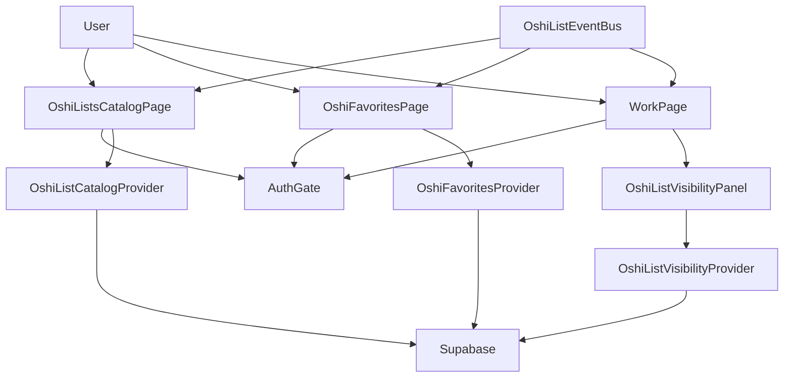
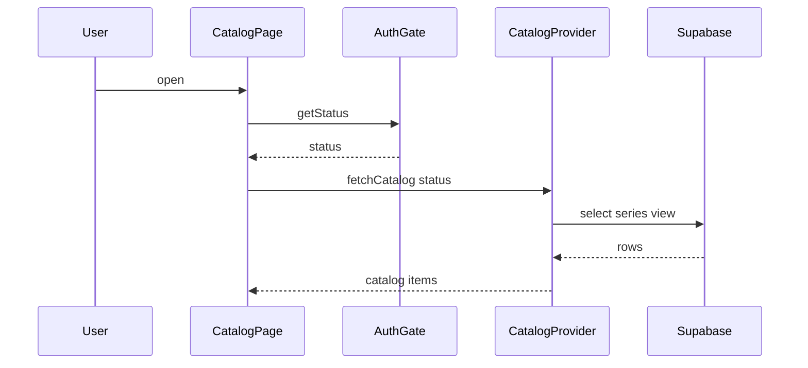

# Design Document

## Overview
本機能は、みんなの推しリスト一覧を公開しつつ、ログインユーザーの「お気に入り推しリスト」は登録済みのみを表示する体験を提供する。推しリストの公開/非公開制御を導入し、未ログインユーザーの閲覧安全性とログインユーザーの操作性を両立する。

対象ユーザーは一覧閲覧ユーザーとログインユーザーであり、前者は公開リストのみ閲覧可能、後者はお気に入り登録/解除や非公開設定を管理できる。既存のReact + Supabase構成を維持し、UIの境界とデータ取得契約を明確化する。

### Goals
- みんなの推しリスト一覧をログイン状態に関わらず閲覧可能にする
- お気に入り推しリストはログインユーザーの登録済みのみを表示する
- 公開/非公開設定と登録数表示の整合性を保つ

### Non-Goals
- 新規の認証基盤導入やIDプロバイダ追加
- 推しリストの作成フローや編集フローの新規実装
- モバイル専用デザインの刷新

## Requirements Traceability

| Requirement | Summary | Components | Interfaces | Flows |
|-------------|---------|------------|------------|-------|
| 1.1 | 未ログイン時にログイン必要表示 | OshiFavoritesPage | UI State | Favorites Auth Flow |
| 1.2 | 未ログイン時の操作無効化 | OshiFavoritesPage | UI State | Favorites Auth Flow |
| 1.3 | お気に入り操作のユーザー紐づけ | AuthGate, OshiFavoritesProvider | Service, State | Favorites Toggle Flow |
| 1.4 | 認証無効時の操作中断 | AuthGate, OshiFavoritesPage | Service | Favorites Toggle Flow |
| 1.5 | 他ユーザー登録結果の非表示 | OshiFavoritesProvider | State | Favorites Auth Flow |
| 2.1 | お気に入り登録 | OshiFavoritesProvider | Service | Favorites Toggle Flow |
| 2.2 | お気に入り解除 | OshiFavoritesProvider | Service | Favorites Toggle Flow |
| 2.3 | 登録済み表示 | OshiFavoritesPage | UI State | Favorites Toggle Flow |
| 2.4 | 不正/不可時のエラー表示 | OshiFavoritesPage, OshiFavoritesProvider | State | Favorites Toggle Flow |
| 2.5 | 重複登録防止 | OshiFavoritesProvider | Service | Favorites Toggle Flow |
| 2.6 | 一覧からの登録 | OshiListsCatalogPage, OshiListCatalogProvider | Service, State | Catalog Toggle Flow |
| 3.1 | 登録済みのみ表示 | OshiFavoritesPage, OshiFavoritesProvider | State | Favorites Auth Flow |
| 3.2 | 空状態表示 | OshiFavoritesPage | UI State | Favorites Auth Flow |
| 3.3 | 変更時の一覧更新 | OshiListEventBus, OshiFavoritesPage | State | Favorites Toggle Flow |
| 3.4 | 重複表示防止 | OshiFavoritesProvider | State | Favorites Auth Flow |
| 4.1 | 公開一覧の表示 | OshiListsCatalogPage | UI State | Catalog Load Flow |
| 4.2 | ログイン時のお気に入り状態表示 | OshiListsCatalogPage, OshiListCatalogProvider | State | Catalog Load Flow |
| 4.3 | 未ログイン時の個人状態非表示 | OshiListCatalogProvider | Service | Catalog Load Flow |
| 4.4 | 一覧からお気に入り登録 | OshiListsCatalogPage, OshiListCatalogProvider | Service | Catalog Toggle Flow |
| 4.5 | 登録数表示 | OshiListsCatalogPage, SeriesFavoriteCounter | State | Catalog Load Flow |
| 4.6 | 登録数で並び替え | OshiListsCatalogPage, OshiListCatalogProvider | Service | Catalog Load Flow |
| 4.7 | 初期表示は多い順 | OshiListsCatalogPage | UI State | Catalog Load Flow |
| 5.1 | 公開/非公開UI表示 | OshiListVisibilityPanel | UI State | Visibility Toggle Flow |
| 5.2 | 公開状態の適用 | OshiListVisibilityProvider | Service | Visibility Toggle Flow |
| 5.3 | 非公開状態の適用 | OshiListVisibilityProvider | Service | Visibility Toggle Flow |
| 5.4 | 非公開は未ログイン非表示 | OshiListCatalogProvider, WorkPage | Service | Catalog Load Flow |
| 5.5 | 所有者以外はUI非表示 | OshiListVisibilityPanel | UI State | Visibility Toggle Flow |
| 5.6 | 所有者のみ操作可能 | OshiListVisibilityProvider, AuthGate | Service | Visibility Toggle Flow |
| 6.1 | 登録アイコン表示 | OshiListsCatalogPage, WorkPage | UI State | Catalog Load Flow |
| 6.2 | 公開ページの登録バッジ | WorkPage | UI State | Catalog Load Flow |
| 6.3 | 登録済み表示 | OshiListsCatalogPage, WorkPage | UI State | Catalog Load Flow |
| 6.4 | 登録数表示 | WorkPage, OshiListsCatalogPage, SeriesFavoriteCounter | State | Catalog Load Flow |
| 6.5 | 登録数更新の反映 | OshiListEventBus, OshiListsCatalogPage, WorkPage | State | Favorites Toggle Flow |
| 7.1 | トップページ導線表示 | TopPage | UI State | Catalog Load Flow |
| 7.2 | 導線から遷移 | AppRouter, TopPage | UI State | Catalog Load Flow |

## Architecture

### Existing Architecture Analysis (if applicable)
- Reactページは`DataProvider`を通してSupabaseへアクセスする構成。
- 認証は`AuthGate`でセッションを確認し、未ログイン時はログイン画面へ誘導している。
- `OshiListsPage`が`movie_oshi`を前提にしているため、推しリスト一覧(シリーズ)の要件とはズレがある。

### Architecture Pattern & Boundary Map



**Architecture Integration**:
- Selected pattern: UI + DataProvider分離。既存構成を維持し、画面ごとの責務を明確化する。
- Domain/feature boundaries: 公開一覧、登録済み一覧、公開/非公開管理を分離し、状態の混在を防止する。
- Existing patterns preserved: `AuthGate`による認証ガード、`OSHI_LIST_UPDATED_EVENT`による更新通知。
- New components rationale: 公開一覧用DataProviderと公開/非公開制御用DataProviderを新設し責務分割。
- Steering compliance: React + Supabase構成とフロントエンド主導の責務分離に準拠。

### Technology Stack

| Layer | Choice / Version | Role in Feature | Notes |
|-------|------------------|-----------------|-------|
| Frontend / CLI | React 18.3.1 | 一覧UIと操作UIの構築 | 既存のHook/Stateで制御 |
| Frontend / CLI | react-router-dom 6.30.1 | ルーティングと遷移 | `/oshi-lists/`の導線維持 |
| Backend / Services | Supabase JS 2.90.1 | 認証とDBアクセス | RLSとビューを利用 |
| Data / Storage | PostgreSQL (Supabase) | 推しリスト/お気に入り永続化 | RLS/トリガー利用 |

## System Flows

### Catalog Load Flow

- 未ログイン時は`isFavorited`を`false`に固定し、公開リストのみを返す。
- 初期の並び順は`favorite_count`降順で固定。

### Favorites Toggle Flow

- 認証失敗時は操作を中断し、ログイン誘導を行う。

## Components and Interfaces

| Component | Domain/Layer | Intent | Req Coverage | Key Dependencies (P0/P1) | Contracts |
|-----------|--------------|--------|--------------|--------------------------|-----------|
| OshiListsCatalogPage | UI | みんなの推しリスト一覧を表示 | 4.1-4.7, 6.1-6.5 | OshiListCatalogProvider(P0), AuthGate(P0) | State |
| OshiFavoritesPage | UI | 登録済みのみの推しリスト一覧 | 1.1-1.5, 2.1-2.6, 3.1-3.4 | OshiFavoritesProvider(P0), AuthGate(P0) | State |
| OshiListVisibilityPanel | UI | 公開/非公開の切替UI | 5.1-5.6 | OshiListVisibilityProvider(P0), AuthGate(P0) | State |
| OshiListCatalogProvider | Data | 公開一覧の取得と並び替え | 4.1-4.7, 6.1, 6.4 | Supabase(P0) | Service |
| OshiFavoritesProvider | Data | お気に入り一覧と登録/解除 | 1.3, 2.1-2.6, 3.1-3.4 | Supabase(P0) | Service |
| OshiListVisibilityProvider | Data | 公開/非公開の更新 | 5.1-5.6 | Supabase(P0) | Service |
| AuthGate | Service | 認証状態の検査 | 1.1-1.4, 5.6 | Supabase Auth(P0) | Service |
| OshiListEventBus | State | 更新通知のハブ | 3.3, 6.5 | window(P1) | State |
| SeriesFavoriteCounter | Data | 登録数の更新と整合 | 4.5-4.7, 6.4-6.5 | PostgreSQL(P0) | Batch |

### UI

#### OshiListsCatalogPage

| Field | Detail |
|-------|--------|
| Intent | 公開推しリスト一覧を表示し、ログイン時のみお気に入り状態を付加する |
| Requirements | 4.1-4.7, 6.1-6.5 |

**Responsibilities & Constraints**
- 公開リストを常に表示し、未ログイン時は個人状態を出さない
- 並び替えは登録数の多い順を初期状態とする
- お気に入りトグル操作は認証必須

**Dependencies**
- Inbound: AppRouter — ルート/導線 (P0)
- Outbound: OshiListCatalogProvider — 一覧取得 (P0)
- Outbound: AuthGate — 認証確認 (P0)
- External: window event — 更新通知 (P1)

**Contracts**: Service [ ] / API [ ] / Event [ ] / Batch [ ] / State [x]

##### State Management
- State model: `items`, `sortOrder`, `isLoading`, `error`, `isAuthenticated`
- Persistence & consistency: メモリ内状態のみ、更新通知で再取得
- Concurrency strategy: 連続操作はボタン無効化

**Implementation Notes**
- Integration: `OSHI_LIST_UPDATED_EVENT`受信時に一覧再取得
- Validation: 未ログイン時は登録ボタンを無効化
- Risks: 未ログイン時に個人状態が混入しないよう`isFavorited`を固定

#### OshiFavoritesPage

| Field | Detail |
|-------|--------|
| Intent | ログインユーザーの登録済み推しリストのみを表示 |
| Requirements | 1.1-1.5, 2.1-2.6, 3.1-3.4 |

**Responsibilities & Constraints**
- 未ログイン時はログイン必要メッセージを表示
- 一覧は登録済みのみ、空状態を表示
- 登録/解除時は一覧の状態を更新

**Dependencies**
- Inbound: AppRouter — ルート/導線 (P0)
- Outbound: OshiFavoritesProvider — お気に入り一覧取得 (P0)
- Outbound: AuthGate — 認証確認 (P0)
- External: window event — 更新通知 (P1)

**Contracts**: Service [ ] / API [ ] / Event [ ] / Batch [ ] / State [x]

##### State Management
- State model: `items`, `isLoading`, `error`, `authRequired`
- Persistence & consistency: 認証成功時のみ取得
- Concurrency strategy: 操作中は対象ボタンを無効化

**Implementation Notes**
- Integration: 認証失敗時は一覧取得を行わずログインCTAを表示
- Validation: `movie_id`や`series_id`の入力検証
- Risks: 認証状態の変化で一覧が表示されない場合がある

#### OshiListVisibilityPanel

| Field | Detail |
|-------|--------|
| Intent | 推しリストページの公開/非公開切替を提供 |
| Requirements | 5.1-5.6 |

**Responsibilities & Constraints**
- 所有者のみUIを表示し操作可能
- 非公開時は未ログインに内容を表示しない

**Dependencies**
- Inbound: WorkPage — 作品ページのコンテキスト (P0)
- Outbound: OshiListVisibilityProvider — 公開設定更新 (P0)
- Outbound: AuthGate — 所有者判定 (P0)

**Contracts**: Service [ ] / API [ ] / Event [ ] / Batch [ ] / State [x]

##### State Management
- State model: `visibility`, `isUpdating`, `error`
- Persistence & consistency: 更新後にページ再取得
- Concurrency strategy: 更新中はUIをロック

**Implementation Notes**
- Integration: 非公開時はWorkPageの主要コンテンツを抑制
- Validation: 所有者以外は操作不可
- Risks: 所有者判定の欠落でUIが誤表示される

### Data

#### OshiListCatalogProvider

| Field | Detail |
|-------|--------|
| Intent | 公開推しリスト一覧の取得と並び替えを提供 |
| Requirements | 4.1-4.7, 6.1, 6.4 |

**Responsibilities & Constraints**
- 公開リストのみ取得し、`favorite_count`で並び替え
- 認証状態に応じて`isFavorited`を付加

**Dependencies**
- Inbound: OshiListsCatalogPage — 一覧取得要求 (P0)
- Outbound: Supabase — `series`ビュー取得 (P0)
- External: Supabase Auth — `auth.uid()`参照 (P1)

**Contracts**: Service [x] / API [ ] / Event [ ] / Batch [ ] / State [ ]

##### Service Interface
```typescript
type Visibility = 'public' | 'private'

type OshiListCatalogItem = {
  id: string
  title: string
  favoriteCount: number
  isFavorited: boolean
  visibility: Visibility
}

type CatalogResult =
  | { ok: true; data: OshiListCatalogItem[] }
  | { ok: false; error: 'network' | 'unknown' | 'not_configured' }

interface OshiListCatalogProvider {
  fetchCatalog(params: { sortOrder: 'favorite_desc' | 'favorite_asc' }): Promise<CatalogResult>
  toggleFavorite(seriesId: string): Promise<{ ok: true; data: { isFavorited: boolean } } | { ok: false; error: 'auth_required' | 'network' | 'conflict' | 'unknown' }>
}
```
- Preconditions: `seriesId`は空文字不可
- Postconditions: `isFavorited`は最新状態を返す
- Invariants: 公開一覧には非公開リストを含めない

**Implementation Notes**
- Integration: `series_with_favorite_state`ビューを使用
- Validation: 未ログイン時は`toggleFavorite`を`auth_required`で失敗させる
- Risks: ビューの権限不足による取得失敗

#### OshiFavoritesProvider

| Field | Detail |
|-------|--------|
| Intent | 登録済み推しリストの取得と登録/解除を提供 |
| Requirements | 1.3, 2.1-2.6, 3.1-3.4 |

**Responsibilities & Constraints**
- ログインユーザーの`series_favorite`のみを取得
- 重複登録を防止し、解除で即時反映

**Dependencies**
- Inbound: OshiFavoritesPage — 一覧取得/操作 (P0)
- Outbound: Supabase — `series_favorite` (P0)
- External: Supabase Auth — `auth.uid()` (P0)

**Contracts**: Service [x] / API [ ] / Event [ ] / Batch [ ] / State [ ]

##### Service Interface
```typescript
type OshiFavoriteItem = {
  id: string
  title: string
  favoriteCount: number
  isFavorited: true
}

type FavoritesResult =
  | { ok: true; data: OshiFavoriteItem[] }
  | { ok: false; error: 'network' | 'unknown' | 'auth_required' | 'not_configured' }

interface OshiFavoritesProvider {
  fetchFavorites(): Promise<FavoritesResult>
  toggleFavorite(seriesId: string): Promise<{ ok: true; data: { isFavorited: boolean } } | { ok: false; error: 'auth_required' | 'network' | 'conflict' | 'unknown' }>
}
```
- Preconditions: 認証済みであること
- Postconditions: 一覧は登録済みのみ
- Invariants: 他ユーザーの登録情報は返さない

**Implementation Notes**
- Integration: RLSによりユーザー単位制御
- Validation: `seriesId`の空値は即時エラー
- Risks: 認証切替で一覧が空になる

#### OshiListVisibilityProvider

| Field | Detail |
|-------|--------|
| Intent | 推しリストの公開/非公開設定を更新 |
| Requirements | 5.1-5.6 |

**Responsibilities & Constraints**
- 所有者のみが更新可能
- 非公開設定は未ログイン閲覧を遮断

**Dependencies**
- Inbound: OshiListVisibilityPanel — 更新要求 (P0)
- Outbound: Supabase — `series`更新 (P0)
- External: Supabase Auth — `auth.uid()` (P0)

**Contracts**: Service [x] / API [ ] / Event [ ] / Batch [ ] / State [ ]

##### Service Interface
```typescript
type Visibility = 'public' | 'private'

type VisibilityResult =
  | { ok: true; data: { visibility: Visibility } }
  | { ok: false; error: 'auth_required' | 'forbidden' | 'network' | 'unknown' }

interface OshiListVisibilityProvider {
  updateVisibility(seriesId: string, visibility: Visibility): Promise<VisibilityResult>
}
```
- Preconditions: `seriesId`が有効で所有者であること
- Postconditions: `visibility`が更新される
- Invariants: 所有者以外は更新不可

**Implementation Notes**
- Integration: RLSポリシーで所有者制御
- Validation: 変更後に一覧とページを再取得
- Risks: 所有者判定ミスで公開範囲が漏れる

#### SeriesFavoriteCounter

| Field | Detail |
|-------|--------|
| Intent | お気に入り登録数の整合性維持 |
| Requirements | 4.5-4.7, 6.4-6.5 |

**Responsibilities & Constraints**
- `series_favorite`の増減に連動し`series.favorite_count`を更新

**Dependencies**
- Inbound: Supabase trigger — 登録/解除 (P0)
- Outbound: PostgreSQL — `series`更新 (P0)

**Contracts**: Service [ ] / API [ ] / Event [ ] / Batch [x] / State [ ]

##### Batch / Job Contract
- Trigger: `series_favorite`のinsert/delete
- Input / validation: `series_id`が存在
- Output / destination: `series.favorite_count`
- Idempotency & recovery: トランザクション内で加減算

**Implementation Notes**
- Integration: DBトリガーで更新
- Validation: `favorite_count`が負数にならないことを保証
- Risks: トリガー未設定時の表示不整合

## Data Models

### Domain Model
- Aggregates: `Series` (推しリスト) が公開設定と登録数を保持
- Entities: `SeriesFavorite`, `MovieOshi`
- Business rules: 非公開リストは未ログインに表示しない

### Logical Data Model

**Structure Definition**:
- `series`: `series_id` (PK), `title`, `favorite_count`, `update`, `owner_user_id`, `visibility`
- `series_favorite`: `user_id` + `series_id` (PK), `created_at`
- `movie_oshi`: `user_id` + `movie_id` (PK), `created_at`

**Consistency & Integrity**:
- `series_favorite`は`series`にFK
- `favorite_count`はトリガーで同期
- `visibility`は`public`/`private`の列挙値

### Physical Data Model

**For Relational Databases**:
- `series`追加列: `owner_user_id uuid`, `visibility text default 'public'`
- `series_favorite`インデックス: `(series_id)`で並び替えと集計を支援
- `series`インデックス: `(favorite_count)`で並び替えを高速化

### Data Contracts & Integration

**API Data Transfer**
- `series_with_favorite_state` view
  - `series_id: text`, `title: text`, `favorite_count: integer`, `visibility: text`, `is_favorited: boolean`
- `series_favorite` toggle
  - Request: `{ series_id: text }`
  - Response: `{ is_favorited: boolean }`

**Cross-Service Data Management**
- RLSで`auth.uid()`に基づきユーザー単位の読み書きを保証

## Error Handling

### Error Strategy
- 認証が必要な操作は`auth_required`で即時停止
- 取得失敗は`network`/`unknown`で分類しUIで通知

### Error Categories and Responses
- User Errors: 未ログイン → ログイン誘導、無効入力 → 操作中止
- System Errors: 通信失敗 → 再試行提示、Supabase障害 → 一覧を空状態に
- Business Logic Errors: 所有者以外の公開切替 → 操作不可メッセージ

### Monitoring
- UIログは`console`のみに留め、実装時に監視基盤連携を検討

## Testing Strategy

### Unit Tests
- `OshiListCatalogProvider.fetchCatalog`の並び替え判定
- `OshiFavoritesProvider.fetchFavorites`の認証失敗パス
- `OshiListVisibilityProvider.updateVisibility`の権限制御

### Integration Tests
- 公開一覧取得とお気に入り状態の反映
- お気に入り登録/解除後の`favorite_count`更新
- 非公開リストが未ログインに非表示になること

### E2E/UI Tests
- 未ログインでお気に入り一覧にアクセスするとログイン必要表示
- 公開一覧でお気に入りトグルが正常動作
- 公開/非公開切替が作品ページに反映される

## Security Considerations
- `series`のRLSを`visibility = public`か`owner_user_id = auth.uid()`に限定
- `series_favorite`/`movie_oshi`は既存ポリシーを維持
- 未ログイン時の個人状態取得を禁止

## Performance & Scalability
- `favorite_count`のインデックスで並び替えコストを抑制
- 一覧取得はページサイズ制限を後続で検討

## Migration Strategy


- AddColumns: `series.owner_user_id`と`series.visibility`追加
- Backfill: 既存データを`public`に設定し所有者未設定は`null`
- UpdatePolicies: `series`のRLS更新とビュー作成
- Verify: 公開一覧と非公開制御の回帰確認
