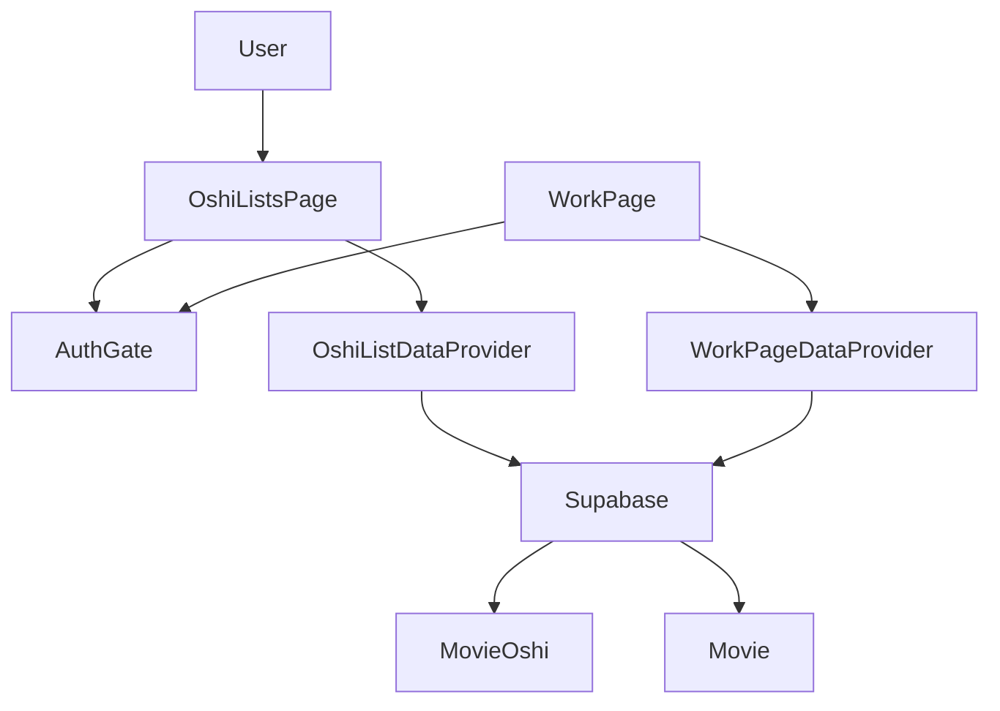
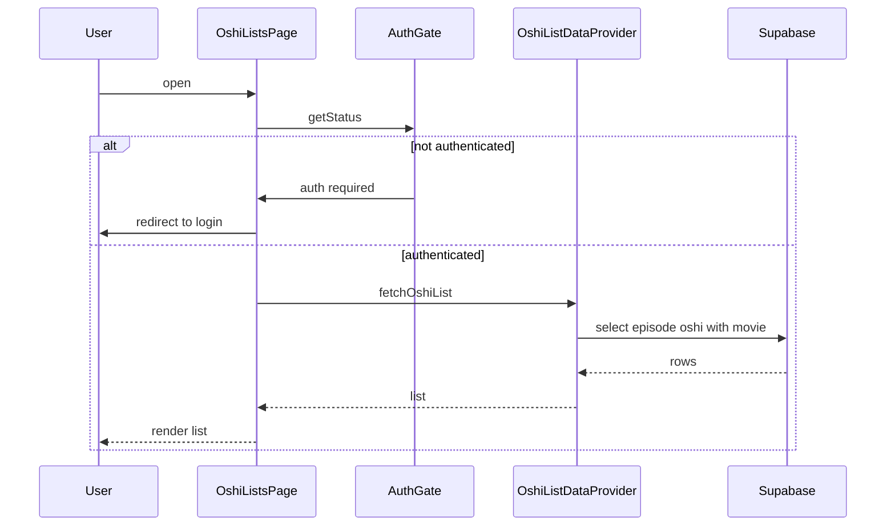
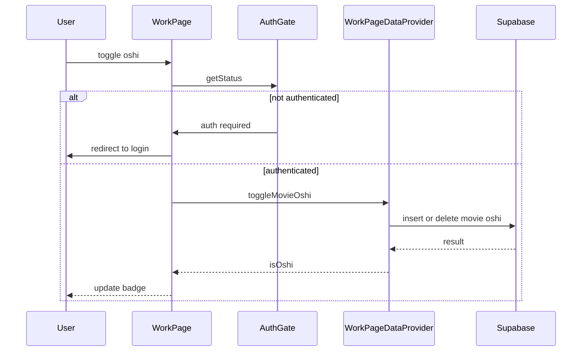

# 技術設計書: oshi-list-user-registration-registered-only

## Overview
本機能は、推し登録をユーザー単位で保持し、推しリストページに登録済みのみを表示する。認証済みユーザーに限定した取得と表示を徹底し、未認証時には一貫したログイン誘導を行う。

推し登録結果を即時にUIへ反映し、登録済み状態の見える化を担保する。登録済み推しの一覧は`movie_oshi`を起点に取得し、既存のSupabase RLSによりユーザー境界を保証する。

### Goals
- 推し登録をユーザーIDに紐づけて保存し、重複登録を防止する。
- 推しリストページで登録済み推しのみを表示し、未認証時はログイン誘導する。
- 推し登録の結果と推しボタン状態を即時に反映する。

### Non-Goals
- 未認証ユーザー向けの閲覧機能追加
- 推し解除や並び替えの追加仕様（要件外）
- サーバーAPI層の新規導入

## Requirements Traceability
| Requirement | Summary | Components | Interfaces | Flows |
| --- | --- | --- | --- | --- |
| 1.1 | 登録時にユーザーIDと推しを紐づける | WorkPageDataProvider, AuthGate | Service | 推し登録フロー |
| 1.2 | 未認証時は登録せずログイン誘導 | AuthGate, WorkPage | Service | 推し登録フロー |
| 1.3 | 無効な識別子は拒否し理由表示 | WorkPage, WorkPageDataProvider | Service | 推し登録フロー |
| 1.4 | 同一ユーザーの重複登録防止 | movie_oshi, WorkPageDataProvider | Data | 推し登録フロー |
| 2.1 | 推しリスト表示時に登録済みのみ | OshiListsPage, OshiListDataProvider | Service | 推し一覧表示フロー |
| 2.2 | movieの推バッジ済のみ表示 | OshiListPanel, OshiListItemCard | State | 推し一覧表示フロー |
| 2.3 | 未認証時は一覧を表示せず誘導 | AuthGate, OshiListsPage | Service | 推し一覧表示フロー |
| 2.4 | 0件時に空状態表示 | OshiListsPage | State | 推し一覧表示フロー |
| 2.5 | 他ユーザー分は表示しない | movie_oshi, Supabase RLS | Data | 推し一覧表示フロー |
| 3.1 | 登録済み状態を表示 | WorkPage, EpisodeListItem | State | 推し登録フロー |
| 3.2 | 登録済み一覧へ反映 | OshiListDataProvider, OshiListsPage | Service | 推し一覧表示フロー |
| 3.3 | 推しボタン初期状態は済 | WorkPageDataProvider, EpisodeListItem | Service | 推し登録フロー |
| 3.4 | 登録失敗の表示 | WorkPage, OshiListsPage | State | 推し登録フロー |
| 4.1 | 取得開始時に読み込み表示 | OshiListsPage | State | 推し一覧表示フロー |
| 4.2 | 取得失敗時にエラー表示 | OshiListsPage | State | 推し一覧表示フロー |
| 4.3 | 取得失敗時は一覧非表示 | OshiListsPage | State | 推し一覧表示フロー |
| 8.1 | 表示形式切り替え | OshiListsPage, OshiListViewToggle | State | 推し一覧表示フロー |
| 8.2 | 切替後も内容維持 | OshiListsPage | State | 推し一覧表示フロー |

## Architecture

### Existing Architecture Analysis
- ReactページがUI状態を保持し、`create*DataProvider`でSupabaseアクセスを抽象化している。
- 認証判定は`AuthGate`が担い、未認証時は`/login/`へ統一的に誘導する。
- `movie_oshi`はRLSによりユーザー単位のアクセスが保証されている。

### Architecture Pattern & Boundary Map


**Architecture Integration**:
- Selected pattern: クライアント直結BaaS + データプロバイダ抽象化
- Domain/feature boundaries: UI層（ページと表示切替）とデータ層（取得/登録）を分離
- Existing patterns preserved: `create*DataProvider`と`AuthGate`の利用
- New components rationale: 推し一覧取得専用のデータプロバイダを追加し責務を限定
- Steering compliance: Supabase利用方針、フロント完結構成を維持

### Technology Stack & Alignment
| Layer | Choice / Version | Role in Feature | Notes |
| --- | --- | --- | --- |
| Frontend | React 18.3.1 | 推し一覧ページと状態管理 | 既存構成を維持 |
| Frontend | react-router-dom 6.30.1 | 未認証時の遷移 | AuthGateから利用 |
| Backend Service | @supabase/supabase-js 2.90.1 | 推し一覧と登録の取得 | 既存依存 |
| Data / Storage | Supabase Postgres | `movie_oshi`と`movie`の取得 | RLSでユーザー境界を担保 |
| Infrastructure | Vite 5.4.10 | ビルド/開発環境 | 既存構成 |

## System Flows

### 推し一覧表示フロー


### 推し登録フロー


## Components & Interface Contracts

| Component | Domain/Layer | Intent | Req Coverage | Key Dependencies (P0/P1) | Contracts |
| --- | --- | --- | --- | --- | --- |
| OshiListsPage | UI | 推し一覧の取得と表示、表示形式切替 | 2.1, 2.3, 2.4, 4.1, 4.2, 4.3, 8.1, 8.2 | AuthGate P0, OshiListDataProvider P0 | State |
| OshiListViewToggle | UI | 表示形式の切替操作 | 8.1, 8.2 | OshiListsPage P1 | State |
| OshiListPanel | UI | 登録済み推し一覧のレンダリング | 2.1, 2.2, 2.4 | OshiListsPage P1 | State |
| OshiListItemCard | UI | 推しアイテムのカード表示 | 2.2, 3.1 | OshiListPanel P1 | State |
| OshiListDataProvider | Data | 推し一覧取得とエラー正規化 | 2.1, 2.2, 2.5, 4.2 | Supabase P0 | Service |
| WorkPageDataProvider | Data | 推し登録と初期状態取得 | 1.1, 1.3, 1.4, 3.1, 3.3, 3.4 | Supabase P0 | Service |
| AuthGate | Shared | 認証判定とログイン誘導 | 1.2, 2.3 | supabase auth P0 | Service |

### UI

#### OshiListsPage
| Field | Detail |
| --- | --- |
| Intent | 推し一覧の取得と表示、未認証時の誘導を統括する |
| Requirements | 2.1, 2.3, 2.4, 4.1, 4.2, 4.3, 8.1, 8.2 |

**Responsibilities & Constraints**
- 認証状態を判定し、未認証時は一覧表示を行わない。
- 読み込み/エラー/空状態/一覧のUI状態を排他的に管理する。
- 表示形式切替時に一覧データを保持し続ける。

**Dependencies**
- Inbound: AppRouter — 推しリストルートからの表示 (P1)
- Outbound: AuthGate — 認証判定とリダイレクト (P0)
- Outbound: OshiListDataProvider — 推し一覧取得 (P0)

**Contracts**: Service [ ] / API [ ] / Event [ ] / Batch [ ] / State [x]

##### State Management
- State model: `viewMode`, `isLoading`, `errorType`, `items`
- Persistence & consistency: 取得済み`items`は表示形式切替時に維持
- Concurrency strategy: 最新取得のみを反映し、並列取得は後勝ちで上書き

**Implementation Notes**
- Integration: 認証判定失敗時は`/login/`へ遷移
- Validation: 取得結果が空配列の場合は空状態を明示
- Risks: 認証状態の遷移により一覧がちらつく可能性

### Data

#### OshiListDataProvider
| Field | Detail |
| --- | --- |
| Intent | 推し一覧取得をSupabaseに委譲し、結果を正規化する |
| Requirements | 2.1, 2.2, 2.5, 4.2 |

**Responsibilities & Constraints**
- `movie_oshi`を起点に`movie`を結合し、登録済みのみ取得する。
- 取得失敗時はエラー種別を正規化しUIに伝達する。
- 未認証状態では呼び出し前にAuthGateで遮断する。

**Dependencies**
- Inbound: OshiListsPage — 一覧取得要求 (P0)
- Outbound: Supabase — `movie_oshi`と`movie`の取得 (P0)

**Contracts**: Service [x] / API [ ] / Event [ ] / Batch [ ] / State [ ]

##### Service Interface
```typescript
type OshiListItem = {
  id: string;
  title: string;
  thumbnailUrl: string | null;
  publishedAt: string | null;
  videoUrl: string | null;
  seriesId: string | null;
  isOshi: true;
};

type OshiListError =
  | { type: 'not_configured' }
  | { type: 'network' }
  | { type: 'unknown' };

interface OshiListService {
  fetchOshiList(): Promise<{ ok: true; data: OshiListItem[] } | { ok: false; error: OshiListError }>;
}
```
- Preconditions: 認証済みであること。
- Postconditions: 登録済みの推しのみ返却する。
- Invariants: `isOshi`は常に`true`。

**Implementation Notes**
- Integration: `movie_oshi`から`movie`への結合で必要項目を取得
- Validation: 空配列はエラーではなく空状態として扱う
- Risks: 結合の指定誤りによる空取得

#### WorkPageDataProvider
| Field | Detail |
| --- | --- |
| Intent | 推し登録/解除と初期状態の整合を保つ |
| Requirements | 1.1, 1.3, 1.4, 3.1, 3.3, 3.4 |

**Responsibilities & Constraints**
- 推し登録時は`movie_oshi`に`movie_id`を登録し、重複は許可しない。
- `fetchMovies`は認証済みの場合に`isOshi`を反映する。
- `movieId`が無効な場合は即時エラーを返す。

**Dependencies**
- Inbound: WorkPage — 推し操作と一覧取得 (P0)
- Outbound: Supabase — `movie`と`movie_oshi`の取得/更新 (P0)

**Contracts**: Service [x] / API [ ] / Event [ ] / Batch [ ] / State [ ]

##### Service Interface
```typescript
type ToggleOshiResult =
  | { ok: true; data: { isOshi: boolean } }
  | { ok: false; error: { type: 'invalid_input' | 'conflict' | 'network' | 'unknown' } };

interface WorkPageOshiService {
  toggleMovieOshi(movieId: string): Promise<ToggleOshiResult>;
  fetchMovies(seriesId: string, sortOrder: 'latest' | 'oldest'): Promise<{ ok: true; data: { id: string; isOshi: boolean }[] } | { ok: false; error: { type: 'not_configured' | 'network' | 'unknown' } }>;
}
```
- Preconditions: `movieId`が有効であること。
- Postconditions: 登録成功時は`isOshi`が反転しUIへ反映される。
- Invariants: 同一ユーザーの`movie_id`は一意。

**Implementation Notes**
- Integration: 登録は一意制約を前提に冪等に扱う
- Validation: 空または形式不正のIDは`invalid_input`
- Risks: 連続操作時の整合性

#### AuthGate
| Field | Detail |
| --- | --- |
| Intent | 認証状態を確認しログイン誘導を統一する |
| Requirements | 1.2, 2.3 |

**Responsibilities & Constraints**
- `supabase.auth.getSession`を用いた認証状態の取得。
- 未認証時は`/login/`に遷移し、必要なリダイレクト情報を付与する。

**Dependencies**
- Inbound: OshiListsPage, WorkPage — 認証判定 (P0)
- Outbound: Supabase Auth — セッション取得 (P0)
- Outbound: react-router-dom — 画面遷移 (P1)

**Contracts**: Service [x] / API [ ] / Event [ ] / Batch [ ] / State [ ]

##### Service Interface
```typescript
interface AuthGateService {
  getStatus(): Promise<{ ok: true; status: { isAuthenticated: true } } | { ok: false; error: { type: 'auth_required' } }>;
  redirectToLogin(context?: { seriesId?: string; selectedEpisodeId?: string; sortOrder?: 'latest' | 'oldest' }): void;
}
```
- Preconditions: `supabaseClient`が有効であること。
- Postconditions: 未認証の場合はログイン画面に誘導される。
- Invariants: 認証状態の判定ロジックはページ間で共通。

**Implementation Notes**
- Integration: 推し一覧では`/login/`への直遷移を許容
- Validation: 取得失敗は`auth_required`扱い
- Risks: セッション取得遅延によるUX低下

## Data Models

### Domain Model
- Aggregate: 推し登録（User + Movie）
- Entities: User, Movie, OshiRegistration
- Business rules & invariants:
  - 同一ユーザーの同一`movie_id`は一意
  - 未認証ユーザーは登録不可

### Logical Data Model
**Structure Definition**:
- `movie_oshi`: `user_id` (uuid), `movie_id` (uuid), `created_at` (timestamptz)
- `movie`: `movie_id` (uuid), `movie_title` (text), `url` (text), `thumbnail_url` (text), `update` (timestamptz), `series_id` (text)
- Relationship: `movie_oshi.movie_id` → `movie.movie_id` (1:N)

**Consistency & Integrity**:
- Transaction boundaries: 1件の推し登録が1トランザクション
- Referential integrity: `movie`削除時に`movie_oshi`はCASCADE
- Temporal aspects: `created_at`で登録順の並び替えが可能

### Physical Data Model
- `episode_oshi`から`movie_oshi`へのリネームマイグレーションを追加する。

### Data Contracts & Integration
**API Data Transfer**
- `movie_oshi` + `movie`結合結果を`OshiListItem`に正規化
- Validation rules: `movie_id`が欠損した行は破棄
- Serialization format: JSON

## Error Handling

### Error Strategy
- 取得前に認証を確認し、未認証は即時リダイレクト。
- 取得失敗はエラー表示、一覧は非表示とする。
- 登録失敗時は通知を表示しUI状態の更新を抑制する。

### Error Categories and Responses
- **User Errors**: 未認証 → ログイン誘導、無効ID → 入力エラー表示
- **System Errors**: ネットワーク障害 → 再試行導線とエラー表示
- **Business Logic Errors**: 重複登録 → 既存状態の維持と通知

### Monitoring
- フロントでエラー種別を記録し、必要に応じてログ送信の拡張余地を確保する。

## Testing Strategy
- Unit Tests: `OshiListDataProvider`のエラー正規化、`AuthGate`の未認証判定、`WorkPageDataProvider`の`isOshi`反映
- Integration Tests: 推し一覧取得の正常系/異常系、推し登録後の状態反映
- E2E/UI Tests: 未認証時のリダイレクト、空状態表示、表示形式切替で一覧保持

## Security Considerations
- RLSにより`movie_oshi`の参照範囲を`auth.uid()`に限定。
- 未認証時は一覧取得を行わず、ログイン画面へ遷移。
- フロント側で`movieId`の入力検証を行い、誤操作を抑制。

## Performance & Scalability
- 推し一覧取得は必要なカラムに限定し、一覧サイズに応じて将来のページングを検討。
- 登録直後の再取得は最小限に留め、必要時のみ再フェッチする。
