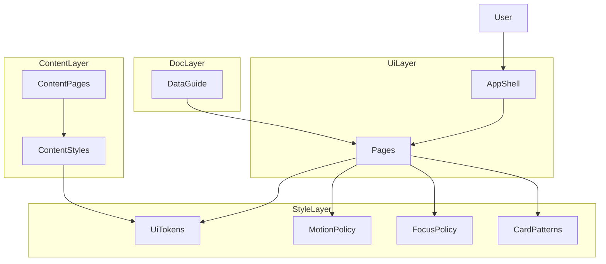

# Design Document: sitewide-ui-polish-accessibility

## Overview
本設計は、サイト全体のUI一貫性とアクセシビリティを底上げするための共通スタイル基盤と運用ドキュメントを定義する。対象はReactページのみとし、`content/`配下の静的ページは今回の対象外とする。既存のページ単位CSSを尊重しつつ、共通トークン化・共通パターン化で視覚整合と可用性を高める。

対象ユーザーは閲覧者・キーボード利用者・低視力ユーザー・更新担当者であり、視認性の改善、操作性の確保、更新手順の明確化を提供する。サイト全体の体験品質に影響するため、段階的な移行前提で設計する。

### Goals
- 全ページで統一されたタイポグラフィ・配色・カード表現を確立する。
- `prefers-reduced-motion` とフォーカス可視化の基準を明確にし、アクセシビリティ要件を満たす。
- CSV/JSON更新フローの文書化で運用の誤更新を抑制する。

### Non-Goals
- 新規データモデルやAPIの追加。
- 既存ページの全面的な構造改修。
- デザインのテーマ切替（ダーク/ライト）導入。
- `content/`配下の静的ページへの適用。

## Requirements Traceability

| Requirement | Summary | Components | Interfaces | Flows |
|-------------|---------|------------|------------|-------|
| 1.1 | タイポと色調の統一 | UiTokenSheet, ContentStyleBridge | Style Token Contract | - |
| 1.2 | ナビゲーションの統一ルール | CardPatternLibrary | - | - |
| 1.3 | 見出し/本文/補足の階層化 | UiTokenSheet | Style Token Contract | - |
| 1.4 | 既定テーマの配色維持 | UiTokenSheet | Style Token Contract | - |
| 1.5 | 対象範囲の明示 | UiTokenSheet, ContentStyleBridge | Style Token Contract | - |
| 2.1 | 字間/行間の維持 | UiTokenSheet | Style Token Contract | - |
| 2.2 | 重要情報の強調 | CardPatternLibrary | - | - |
| 2.3 | 低コントラスト時の調整 | UiTokenSheet, FocusRingPolicy | Style Token Contract | - |
| 2.4 | 背景上の可読性維持 | CardPatternLibrary | - | - |
| 2.5 | コントラスト基準の明記 | UiTokenSheet | Style Token Contract | - |
| 3.1 | カード間隔と配置 | CardPatternLibrary | - | - |
| 3.2 | 主/補助カードの区別 | CardPatternLibrary | - | - |
| 3.3 | ホバー/フォーカス反応 | FocusRingPolicy, CardPatternLibrary | Focus Contract | - |
| 3.4 | レスポンシブ再配置 | CardPatternLibrary | - | - |
| 3.5 | 共通スタイル規則 | UiTokenSheet, CardPatternLibrary | Style Token Contract | - |
| 4.1 | 初回ロード演出 | MotionPolicy | Motion Contract | - |
| 4.2 | カード出現演出 | MotionPolicy | Motion Contract | - |
| 4.3 | 動きの速度/量 | MotionPolicy | Motion Contract | - |
| 4.4 | 動き抑制 | MotionPolicy | Motion Contract | - |
| 4.5 | reduce対象定義 | MotionPolicy | Motion Contract | - |
| 5.1 | 更新手順の記載 | DataUpdateGuide | Doc Contract | - |
| 5.2 | 入力項目/形式/配置 | DataUpdateGuide | Doc Contract | - |
| 5.3 | 失敗例と対処 | DataUpdateGuide | Doc Contract | - |
| 5.4 | 更新後チェック | DataUpdateGuide | Doc Contract | - |
| 5.5 | 対象範囲と反映先 | DataUpdateGuide | Doc Contract | - |
| 6.1 | キーボード到達性 | FocusRingPolicy | Focus Contract | - |
| 6.2 | フォーカス可視化 | FocusRingPolicy | Focus Contract | - |
| 6.3 | フォーカス順制御 | FocusRingPolicy | Focus Contract | - |
| 6.4 | モーダル内フォーカス | FocusRingPolicy | Focus Contract | - |
| 6.5 | :focus-visible 統一 | FocusRingPolicy | Focus Contract | - |
| 7.1 | コントラスト維持 | UiTokenSheet | Style Token Contract | - |
| 7.2 | 色以外の手がかり | CardPatternLibrary | - | - |
| 7.3 | 装飾下の可視性 | CardPatternLibrary | - | - |
| 7.4 | 測定方法の明示 | UiTokenSheet | Style Token Contract | - |

## Architecture

### Existing Architecture Analysis
- ページ単位のCSSが分散し、色・影・タイポがページ毎に定義されている。
- `outline: none` が一部で利用され、フォーカス可視性が不足している。
- アニメーションは`App.css`中心で、ページ全体に統一適用されていない。
- `content/`配下は独自スタイル（`content/assets/styles.css`）を持つ。

### Architecture Pattern & Boundary Map
**Architecture Integration**:
- Selected pattern: 共通スタイル基盤 + ページ単位適用（ハイブリッド移行）
- Domain/feature boundaries: グローバルスタイル、共通UIパターン、ページ個別調整、運用ドキュメントを分離
- Existing patterns preserved: React + CSS並置、既存クラス命名
- New components rationale: 共通トークン/モーション/フォーカス/運用ドキュメントの責務を明確化
- Steering compliance: 既存構成とCSS並置規約を維持

## Technology Stack & Alignment

| Layer | Choice / Version | Role in Feature | Notes |
|-------|------------------|-----------------|-------|
| Frontend | React 18 + Vite | 既存UIの統一スタイル適用 | 既存構成維持 |
| Styling | CSS (global + per-page) | トークン化/フォーカス/モーション規定 | 新規依存なし |
| Documentation | Markdown | 更新手順ドキュメント | `docs/` 追加を想定 |
| Runtime | Node.js | 開発環境 | 変更なし |

## Components & Interface Contracts

| Component | Domain/Layer | Intent | Req Coverage | Key Dependencies (P0/P1) | Contracts |
|-----------|--------------|--------|--------------|--------------------------|-----------|
| UiTokenSheet | Style | 色/タイポ/余白/影の共通トークンを提供 | 1.1-1.5, 2.1-2.5, 3.5, 7.1, 7.4 | `src/index.css` (P0) | State |
| MotionPolicy | Style | アニメーションの統一とreduce対応 | 4.1-4.5 | `src/App.css` (P0) | State |
| FocusRingPolicy | Style | フォーカスリングの統一規則 | 6.1-6.5, 3.3, 2.3 | `src/App.css`, `src/LoginPage.css` (P0) | State |
| CardPatternLibrary | Style | カード/ボタン/バッジの共通規則 | 3.1-3.5, 2.2, 2.4, 7.2, 7.3 | 各ページCSS (P0) | - |
| ContentStyleBridge | Style | `content/`用スタイルのトークン整合 | 1.1, 1.5, 2.1-2.5, 3.5, 7.1-7.4 | `content/assets/styles.css` (P1) | State |
| DataUpdateGuide | Docs | CSV/JSON更新フロー文書化 | 5.1-5.5 | `docs/` (P0) | Doc |

### Style Layer

#### UiTokenSheet
| Field | Detail |
|-------|--------|
| Intent | 共通の色・タイポ・余白・影をCSS変数として提供する |
| Requirements | 1.1, 1.3, 1.4, 1.5, 2.1, 2.5, 3.5, 7.1, 7.4 |

**Responsibilities & Constraints**
- 既存ページCSSの色指定を変数参照へ移行できるようにする。
- タイポ階層（見出し/本文/補足）の基準を定義する。
- コントラスト基準（AA相当）を満たす配色セットを提供する。

**Dependencies**
- Inbound: 各ページCSS — トークン参照 (P0)
- Outbound: なし
- External: なし

**Contracts**: State [x]

##### State Management
- State model: CSS custom properties（色/タイポ/余白/影）
- Persistence & consistency: `:root` に定義し全ページへ継承
- Concurrency strategy: 非同期更新なし

**Implementation Notes**
- Integration: `src/index.css` をトークンの単一ソースとし、ページCSSは参照に寄せる。
- Validation: コントラスト測定対象（本文/見出し/補足/ボタン/フォーカスリング）を明示。
- Risks: `content/` が別トーンの場合、橋渡しの設計が必要。

#### MotionPolicy
| Field | Detail |
|-------|--------|
| Intent | アニメーションの統一と reduce モードの基準を定義 |
| Requirements | 4.1, 4.2, 4.3, 4.4, 4.5 |

**Responsibilities & Constraints**
- 初回ロードとカード出現の動きを共通化する。
- `prefers-reduced-motion` で非必須アニメーションを抑制する。

**Dependencies**
- Inbound: ページCSS — animation/transition 参照 (P0)
- Outbound: なし
- External: なし

**Contracts**: State [x]

##### State Management
- State model: `@media (prefers-reduced-motion: reduce)` での動作切替
- Persistence & consistency: CSSメディア条件に依存
- Concurrency strategy: 非同期更新なし

**Implementation Notes**
- Integration: `App.css` の既存keyframesを共通ルールへ整理。
- Validation: reduce時の代替表現（フェードのみ/移動停止）を明示。
- Risks: 必須動作と非必須動作の線引きが曖昧だと不整合が出る。

**Animation Trigger Policy（カード出現/初回ロード）**
- 実装方式: Intersection Observer で要素可視化を検知し、`is-visible` を付与する。
- 初回ロード: ページ単位で `data-animate-once` を付与し、初回のみ再生する。
- 命名規約: `is-visible`（可視化）、`is-animated-once`（初回限定）を標準とする。
- reduce時: `@media (prefers-reduced-motion: reduce)` で移動・拡大を停止し、必要に応じてフェードのみ許可する（または完全停止）。

#### FocusRingPolicy
| Field | Detail |
|-------|--------|
| Intent | キーボード操作時のフォーカス可視化を統一 |
| Requirements | 6.1, 6.2, 6.5, 3.3, 2.3 |

**Responsibilities & Constraints**
- `:focus-visible` を基準にフォーカスリングを定義する。
- 既存の `outline: none` を置換し視認性を確保する。
- キーボード操作時のフォーカス順を乱す要素は除外する（`tabindex="-1"` など）。
- モーダル表示時はフォーカスをモーダル内に閉じ込める。

**Dependencies**
- Inbound: 各ページCSS — フォーカス定義 (P0)
- Outbound: なし
- External: なし

**Contracts**: State [x]

##### State Management
- State model: フォーカスリングの色/太さ/影をトークン化
- Persistence & consistency: `:focus-visible` を標準とする
- Concurrency strategy: 非同期更新なし

**Implementation Notes**
- Integration: `App.css`/`LoginPage.css` の `outline: none` を共通ルールに置換。
- Validation: コントラスト3:1相当のリング視認性をチェック。
- Risks: マウス操作時の過剰表示を避ける必要がある。

**Focus Contract（モーダル時）**
- モーダル表示直後にモーダル内の最初の操作要素へフォーカスを移す。
- `Tab`/`Shift+Tab` はモーダル内のフォーカス可能要素のみを巡回。
- `Esc` でモーダルを閉じる（既存仕様がある場合はそれに準拠）。
- モーダルを閉じたら、開く前にフォーカスがあった要素に戻す。
- 背景要素は `aria-hidden="true"` または `inert` 相当でフォーカス不可にする。

**Modal Scope Note（現状）**
- 現時点のコードベースに明確なモーダル実装は存在しない。
- 今後モーダルを追加する場合は、上記 Focus Contract を標準仕様として適用する。

#### ContentStyleBridge
| Field | Detail |
|-------|--------|
| Intent | `content/` の静的ページにトークン整合を適用 |
| Requirements | 1.1, 1.5, 2.1, 2.5, 7.1 |

**Responsibilities & Constraints**
- `content/assets/styles.css` と `src/index.css` の色/フォント整合を図る。
- 適用対象範囲が「Reactのみ」のため、今回は導入を見送る。

**Dependencies**
- Inbound: コンテンツCSS — トークン参照 (P1)
- Outbound: UiTokenSheet — 参照 (P0)
- External: なし

**Contracts**: State [x]

##### State Management
- State model: 共通トークンと静的ページ変数のマッピング
- Persistence & consistency: `content/assets/styles.css` を更新
- Concurrency strategy: 非同期更新なし

**Implementation Notes**
Integration: 対象外のため今回は変更なし。
Validation: 対象外のため今回は変更なし。
Risks: なし（次フェーズで検討）。

### Docs Layer

#### DataUpdateGuide
| Field | Detail |
|-------|--------|
| Intent | CSV/JSON更新フローを文書化し運用誤りを防ぐ |
| Requirements | 5.1, 5.2, 5.3, 5.4, 5.5 |

**Responsibilities & Constraints**
- 対象データ（CSV/JSON）の範囲と配置場所を明記する。
- 典型的な失敗例と確認チェックを含める。

**Dependencies**
- Inbound: 更新担当者の利用 (P0)
- Outbound: なし
- External: なし

**Contracts**: Doc [x]

**Implementation Notes**
- Integration: `docs/data-update-flow.md` に集約する設計。
- Validation: 更新後の表示チェックリストを明記。
- Risks: 実データの更新経路が未整理のままだと文書が形骸化する。

## Data Models

### Domain Model
- 本機能は新規データモデルを追加しない。

### Logical Data Model
- データ構造の変更なし。

## Error Handling

### Error Strategy
- デザイン適用による表示崩れは「段階導入 + 重点ページ検証」で検知する。
- ドキュメント不足は更新担当者の手戻りにつながるため、更新手順の網羅性を担保する。

### Error Categories and Responses
- User Errors: 更新手順の不備 → ドキュメント内に対処手順を記載
- System Errors: 表示崩れ → 影響範囲を限定しロールバック
- Business Logic Errors: 視認性基準未達 → トークン調整と再検証

### Monitoring
- 画面QAチェックリストで視認性・フォーカス・アニメーションをレビュー対象化する。

## Testing Strategy

### Unit Tests
- フォーカス対象要素がボタン/リンクで構成されることの確認。
- トークン参照クラスが主要ページに適用されることの確認。
- `prefers-reduced-motion` 条件でアニメーションが抑制されることの確認。

### Integration Tests
- TopPage/OshiLists/WorkPage/History におけるカード表現の整合性。
- キーボード操作時のフォーカス可視化と遷移。
- モーダル表示時のフォーカストラップとフォーカス復帰。

### E2E/UI Tests
- 主要導線（トップ→一覧→作品）の視認性・コントラスト確認。
- 低視力向けの警告/選択状態が色以外の手がかりを持つか。
- 更新後の表示チェックリストに基づく確認。

## Contrast & Measurement Policy
- 基準: WCAG 2.1 AA を最低基準とする。
- 対象: 本文テキスト、見出し、補足テキスト、ボタン/リンクラベル、フォーカスリング。
- 数値:
  - 本文/補足: 4.5:1 以上
  - 見出し/大きい文字: 3:1 以上
  - アイコン/非テキスト要素: 3:1 以上
  - フォーカスリング: 3:1 以上（背景とのコントラスト）
- 測定方法: 主要ページで画面キャプチャを取り、コントラスト計測ツールで値を記録する。
- 記録場所: 画面QAチェックリストに測定値と対象を記載する。

## Security Considerations
- 本機能は認証/権限を変更しないため、セキュリティ影響は限定的。

## Performance & Scalability
- CSSトークン化はランタイムコストが小さく、性能影響は軽微。
- アニメーション削減は低スペック端末での体感改善が期待される。

## Migration Strategy
- まず共通トークンとフォーカス/モーション基準を定義し、重点ページから段階移行する。
- `content/` 適用は別フェーズで検討する。
