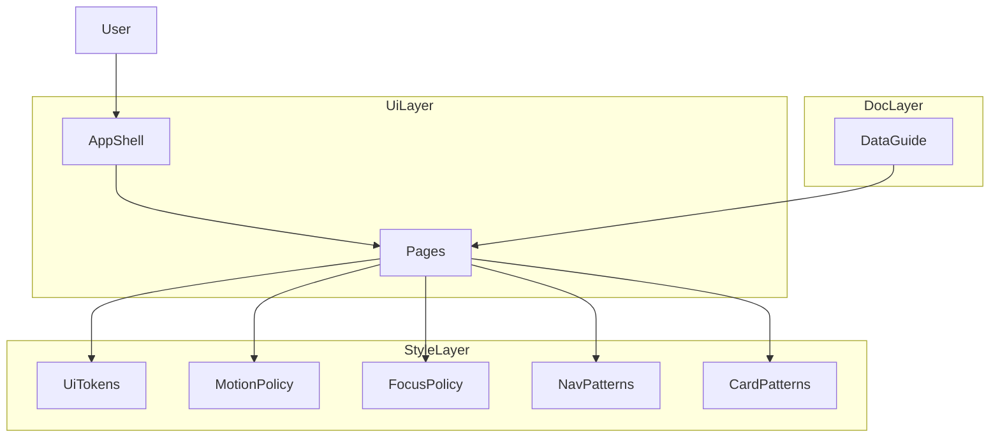

# Design Document: sitewide-ui-polish-accessibility

## Overview
本設計は、Reactページに限定したサイト全体のUI一貫性・アクセシビリティの底上げと、データ更新フローの明確化を行う。共通トークン（色・タイポ・余白・影）と共通UIパターン（カード/ナビゲーション/フォーカス/モーション）を定義し、既存ページCSSに段階的に適用する。

対象ユーザーは閲覧者・キーボード利用者・低視力ユーザー・更新担当者である。視認性と操作性を改善し、更新手順の誤りを抑止する。`content/` 配下の静的ページに加え `LoginPage` / `NotFound` は今回の対象外とし、対象範囲を明示する。

### Goals
- 全ページ（React）のタイポグラフィ/配色/カード/ナビゲーション表現を統一する。
- `prefers-reduced-motion` と `:focus-visible` を基準にアクセシビリティ規定を定義する。
- CSV/JSON/Supabaseの更新手順と検証項目を文書化する。

### Non-Goals
- `content/` 配下の静的ページへの適用。
- 新規データモデルやAPIの導入。
- テーマ切替（ダーク/ライト）の追加。
- 大規模なUI構造の刷新。

## Requirements Traceability

| Requirement | Summary | Components | Interfaces | Flows |
|-------------|---------|------------|------------|-------|
| 1.1 | タイポと色調の統一 | UiTokenSheet | State | - |
| 1.2 | ナビゲーションの統一ルール | NavigationPatternLibrary | State | - |
| 1.3 | 見出し/本文/補足の階層化 | UiTokenSheet | State | - |
| 1.4 | 既定テーマの配色維持 | UiTokenSheet | State | - |
| 1.5 | 対象範囲の明示 | UiTokenSheet, Architecture Scope Statement | State | - |
| 2.1 | 字間/行間の維持 | UiTokenSheet | State | - |
| 2.2 | 重要情報の強調 | CardPatternLibrary | State | - |
| 2.3 | 低コントラスト時の調整 | UiTokenSheet, FocusRingPolicy | State | - |
| 2.4 | 背景上の可読性維持 | CardPatternLibrary | State | - |
| 2.5 | コントラスト基準の明記 | UiTokenSheet | State | - |
| 3.1 | カード間隔と配置 | CardPatternLibrary | State | - |
| 3.2 | 主/補助カードの区別 | CardPatternLibrary | State | - |
| 3.3 | ホバー/フォーカス反応 | FocusRingPolicy, CardPatternLibrary | State | - |
| 3.4 | レスポンシブ再配置 | CardPatternLibrary | State | - |
| 3.5 | 共通スタイル規則 | UiTokenSheet, CardPatternLibrary, NavigationPatternLibrary | State | - |
| 4.1 | 初回ロード演出 | MotionPolicy | State | - |
| 4.2 | カード出現演出 | MotionPolicy | State | - |
| 4.3 | 動きの速度/量 | MotionPolicy | State | - |
| 4.4 | 動き抑制 | MotionPolicy | State | - |
| 4.5 | reduce対象定義 | MotionPolicy | State | - |
| 5.1 | 更新手順の記載 | DataUpdateGuide | Doc | - |
| 5.2 | 入力項目/形式/配置 | DataUpdateGuide | Doc | - |
| 5.3 | 失敗例と対処 | DataUpdateGuide | Doc | - |
| 5.4 | 更新後チェック | DataUpdateGuide | Doc | - |
| 5.5 | 対象範囲と反映先 | DataUpdateGuide | Doc | - |
| 6.1 | キーボード到達性 | FocusRingPolicy | State | - |
| 6.2 | フォーカス可視化 | FocusRingPolicy | State | - |
| 6.3 | フォーカス順制御 | FocusRingPolicy | State | - |
| 6.4 | モーダル内フォーカス | FocusRingPolicy | State | - |
| 6.5 | :focus-visible 統一 | FocusRingPolicy | State | - |
| 7.1 | コントラスト維持 | UiTokenSheet | State | - |
| 7.2 | 色以外の手がかり | CardPatternLibrary | State | - |
| 7.3 | 装飾下の可視性 | CardPatternLibrary | State | - |
| 7.4 | 測定方法の明示 | UiTokenSheet | State | - |

## Architecture

### Existing Architecture Analysis
- `src/index.css` が基本タイポ/背景/フォントを定義し、各ページCSSで色や影が分散している。
- `src/App.css` に `outline: none` の記述があり、フォーカス可視性が不足している。
- ページ単位でカード/ナビゲーション/ボタンのスタイルが個別定義されている。
- `docs/data-update-flow.md` にデータ更新手順が存在し、CSV/JSON/Supabaseの範囲が整理されている。

### Architecture Pattern & Boundary Map
**Architecture Integration**:
- Selected pattern: 共通トークン + 共通UIパターンのハイブリッド段階移行
- Domain/feature boundaries: スタイル基盤（トークン/モーション/フォーカス）とパターン（カード/ナビ）と運用ドキュメントを分離
- Existing patterns preserved: React + CSS並置、ページCSSの段階的置換
- New components rationale: UI一貫性・アクセシビリティ・運用手順を独立責務として管理
- Steering compliance: Vite + React + CSS中心の構成を維持

## Technology Stack & Alignment

| Layer | Choice / Version | Role in Feature | Notes |
|-------|------------------|-----------------|-------|
| Frontend | React 18 + Vite | UI統一とアクセシビリティ改善の適用 | 既存構成維持 |
| Styling | CSS (global + per-page) | トークン/フォーカス/モーション規定 | 新規依存なし |
| Documentation | Markdown | 更新手順の明文化 | `docs/data-update-flow.md` を拡充 |
| Runtime | Node.js | 開発環境 | 変更なし |

## Components & Interface Contracts

| Component | Domain/Layer | Intent | Req Coverage | Key Dependencies (P0/P1) | Contracts |
|-----------|--------------|--------|--------------|--------------------------|-----------|
| UiTokenSheet | Style | 色/タイポ/余白/影の共通トークンを提供 | 1.1, 1.3, 1.4, 1.5, 2.1, 2.3, 2.5, 3.5, 7.1, 7.4 | `src/index.css` (P0) | State |
| NavigationPatternLibrary | Style | ナビゲーションのレイアウト/階層/状態表現を統一 | 1.2, 3.5 | `src/TopPage.css` (P0) | State |
| CardPatternLibrary | Style | カード/ボタン/バッジ/タグの共通ルールを整理 | 2.2, 2.4, 3.1, 3.2, 3.3, 3.4, 3.5, 7.2, 7.3 | `src/App.css`, `src/OshiListsPage.css`, `src/HistoryPage.css` (P0) | State |
| MotionPolicy | Style | アニメーション基準とreduce対応 | 4.1, 4.2, 4.3, 4.4, 4.5 | `src/App.css` (P0) | State |
| FocusRingPolicy | Style | フォーカスリングとキーボード操作規則 | 2.3, 3.3, 6.1, 6.2, 6.3, 6.4, 6.5 | `src/App.css`, `src/TopPage.css` (P0) | State |
| DataUpdateGuide | Docs | CSV/JSON/Supabase更新フローの明文化 | 5.1, 5.2, 5.3, 5.4, 5.5 | `docs/data-update-flow.md` (P0) | Doc |

### Style Layer

#### UiTokenSheet
| Field | Detail |
|-------|--------|
| Intent | 共通の色・タイポ・余白・影をCSS変数として提供する |
| Requirements | 1.1, 1.3, 1.4, 1.5, 2.1, 2.3, 2.5, 3.5, 7.1, 7.4 |

**Responsibilities & Constraints**
- タイポ階層（見出し/本文/補足）と可読性の基準を定義する。
- コントラスト基準（AA相当）を満たす配色セットを定義する。
- 対象範囲はReactページのみであることを明文化する。

**Minimum Token Set（最小トークン定義）**
| Token | 用途 | 最小基準/備考 |
| --- | --- | --- |
| `--color-text` | 本文テキスト | 4.5:1 以上（本文） |
| `--color-text-strong` | 見出し/重要情報 | 3:1 以上（大きい文字） |
| `--color-text-muted` | 補足/メタ情報 | 4.5:1 以上（本文相当） |
| `--color-surface` | ページ背景 | 既定テーマの基調色 |
| `--color-surface-elevated` | カード背景 | 画像/装飾上でも可読性確保 |
| `--color-accent` | 強調/アクティブ | 色以外の手がかりと併用 |
| `--focus-ring-color` | フォーカスリング | 3:1 以上 |
| `--focus-ring-width` | フォーカスリング太さ | 2px 以上 |
| `--shadow-card` | カード影 | 可読性を損なわない範囲 |
| `--radius-card` | カード角丸 | 一貫した角丸基準 |
| `--space-2`, `--space-3`, `--space-4` | 余白スケール | 主要間隔の共通化 |
| `--font-body` | 本文フォント | 可読性優先 |
| `--font-heading` | 見出しフォント | 階層の明確化 |
| `--font-display` | 強調見出し | タイトル/重要情報 |
| `--font-caption` | 補足テキスト | 小さめ・可読性維持 |

**Dependencies**
- Inbound: 各ページCSS — トークン参照 (P0)
- Outbound: なし
- External: なし

**Contracts**: State [x]

##### State Management
- State model: CSS custom properties（色/タイポ/余白/影）
- Persistence & consistency: `:root` で定義し全ページへ継承
- Concurrency strategy: 非同期更新なし

**Implementation Notes**
- Integration: `src/index.css` をトークンの単一ソースとし、ページCSSは参照に寄せる。
- Validation: 本文/見出し/補足/ボタンラベル/フォーカスリングのコントラストを測定対象に含める。
- Risks: `content/` とのトーン差異が残るため、別フェーズで橋渡しを検討する。

#### NavigationPatternLibrary
| Field | Detail |
|-------|--------|
| Intent | ナビゲーションの階層・状態・余白を共通化する |
| Requirements | 1.2, 3.5 |

**Responsibilities & Constraints**
- ナビゲーションの視覚階層（見出し/アクティブ/非アクティブ）を定義する。
- フォーカス/ホバー時の視認性を共通ルールで表現する。

**Dependencies**
- Inbound: ナビゲーションUI — ルール参照 (P0)
- Outbound: UiTokenSheet — 色/タイポ参照 (P0)
- External: なし

**Contracts**: State [x]

##### State Management
- State model: ナビ状態（デフォルト/アクティブ/フォーカス/ホバー）
- Persistence & consistency: CSSクラスで表現
- Concurrency strategy: 非同期更新なし

**Implementation Notes**
- Integration: `src/TopPage.css` を中心に共通ルールを抽出し、他ページへ展開する。
- Validation: フォーカスがコンテンツに隠れないことを検証する。
- Risks: ページごとの差異が残る場合、段階移行計画で吸収する。

#### CardPatternLibrary
| Field | Detail |
|-------|--------|
| Intent | カード/ボタン/バッジ/タグの共通ルールを提供する |
| Requirements | 2.2, 2.4, 3.1, 3.2, 3.3, 3.4, 3.5, 7.2, 7.3 |

**Responsibilities & Constraints**
- 主要カードと補助カードの視覚差を定義する。
- 画像上のテキストやバッジの可読性を担保する。
- 状態変化（選択/非活性）に色以外の手がかりを追加する。

**Dependencies**
- Inbound: 各ページカードUI — ルール参照 (P0)
- Outbound: UiTokenSheet — 色/影/余白参照 (P0)
- External: なし

**Contracts**: State [x]

##### State Management
- State model: カード状態（標準/強調/非活性/フォーカス/ホバー）
- Persistence & consistency: CSSクラスで表現
- Concurrency strategy: 非同期更新なし

**Implementation Notes**
- Integration: `src/App.css` とページCSSで共通のカード規則を定義する。
- Validation: 重要情報の強調が色以外の視覚手がかりを持つことを確認する。
- Risks: 既存カードの余白/影が不統一な場合、優先ページから順に適用する。

#### MotionPolicy
| Field | Detail |
|-------|--------|
| Intent | アニメーションの統一基準とreduce時の抑制を定義する |
| Requirements | 4.1, 4.2, 4.3, 4.4, 4.5 |

**Responsibilities & Constraints**
- 初回ロードとカード出現のモーションを共通基準で定義する。
- `prefers-reduced-motion` の場合は移動/拡大の動きを抑制する。

**Dependencies**
- Inbound: ページCSS — animation/transition参照 (P0)
- Outbound: UiTokenSheet — 色/影参照 (P1)
- External: なし

**Contracts**: State [x]

##### State Management
- State model: アニメーション種別（初回ロード/カード出現/ホバー）
- Persistence & consistency: CSSアニメーション設定に統一ルールを適用
- Concurrency strategy: 非同期更新なし

**Implementation Notes**
- Integration: 既存アニメーションを基準化し、reduce時の代替表現を明示する。
- `prefers-reduced-motion` の適用場所: `src/index.css` に共通ルールを集約し、ページCSSはクラス/変数参照のみとする。
- 適用方式: 共通クラス（例: `.motion-fade`, `.motion-rise`, `.motion-hover`）を定義し、各ページで参照する。
- カード出現トリガー: `IntersectionObserver` を用いて `isInView` を判定し、`motion-appear` クラスを付与する。
- 付与ロジックの責務: 共通Hook（例: `useInViewMotion`）に集約し、各ページ/カードはHookの返却値でクラス付与のみを行う。
- Reduce時の適用条件: `useInViewMotion` 内で `prefers-reduced-motion` を参照し、reduce時は `motion-appear` を付与しない。
- Reduce時の具体抑制範囲（初回ロード）: `opacity` のみで段階表示し、`transform` の移動/拡大は無効化する。
- Reduce時の具体抑制範囲（カード出現）: 出現アニメーションは無効化し、即時表示または `opacity` 150ms のみを許可する。
- Reduce時の具体抑制範囲（ホバー）: `transform` や大きな `box-shadow` 変化は無効化し、色/下線など軽微な変化のみとする。
- Reduce時の具体抑制範囲（例外）: 重要通知の視認性確保のため、`opacity` 以外の動きは使用しない。
- Validation: reduce時は動きの量を最小化し、視認性を優先する。
- Risks: 重要度の高い動作と非必須動作の線引きが曖昧になる可能性がある。

#### FocusRingPolicy
| Field | Detail |
|-------|--------|
| Intent | キーボード操作時のフォーカス可視化を統一する |
| Requirements | 2.3, 3.3, 6.1, 6.2, 6.3, 6.4, 6.5 |

**Responsibilities & Constraints**
- `:focus-visible` を基準にフォーカスリングを設計する。
- 操作不能な要素はフォーカス順から除外する。
- モーダルが導入される場合はフォーカスを閉じ込める。

**Dependencies**
- Inbound: 各ページCSS — フォーカス規則参照 (P0)
- Outbound: UiTokenSheet — 色/影参照 (P0)
- External: なし

**Contracts**: State [x]

##### State Management
- State model: フォーカス状態（通常/フォーカス/フォーカス可視）
- Persistence & consistency: `:focus-visible` を標準化し共通リングを適用
- Concurrency strategy: 非同期更新なし

**Implementation Notes**
- Integration: `outline: none` を置換し、共通リング規則を全ページに適用する。
- 監査範囲: 対象のReactページのCSSと、`onClick` を持つ要素（JSX）を対象に監査する。
- モーダル/ポップアップ導入時のフォーカストラップ仕様: フォーカストラップは必須とし、モーダル内のフォーカス可能要素のみを循環させる。
- モーダル/ポップアップ導入時のフォーカストラップ仕様: `Esc` で閉じる場合、閉じた後は起点要素にフォーカスを戻す。
- モーダル/ポップアップ導入時のフォーカストラップ仕様: 背景要素は `aria-hidden` または `inert` 相当でフォーカス到達を遮断する。
- 非セマンティック要素（`div`/`span`）のクリック操作は原則禁止とし、`button`/`a`へ置換する。
- 監査手順:
  - `onClick` を持つ要素を抽出し、`button`/`a`以外を是正対象にする。
  - フォーカス順に不要な要素（`disabled` や操作不能UI）が含まれる場合は除外する。
  - `role="button"` や `tabindex="0"` は原則例外扱いとし、やむを得ない場合のみ使用する。
- 監査の優先順位と例外条件:
  - 優先対象: TopPage / OshiListsPage / WorkPage / HistoryPage
  - 次点: UserPage / UserOshiSeriesPage
  - その他: OshiMyListPage / OshiFavoritesPage / OshiListPage
  - 例外条件: 既存構造の制約で `button`/`a` へ置換できない場合のみ、`role="button"` と `tabindex="0"` を許容し、`aria-label` を必須とする。
- Validation: フォーカスリングが背景と十分なコントラストを持つことを確認する。
- Risks: モーダル導入時は、設計どおりのトラップとフォーカス復帰が機能するか追加で検証する。

### Docs Layer

#### DataUpdateGuide
| Field | Detail |
|-------|--------|
| Intent | CSV/JSON/Supabase更新フローを文書化する |
| Requirements | 5.1, 5.2, 5.3, 5.4, 5.5 |

**Responsibilities & Constraints**
- 対象データと反映先（画面/ビルド/DB）を明示する。
- 更新失敗の代表例と対処を提示する。
- 正の情報源（SSOT）は Supabase とし、CSV/JSON は補助資料として扱う。
- ドキュメント更新の責務を更新担当者と開発者で分離する。

**Dependencies**
- Inbound: 更新担当者の利用 (P0)
- Outbound: なし
- External: なし

**Contracts**: Doc [x]

**Implementation Notes**
- Integration: `docs/data-update-flow.md` を単一の参照元として維持し、SSOTはSupabaseである旨を明文化する。
- Validation: 更新後チェックリストを常に最新化する。
- Risks: データ経路の変更が反映されないとドキュメントが形骸化する。
- Update Responsibility:
  - 更新担当者: CSV/JSONやデータ内容の更新時に、手順・チェックリスト・注意点を更新する。
  - 開発者: Supabaseスキーマ/スクリプト/反映先の変更時に、データ一覧・反映先・更新トリガーを更新する。
- Update Triggers:
  - CSV/JSONの追加・削除・列変更
  - Supabaseテーブル/列の追加・削除・命名変更
  - `scripts/` の更新手順変更
  - 画面の反映先追加・変更

## Data Models

### Domain Model
- 新規データモデルは追加しない。

### Logical Data Model
- 既存CSV/DB構造の変更はない。

## Error Handling

### Error Strategy
- UIの視認性低下は重点ページでの段階検証とロールバックで対処する。
- ドキュメント不備は更新担当者の手戻りにつながるため、手順/チェックの網羅性を担保する。

### Error Categories and Responses
- User Errors: 更新手順の不備 → 手順書に対処手順を記載
- System Errors: 表示崩れ → 影響範囲を限定しロールバック
- Business Logic Errors: 視認性基準未達 → トークン再調整と再計測

### Monitoring
- 画面QAチェックリストに、コントラスト測定とフォーカス可視性を含める。

## Testing Strategy

### Unit Tests
- フォーカス対象要素がボタン/リンクで構成されることの確認。
- トークン参照クラスが主要ページに適用されることの確認。
- `prefers-reduced-motion` 条件でアニメーションが抑制されることの確認。

### Integration Tests
- TopPage/OshiLists/WorkPage/History におけるカード表現の整合性。
- キーボード操作時のフォーカス可視化と遷移。
- フォーカスが固定ヘッダー等に隠れないことの確認。

### E2E/UI Tests
- 主要導線（トップ→一覧→作品）の視認性・コントラスト確認。
- 低視力向けの警告/選択状態が色以外の手がかりを持つかを確認。
- 更新後の表示チェックリストに基づく確認。

## Contrast & Measurement Policy
- 基準: WCAG 2.1 AA を最低基準とする。
- 対象: 本文テキスト、見出し、補足テキスト、ボタン/リンクラベル、フォーカスリング。
- 数値:
  - 本文/補足: 4.5:1 以上
  - 見出し/大きい文字: 3:1 以上
  - アイコン/非テキスト要素: 3:1 以上
  - フォーカスリング: 3:1 以上
- 測定方法: 主要ページで画面キャプチャを取得し、コントラスト計測ツールで記録する。
- 記録場所: 本設計書内の「Contrast Measurement Log」セクションに測定値と対象を記載する。

### Contrast Measurement Log（記録フォーマット）
| Page | Element | Foreground/Background | Ratio | Tool | Date | Notes |
| --- | --- | --- | --- | --- | --- | --- |
| TopPage | `h1` | `#000/#fff` | `7.0:1` | WebAIM | 2026-02-05 | 例 |

## Security Considerations
- 認証/権限を変更しないため、セキュリティ影響は限定的。

## Performance & Scalability
- CSSトークン化はランタイムコストが小さいため性能影響は軽微。
- アニメーション削減は低スペック端末での体感改善に寄与する。

## Migration Strategy
- まず共通トークンとフォーカス/モーション基準を定義する。
- 重点ページから段階適用し、差分を縮小する。
- `content/` への適用は次フェーズで検討する。

### Selector Mapping (Priority Pages)
重点ページの既存CSSセレクタを、共通トークン/共通クラスへ段階的に移行するための対応表を示す。

#### TopPage
| Existing Selector | Target Token / Class | Note |
|------------------|----------------------|------|
| `.top-page` | `--font-body`, `--color-surface` | ベースの本文/背景トークン参照 |
| `.top-page h1` | `--font-display`, `--color-text-strong` | 見出しの階層を統一 |
| `.nav` | `.nav-pattern` | ナビゲーション共通ルールへ寄せる |
| `.card` | `.card-primary` | 主要カード表現へ統合 |
| `.card:hover` | `.card-primary.is-hover` | ホバーの統一表現 |

#### OshiListsPage
| Existing Selector | Target Token / Class | Note |
|------------------|----------------------|------|
| `.oshi-lists` | `--font-body`, `--color-surface` | ベーストークン適用 |
| `.oshi-lists h2` | `--font-heading`, `--color-text` | 見出し階層を統一 |
| `.list-card` | `.card-primary` | 主要カードへ統合 |
| `.list-card--sub` | `.card-secondary` | 補助カードへ統合 |

#### WorkPage
| Existing Selector | Target Token / Class | Note |
|------------------|----------------------|------|
| `.work-page` | `--font-body`, `--color-surface` | ベーストークン適用 |
| `.work-title` | `--font-display`, `--color-text-strong` | タイトル強調 |
| `.work-meta` | `--font-caption`, `--color-text-muted` | 補足階層 |
| `.work-card` | `.card-primary` | 主要カードへ統合 |

#### HistoryPage
| Existing Selector | Target Token / Class | Note |
|------------------|----------------------|------|
| `.history-page` | `--font-body`, `--color-surface` | ベーストークン適用 |
| `.history-item` | `.card-secondary` | 補助カード表現へ統合 |
| `.history-date` | `--font-caption`, `--color-text-muted` | 補足階層 |

### Scope Definition (React pages only)
対象ページは `src/AppRouter.jsx` のルート定義に一致し、以下を含む。`LoginPage` と NotFound など補助ページは対象外とする。
- TopPage (/)
- OshiMyListPage (/oshi-lists/)
- OshiListsPage (/oshi-lists/catalog/)
- OshiListPage (/oshi-lists/:listId/)
- OshiFavoritesPage (/oshi-lists/favorites/)
- UserPage (/users/:userId/)
- UserOshiSeriesPage (/users/:userId/oshi-series/)
- HistoryPage (/history/)
- WorkPage (/series/:seriesId/)

### Definition of Done (DoD)
- DoD-1: 上記対象ページすべてで `UiTokenSheet`（`src/index.css` のCSS変数）参照を確認
- DoD-2: カード/ボタン/ナビゲーションの主要UIが `CardPatternLibrary` / `NavigationPatternLibrary` に統一
- DoD-3: `outline: none` を除去し、`:focus-visible` の統一フォーカスリングが表示される
- DoD-4: `prefers-reduced-motion` の抑制ルールが全対象ページに適用
- DoD-5: 重点ページ（Top / OshiLists / Work / History）でコントラスト測定が完了し、AA基準を満たす

### Migration Priority
1. TopPage
2. OshiListsPage
3. WorkPage
4. HistoryPage
5. UserPage / UserOshiSeriesPage
6. OshiMyListPage / OshiFavoritesPage / OshiListPage
