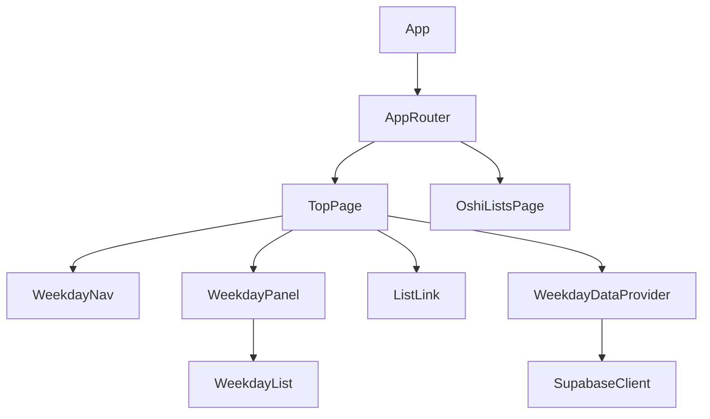
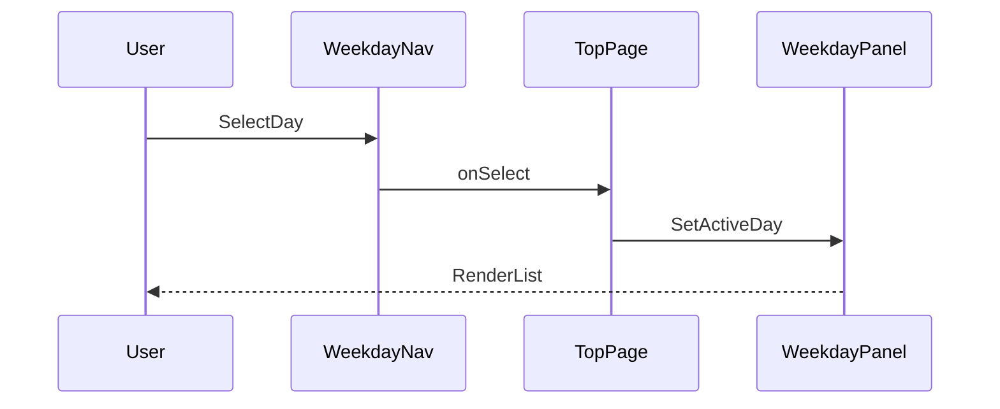
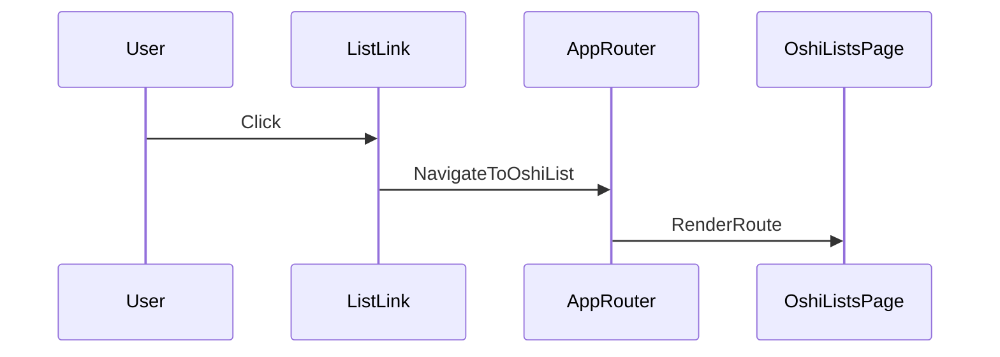

# Technical Design: top-page-layout-weekday-list

## Overview
本機能は、訪問者がトップページの情報構造を直感的に把握できるように、骨組みレイアウトと曜日別一覧表示を提供する。曜日ナビゲーションとリスト導線を明確に分離し、推しの漫画・動画にアクセスしやすい入口を整備する。

対象ユーザーは、トップページから目的の曜日や一覧へ移動したい訪問者である。影響範囲はトップページの情報設計とナビゲーション構造であり、既存の単一ページ構成に依存しない。

### Goals
- トップページの主要エリアを視覚的に区分し、導線の役割を明確化する
- 週7日すべての曜日一覧を切り替えて閲覧できるUIを提供する
- 推しリスト一覧ページへの導線をトップページ内に設置し、別ルートに遷移できるようにする

### Non-Goals
- 推しリストページ自体の詳細UI/実装
- 認証・権限管理の導入
- Supabaseのスキーマ最適化や高度な検索機能

## Architecture

### Existing Architecture Analysis (if applicable)
- 現状は`src/App.jsx`にUIが集約されており、ルーティングやページ分割は未導入。
- CSSはグローバルに適用される構成のため、トップページ専用スタイルの分離が必要。
- 本機能では`react-router`を導入し、最小ルーティング（`/` と `/oshi-lists/`）に限定して移行する。

### Architecture Pattern & Boundary Map


**Architecture Integration**:
- Selected pattern: ComponentizedPage（トップページ責務を分割して構成）
- Domain/feature boundaries: レイアウト制御、曜日切替、一覧表示、導線表示、データ取得を分離
- Existing patterns preserved: React + Vite、グローバルCSS運用
- New components rationale: トップページ構造の明示と状態管理を整理するため
- Steering compliance: UI責務分離、Supabaseクライアント集約方針を維持

### Technology Stack & Alignment

| Layer | Choice / Version | Role in Feature | Notes |
|-------|------------------|-----------------|-------|
| Frontend | React 18.3.1 | トップページUI構築 | 既存スタック維持 |
| Frontend Build | Vite 5.4.10 | 開発/ビルド | 既存スタック維持 |
| Data / Storage | Supabase (PostgreSQL) | 曜日別一覧データ供給 | `@supabase/supabase-js`利用 |
| Runtime | Node.js | 開発実行環境 | 既存スタック維持 |

## System Flows



曜日切替はトップページ内の状態更新で完結し、選択中の曜日を視覚的に強調する。



推しリスト一覧ページへの導線はクライアント側ルート遷移で実現する。

## Requirements Traceability

| Requirement | Summary | Components | Interfaces | Flows |
|-------------|---------|------------|------------|-------|
| 1.1 | 主要エリアの視覚的区分 | TopPage, WeekdayPanel, ListLink | State | - |
| 1.2 | ナビ領域の識別 | WeekdayNav | State | - |
| 1.3 | 主要導線の明示 | TopPage, ListLink | State | - |
| 2.1 | 曜日選択で一覧表示 | WeekdayNav, WeekdayPanel | State | WeekdaySelection |
| 2.2 | 推しリスト一覧ページ導線 | ListLink, AppRouter, OshiListsPage | State | OshiListNavigation |
| 2.3 | 導線の区別表示 | TopPage, WeekdayNav, ListLink | State | - |
| 3.1 | 7曜日の一覧枠 | WeekdayPanel, WeekdayList | State | - |
| 3.2 | 初期表示で1曜日を閲覧可能 | TopPage | State | - |
| 3.3 | 選択中曜日の明示 | WeekdayNav, WeekdayPanel | State | WeekdaySelection |

## Components & Interface Contracts

### Component Summary
| Component | Domain/Layer | Intent | Req Coverage | Key Dependencies (P0/P1) | Contracts |
|-----------|--------------|--------|--------------|--------------------------|-----------|
| AppRouter | UI | ルート判定とページ切替 | 2.2 | TopPage (P0), OshiListsPage (P0) | State |
| TopPage | UI | トップページのレイアウトと状態制御 | 1.1, 1.2, 1.3, 2.1, 3.2 | WeekdayDataProvider (P0) | State |
| WeekdayNav | UI | 曜日ナビゲーションの表示 | 1.2, 2.1, 3.3 | TopPage (P0) | State |
| WeekdayPanel | UI | 選択中曜日の一覧表示枠 | 1.1, 2.1, 3.1, 3.3 | TopPage (P0) | State |
| WeekdayList | UI | 一覧カードのグリッド表示 | 3.1 | WeekdayPanel (P0) | State |
| ListLink | UI | 推しリスト一覧への導線 | 1.3, 2.2, 2.3 | TopPage (P0) | State |
| WeekdayDataProvider | Data | 曜日別一覧データの取得 | 2.1, 3.1, 3.2 | SupabaseClient (P0) | Service |
| OshiListsPage | UI | 推しリスト一覧ページのルート受け皿 | 2.2 | AppRouter (P0) | State |

### UI Layer

#### TopPage

| Field | Detail |
|-------|--------|
| Intent | トップページのレイアウトと状態管理を統括する |
| Requirements | 1.1, 1.2, 1.3, 2.1, 3.2 |

**Responsibilities & Constraints**
- 主要エリア（ナビ、一覧、導線）のレイアウト管理
- 選択中曜日の状態保持と初期選択の決定（JST基準の現在曜日を初期値）
- データ取得状態（loading/error）の制御

**Dependencies**
- Inbound: App — ルート表示 (P0)
- Outbound: WeekdayNav — 曜日切替UI (P0)
- Outbound: WeekdayPanel — 一覧表示 (P0)
- Outbound: ListLink — リスト導線 (P0)
- Outbound: WeekdayDataProvider — データ取得 (P0)

**Contracts**: Service [ ] / API [ ] / Event [ ] / Batch [ ] / State [x]

##### State Management
- State model:
  - `selectedWeekday`: WeekdayKey
  - `weekdayLists`: WeekdayList[]
  - `isLoading`: boolean
  - `error`: WeekdayDataError | null
- Persistence & consistency: ページ内メモリのみ
- Concurrency strategy: 最新取得を優先、選択中曜日は維持

**Implementation Notes**
- Integration: Supabase未設定時は空状態に切替
- Validation: 選択曜日は`WeekdayKey`のみに限定
- Risks: JST基準の現在曜日算出は境界時刻の挙動を要確認

#### AppRouter
Summary-only. `react-router`でルートを判定し、`/` と `/oshi-lists/` の表示を切り替える。

#### WeekdayNav
Summary-only. 表示のみを担当し、イベントは`TopPage`に委譲する。

#### WeekdayPanel
Summary-only. 選択中の曜日と一致する一覧だけを表示する。

#### WeekdayList
Summary-only. 一覧カードの描画のみを担当する。

#### ListLink
Summary-only. 推しリスト一覧ページ（`/oshi-lists/`）への導線表示と遷移トリガーに限定する。

#### OshiListsPage
Summary-only. 推しリスト一覧ページのルート表示枠としてのみ扱う。

### Data Layer

#### WeekdayDataProvider

| Field | Detail |
|-------|--------|
| Intent | 曜日別一覧データを取得し、UIに供給する |
| Requirements | 2.1, 3.1, 3.2 |

**Responsibilities & Constraints**
- Supabaseから曜日別一覧の取得を行う
- 未設定時はエラー状態を返却する
- 一覧は人気順（降順）で返却する
- 取得対象は「現在から過去1週間」内に投稿された動画に限定する

**Dependencies**
- Inbound: TopPage — データ要求 (P0)
- External: SupabaseClient — 読み取りAPI (P0)

**Contracts**: Service [x] / API [ ] / Event [ ] / Batch [ ] / State [ ]

##### Service Interface
```typescript
type WeekdayKey = 'mon' | 'tue' | 'wed' | 'thu' | 'fri' | 'sat' | 'sun'

type WeekdayDataError = 'not_configured' | 'network' | 'unknown'

type WeekdayListResult =
  | { ok: true; data: WeekdayList[] }
  | { ok: false; error: WeekdayDataError }

interface WeekdayDataProvider {
  fetchWeekdayLists(): Promise<WeekdayListResult>
}
```
- Preconditions: Supabase接続が有効、またはフォールバック可能
- Postconditions: `ok=true`時は曜日ごとの一覧を返却
- Invariants: `WeekdayKey`以外の曜日は返却しない

**Implementation Notes**
- Integration: Supabaseテーブル`movie`を読み取り
- Validation: 欠損データは空配列として扱う
- Query: `update >= (today - 6 days)` を満たす行を取得し、`favorite_count`降順で並べ替える（JST基準）
- Dev Setup: 開発時は`movie`の作成と、過去1週間分の動画サンプルを曜日別に投入して人気順確認ができる状態にする
- Risks: `update`の粒度が粗い場合は境界時刻の扱いを要確認

## Data Models

### Domain Model
- Aggregates: WeekdayList
- Entities: WeekdayListItem
- Business rules: 各アイテムは必ず1つの曜日に紐づく

### Logical Data Model

**Structure Definition**:
- WeekdayList
  - weekday: WeekdayKey
  - items: WeekdayListItem[]
- WeekdayListItem
  - id: string
  - title: string
  - popularityScore: number
  - thumbnailUrl: string | null
  - detailPath: string
  - publishedAt: string
  - weekday: WeekdayKey
  - seriesId: string | null

**Consistency & Integrity**:
- 曜日は`WeekdayKey`に限定
- 公開対象のみを表示対象とする

### Physical Data Model
**Relational (Supabase/PostgreSQL)**
- `movie`
  - `movie_id` (uuid, pk)
  - `movie_title` (text)
  - `url` (text)
  - `favorite_count` (integer)
  - `update` (timestamptz)
  - `series_id` (uuid, nullable)
  - `weekday` (text)

### Data Setup (Dev)
- `movie`を作成し、過去1週間分の動画サンプルを曜日別に投入する
- 各曜日に最低1件のデータを用意し、人気順の並び替えが確認できる状態にする

## Error Handling

### Error Strategy
- データ取得失敗時は空状態とエラーメッセージを表示
- Supabase未設定時は明示的に「設定不足」を通知

### Error Categories and Responses
- User Errors: なし（閲覧機能のみ）
- System Errors: ネットワーク障害 → 再読み込み導線を提示
- Business Logic Errors: 公開フラグ未設定 → 画面に表示しない

### Monitoring
- フロント側ログとSupabaseのクエリ失敗ログを併用

## Testing Strategy

- Unit Tests: 曜日選択ロジック、初期選択決定、データ正規化
- Integration Tests: WeekdayDataProviderとSupabaseの読み取り
- E2E/UI Tests: 曜日切替、導線クリック、初期表示の一覧表示

## Optional Sections

### Security Considerations
- 公開情報のみ取得できるRLS設定を前提とする
- APIキーは`VITE_*`環境変数で管理する

### Performance & Scalability
- 曜日別一覧はキャッシュ可能な読み取りとし、初回取得後は再利用する
- 画像は遅延読み込みを前提とする

## Supporting References (Optional)
- `research.md`
