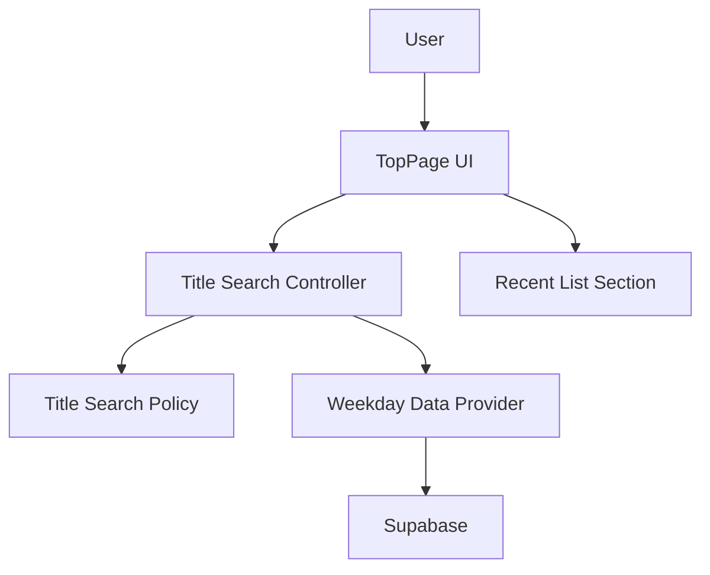
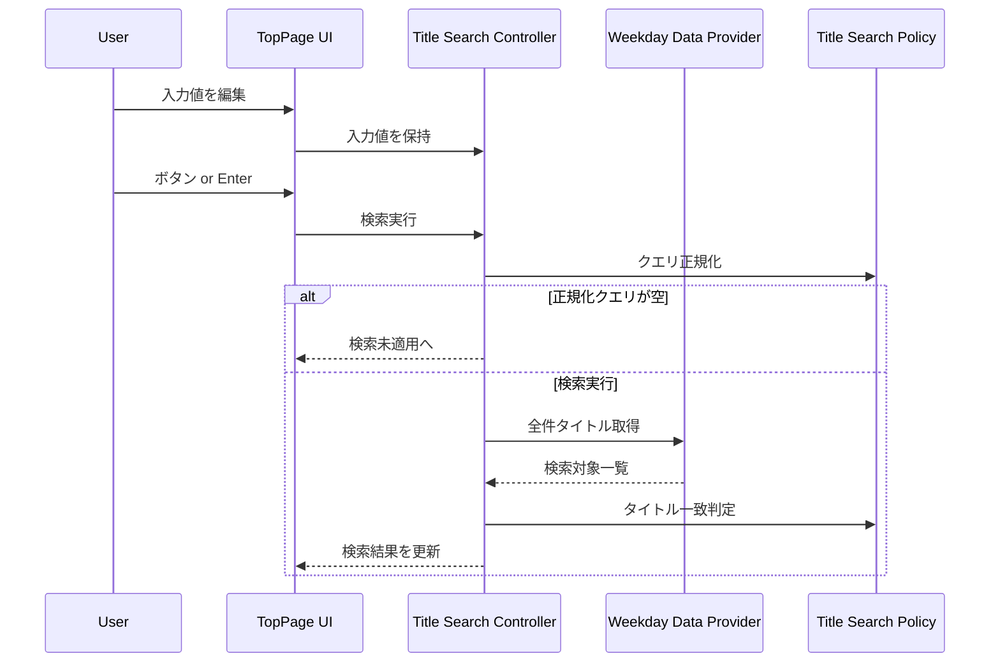

# Technical Design Document

## Overview
トップページに「タイトル検索」を追加し、利用者が作品名で一覧を絞り込めるようにする。入力値は検索クエリとして保持され、検索実行時にタイトル一致(部分一致、大小/全半角、空白整形)で結果が更新される。

検索結果は曜日別一覧の枠内で表示し、検索適用中は過去分を含む全一覧データを対象とする。一方で、過去100件の作品セクションは従来どおり100件制限を維持し、検索とは独立して表示される。

### Goals
- 1.1〜1.3の操作要件に沿って、入力保持と検索実行を分離したUIを提供する
- 2.1〜2.6の一致判定を満たす検索結果を表示する
- 3.1〜3.5の状態表示を明確にし、検索適用中/未適用の切替を分かりやすくする

### Non-Goals
- サーバー側検索APIやDBスキーマ変更の導入
- 検索結果の永続化やURLクエリ同期
- 詳細なランキングやタグ検索などの複合検索

## Requirements Traceability

| Requirement | Summary | Components | Interfaces | Flows |
|-------------|---------|------------|------------|-------|
| 1.1 | 入力値を検索クエリとして保持する | TopPage, TitleSearchController | State | TitleSearchApplyFlow |
| 1.2 | ボタン/Enterで検索開始 | TopPage, TitleSearchController | State | TitleSearchApplyFlow |
| 1.3 | 空クエリは未適用扱い | TitleSearchController | State | TitleSearchApplyFlow |
| 2.1 | 過去分を含む全一覧データを対象 | WeekdayDataProvider, TitleSearchController | Service, State | TitleSearchApplyFlow |
| 2.2 | 部分一致で検索 | TitleSearchPolicy | Service | TitleSearchApplyFlow |
| 2.3 | 大文字/小文字を無視 | TitleSearchPolicy | Service | TitleSearchApplyFlow |
| 2.4 | 全角/半角を無視 | TitleSearchPolicy | Service | TitleSearchApplyFlow |
| 2.5 | 空白整形を適用 | TitleSearchPolicy | Service | TitleSearchApplyFlow |
| 2.6 | クエリ更新で結果更新 | TitleSearchController | State | TitleSearchApplyFlow |
| 3.1 | 検索結果一覧を表示 | TopPage | State | TitleSearchApplyFlow |
| 3.2 | 0件メッセージ表示 | TopPage | State | TitleSearchApplyFlow |
| 3.3 | 未適用時は通常一覧 | TopPage | State | TitleSearchApplyFlow |
| 3.4 | 検索中は100件制限を解除 | TopPage, TitleSearchController | State | TitleSearchApplyFlow |
| 3.5 | 過去100件セクションは維持 | TopPage | State | - |

## Architecture

### Existing Architecture Analysis
- `TopPage`が曜日別一覧と過去100件一覧を同一画面で構成し、`weekdayDataProvider`を介してSupabaseからデータを取得している。
- 一覧描画はローカル状態と`sortItems`で整列し、100件制限は`MAX_LIST_ITEMS`のスライスで適用している。
- 検索に関する既存ロジックはなく、入力スタイルは`App.css`の`.search`を再利用可能。

### Architecture Pattern & Boundary Map
**Architecture Integration**:
- Selected pattern: UI + stateful hook + data provider拡張 (軽量MVC相当)
- Domain/feature boundaries: UI表示と検索状態制御、データ取得/正規化を分離
- Existing patterns preserved: `TopPage`内のローカル状態管理、`weekdayDataProvider`のResult型
- New components rationale: 検索正規化と検索データ取得の境界を明確化
- Steering compliance: React/Vite構成とSupabaseクライアント分離を維持



## Technology Stack & Alignment

| Layer | Choice / Version | Role in Feature | Notes |
|-------|------------------|-----------------|-------|
| Frontend | React 18.3.1 + Vite 5.4.10 | 検索UIと状態管理 | 既存構成を維持 | 
| Frontend Routing | react-router-dom 6.30.1 | 既存のURL同期に影響なし | 新規ルート追加なし |
| Data Access | @supabase/supabase-js 2.90.1 | 検索対象データの取得 | 既存クライアント拡張のみ |
| Data Storage | Supabase PostgreSQL | `movie`テーブル参照 | スキーマ変更なし |

## System Flows



- 検索適用中は`TopPage`の一覧表示が検索結果に切り替わり、100件制限は適用しない。
- 過去100件セクションは別の状態で維持され、検索フローの影響を受けない。

## Components & Interface Contracts

### Components Summary
| Component | Domain/Layer | Intent | Req Coverage | Key Dependencies (P0/P1) | Contracts |
|-----------|--------------|--------|--------------|--------------------------|-----------|
| TopPage | UI | 検索UI/結果表示を含むトップページの統合 | 1.1, 1.2, 1.3, 3.1, 3.2, 3.3, 3.4, 3.5 | TitleSearchController (P0) | State |
| TitleSearchController | UI State | 検索入力・適用・結果生成の制御 | 1.1, 1.2, 1.3, 2.6, 3.4 | TitleSearchPolicy (P0), WeekdayDataProvider (P0) | Service, State |
| TitleSearchPolicy | Domain | 正規化と部分一致判定 | 2.2, 2.3, 2.4, 2.5 | - | Service |
| WeekdayDataProvider | Data | 検索対象データの取得 | 2.1 | Supabase Client (P0) | Service |

### UI Layer

#### TopPage

| Field | Detail |
|-------|--------|
| Intent | 検索UIの表示と検索結果/通常一覧の切替を担う |
| Requirements | 1.1, 1.2, 1.3, 3.1, 3.2, 3.3, 3.4, 3.5 |

**Responsibilities & Constraints**
- 検索入力欄、検索ボタン、検索状態表示を`top-page__list`内に配置する。
- 検索適用中は一覧表示を検索結果に置換し、100件制限を解除する。
- 過去100件セクションは既存ロジックを維持する。

**Dependencies**
- Inbound: User interaction — 検索入力/実行 (P0)
- Outbound: TitleSearchController — 検索状態の取得/更新 (P0)
- Outbound: SortControl — 既存ソート状態の維持 (P1)

**Contracts**: Service [ ] / API [ ] / Event [ ] / Batch [ ] / State [x]

##### State Management
- State model: `searchInput`, `searchQuery`, `searchResults`, `searchStatus`
- Persistence & consistency: コンポーネント内のローカル状態のみ
- Concurrency strategy: 連続検索は最新実行のみ反映

**Implementation Notes**
- Integration: `.search`スタイルを再利用し、`top-page__list`に検索UIを追加
- Validation: 空クエリは未適用扱いに切替
- Risks: 検索中の読み込み状態が分かりにくい場合は明示メッセージを追加

### UI State Layer

#### TitleSearchController

| Field | Detail |
|-------|--------|
| Intent | 検索入力/適用/結果更新を一貫して管理する |
| Requirements | 1.1, 1.2, 1.3, 2.6, 3.4 |

**Responsibilities & Constraints**
- 入力値と適用クエリを分離し、ボタン/Enterでのみ検索を実行する。
- 検索適用時に全件データを取得し、正規化比較で部分一致を判定する。
- 検索対象データはキャッシュし、再検索時に再取得を避ける。

**Dependencies**
- Inbound: TopPage — 検索実行トリガー (P0)
- Outbound: TitleSearchPolicy — 正規化と一致判定 (P0)
- Outbound: WeekdayDataProvider — 検索対象データ取得 (P0)

**Contracts**: Service [x] / API [ ] / Event [ ] / Batch [ ] / State [x]

##### Service Interface
```typescript
type DataProviderError = 'not_configured' | 'network' | 'unknown'

type Result<T> =
  | { ok: true; data: T }
  | { ok: false; error: DataProviderError }

type TitleSearchItem = {
  id: string
  title: string
  publishedAt: string | null
  popularityScore: number
  detailPath: string | null
  thumbnailUrl: string | null
  seriesId: string | null
  weekday: string | null
}

type TitleSearchState = {
  inputValue: string
  appliedQuery: string
  normalizedQuery: string
  status: 'idle' | 'loading' | 'active' | 'error'
  error: DataProviderError | null
  results: TitleSearchItem[]
}

interface TitleSearchController {
  state: TitleSearchState
  setInput(value: string): void
  applySearch(): void
  clearSearch(): void
}
```
- Preconditions: `applySearch`は入力値がある場合のみ適用し、空の場合は`clearSearch`に遷移する
- Postconditions: 検索適用時は`status=active`で`results`が更新される
- Invariants: `normalizedQuery`は常に正規化済み文字列

**Implementation Notes**
- Integration: 初回検索時に`WeekdayDataProvider.fetchAllItems`を呼び出しキャッシュする
- Validation: 入力値は正規化前後の比較で空文字を判定
- Risks: 大量データ取得時の待ち時間増加

### Domain Layer

#### TitleSearchPolicy

| Field | Detail |
|-------|--------|
| Intent | 正規化と部分一致判定の規約を単一関数に集約する |
| Requirements | 2.2, 2.3, 2.4, 2.5 |

**Responsibilities & Constraints**
- クエリ/タイトルの正規化を同一ルールで適用する。
- 正規化済みの文字列同士で部分一致を判定する。

**Dependencies**
- Inbound: TitleSearchController — 正規化/一致判定 (P0)
- Outbound: none

**Contracts**: Service [x] / API [ ] / Event [ ] / Batch [ ] / State [ ]

##### Service Interface
```typescript
interface TitleSearchPolicy {
  normalize(text: string): string
  matchesTitle(params: { title: string; query: string }): boolean
}
```
- Preconditions: `text`と`query`は文字列として扱えること
- Postconditions: `normalize`はNFKC正規化 + 小文字化 + 空白整形を適用した文字列を返す
- Invariants: `matchesTitle`は正規化済みの部分一致のみを返す

**Implementation Notes**
- Integration: `String.prototype.normalize('NFKC')`を前提に正規化を定義
- Validation: 連続空白は単一スペースに統一
- Risks: 言語特有の表記揺れは完全には吸収できない

### Data Layer

#### WeekdayDataProvider

| Field | Detail |
|-------|--------|
| Intent | 検索対象の全件データを取得する |
| Requirements | 2.1 |

**Responsibilities & Constraints**
- 既存の`fetchWeekdayLists`/`fetchWeekdayItems`に加え、全件検索用の取得メソッドを提供する。
- 取得フィールドは検索と表示に必要な最小構成に限定する。

**Dependencies**
- Inbound: TitleSearchController — 検索対象取得 (P0)
- External: Supabase Client — `movie`テーブル参照 (P0)

**Contracts**: Service [x] / API [ ] / Event [ ] / Batch [ ] / State [ ]

##### Service Interface
```typescript
type FetchAllItemsParams = {
  select?: 'minimal' | 'full'
}

interface WeekdayDataProvider {
  fetchAllItems(params?: FetchAllItemsParams): Promise<Result<TitleSearchItem[]>>
}
```
- Preconditions: Supabaseクライアントが有効であること
- Postconditions: 検索対象の全件タイトルが返る
- Invariants: `Result`の成功/失敗構造は既存と同一

**Implementation Notes**
- Integration: `movie`テーブルからタイトル検索に必要なフィールドのみを取得
- Validation: `update`欠損は除外
- Risks: 大量件数時の応答遅延

## Data Models

### Domain Model
- **TitleSearchItem**: 作品タイトル検索に必要な情報をまとめた値オブジェクト
- **Invariants**: `id`と`title`は必須、`publishedAt`は未設定の場合がある

### Logical Data Model
- **Source**: Supabase `movie`テーブル
- **Fields**: `movie_id`, `movie_title`, `url`, `thumbnail_url`, `favorite_count`, `update`, `series_id`, `weekday`
- **Consistency & Integrity**: `update`がないデータは検索対象から除外する

## Error Handling

### Error Strategy
- 検索データ取得失敗時は`TitleSearchController`が`status=error`とエラー種別を保持する。
- `TopPage`は既存のエラー表記トーンに合わせて検索結果枠内にメッセージを表示する。

### Error Categories and Responses
- **User Errors**: 空クエリは検索未適用として通常一覧へ戻す
- **System Errors**: `not_configured`/`network`/`unknown`を区別し、再検索導線を提示

### Monitoring
- 既存のログ基盤に準拠し、追加の外部監視は行わない

## Testing Strategy

- Unit Tests: 正規化処理、部分一致判定、空クエリの扱い
- Integration Tests: TopPageで検索適用/解除、検索結果0件表示、100件制限解除確認
- E2E/UI Tests: タイトル検索の主要フロー(入力→検索→結果確認)
- Performance/Load: 初回検索の取得件数が多い場合の待ち時間

## Security Considerations
- 認証や権限に関する新規要件はなく、既存方針に準拠する

## Performance & Scalability
- 初回検索は全件取得のため待ち時間が発生し得る。取得フィールドを最小化し、キャッシュを行う。
- データ量が増大した場合は、正規化列導入やサーバー側検索への切替を検討する。
