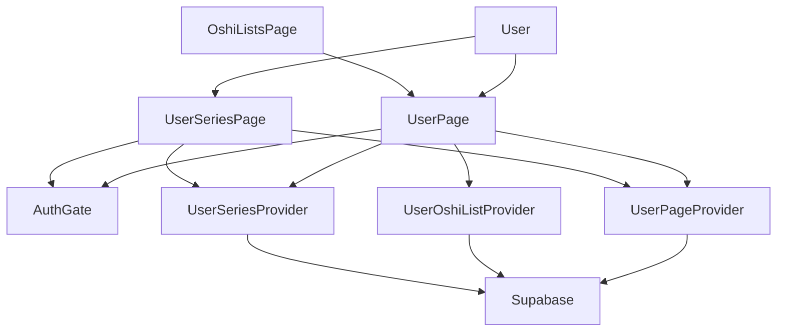
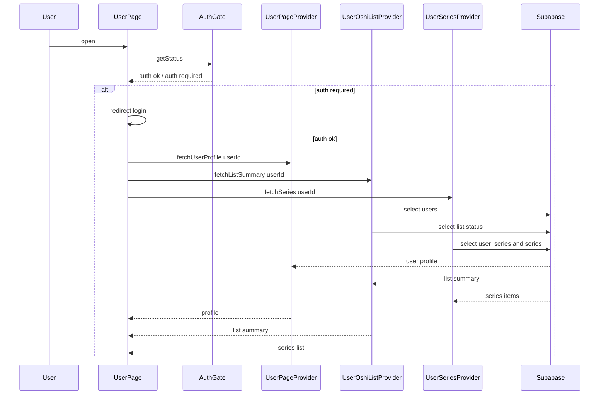
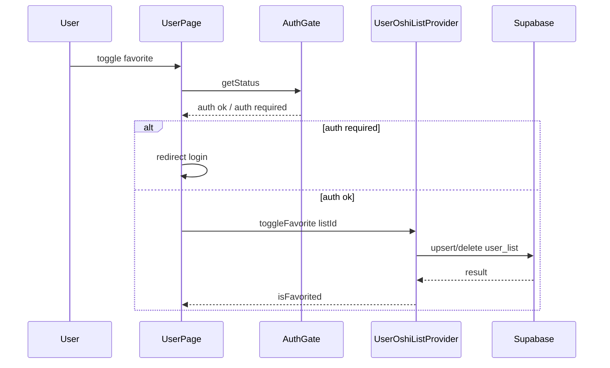
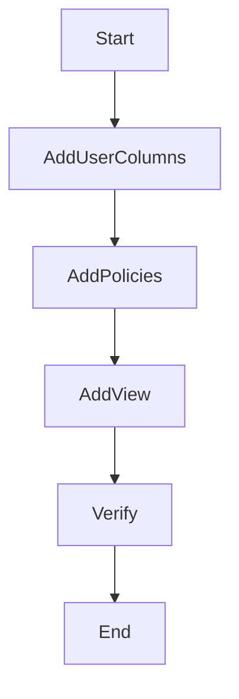

# Design Document

## Overview
本機能は、他者ユーザーのマイページと推し作品一覧ページで、ユーザー情報・推しリスト・推し作品・外部リンクを一貫して閲覧できる体験を提供する。閲覧はログイン必須とし（現状の導線がログイン必須のため）、公開設定やエラー状態を明確に区別したUIを構築する。将来的に未ログイン閲覧を許可する場合は、お気に入り操作のみ無効化する方針（要件7.3）で拡張する。

対象ユーザーはログイン済みの閲覧者であり、他者ユーザーの推し傾向の把握と推しリストのお気に入り登録を行う。既存のReact + SupabaseのUI/DataProvider分離を維持し、`/users/:userId/` と `/users/:userId/oshi-series/` の2ページに共通のユーザー情報と外部リンクを表示する。

### Goals
- 他者ユーザーのユーザー情報と外部リンクを2ページで一貫表示する
- 推しリストと推し作品（シリーズ）を明確な空状態/エラー状態とともに表示する
- 公開/非公開状態を反映し、推しリストの閲覧可否を制御する
- 推しリストのお気に入り登録を永続化し、再表示時も状態を反映する

### Non-Goals
- ユーザー情報や外部リンクの編集・登録UIの実装
- ユーザーアイコンのアップロード/管理機能の新規実装
- 認証基盤やログインフローの刷新
- 既存の推しリスト/推し作品データの作成・編集機能の拡張

## Requirements Traceability

| Requirement | Summary | Components | Interfaces | Flows |
|-------------|---------|------------|------------|-------|
| 1.1 | ユーザーネーム表示 | UserPage, UserInfoPanel, UserPageProvider | State | UserPageLoad |
| 1.2 | アイコン表示 | UserPage, UserInfoPanel, UserPageProvider | State | UserPageLoad |
| 1.3 | アイコン空状態 | UserPage, UserInfoPanel | State | UserPageLoad |
| 1.4 | 読み込み状態 | UserPage, UserInfoPanel | State | UserPageLoad |
| 1.5 | 見出し表示 | UserInfoPanel | State | UserPageLoad |
| 1.6 | 円形表示 | UserInfoPanel | State | UserPageLoad |
| 1.7 | PNG/JPEG/GIF対応 | UserInfoPanel | State | UserPageLoad |
| 2.1 | 推しリスト表示 | UserPage, UserOshiListPanel, UserOshiListProvider | State | UserPageLoad |
| 2.2 | 推し作品表示 | UserPage, UserOshiSeriesPanel, UserSeriesProvider | State | UserPageLoad |
| 2.3 | 推しリスト空状態 | UserPage, UserOshiListPanel | State | UserPageLoad |
| 2.4 | 推し作品空状態 | UserPage, UserOshiSeriesPanel | State | UserPageLoad |
| 2.5 | 読み込み状態 | UserPage, UserOshiListPanel, UserOshiSeriesPanel | State | UserPageLoad |
| 3.1 | 外部リンク一覧表示 | ExternalLinksPanel, UserPageProvider | State | UserPageLoad |
| 3.2 | 表示名表示 | ExternalLinksPanel, UserPageProvider | State | UserPageLoad |
| 3.3 | 無効URL非表示 | ExternalLinksPanel, UserPageProvider | State | UserPageLoad |
| 3.4 | 外部リンク空状態 | ExternalLinksPanel | State | UserPageLoad |
| 3.5 | クリック可能表示 | ExternalLinksPanel | State | UserPageLoad |
| 3.6 | カテゴリ表示 | ExternalLinksPanel | State | UserPageLoad |
| 3.7 | 新規タブ表示 | ExternalLinksPanel | State | UserPageLoad |
| 3.8 | noopener/noreferrer | ExternalLinksPanel | State | UserPageLoad |
| 3.9 | http/httpsのみ表示 | ExternalLinksPanel, UserPageProvider | State | UserPageLoad |
| 4.1 | マイページ適用 | UserPage, UserInfoPanel, ExternalLinksPanel | State | UserPageLoad |
| 4.2 | 推し作品一覧ページ適用 | UserOshiSeriesPage, UserInfoPanel, ExternalLinksPanel | State | UserSeriesLoad |
| 4.3 | 対象ページ以外非表示 | AppRouter | UI State | Navigation |
| 4.4 | 同一ユーザー表示 | UserPage, UserOshiSeriesPage | State | UserPageLoad |
| 5.1 | 推し作品一覧表示 | UserOshiSeriesPage, UserOshiSeriesPanel, UserSeriesProvider | State | UserSeriesLoad |
| 5.2 | 項目表示 | UserOshiSeriesPanel | State | UserSeriesLoad |
| 5.3 | 空状態表示 | UserOshiSeriesPanel | State | UserSeriesLoad |
| 5.4 | 読み込み状態 | UserOshiSeriesPanel | State | UserSeriesLoad |
| 5.5 | 見出し表示 | UserOshiSeriesPage | State | UserSeriesLoad |
| 6.1 | 公開時に推しリスト表示 | UserOshiListPanel, UserOshiListProvider | State | UserPageLoad |
| 6.2 | 非公開時に案内表示 | UserOshiListPanel, UserOshiListProvider | State | UserPageLoad |
| 6.3 | 判定中読み込み表示 | UserOshiListPanel | State | UserPageLoad |
| 6.4 | 公開状態反映 | UserOshiListPanel, UserOshiListProvider | State | UserPageLoad |
| 7.1 | お気に入り操作表示 | UserOshiListPanel | State | FavoriteToggle |
| 7.2 | 登録済み表示 | UserOshiListPanel | State | FavoriteToggle |
| 7.3 | 未ログイン無効化 | AuthGate, UserOshiListPanel | Service | FavoriteToggle |
| 7.4 | 失敗時エラー | UserOshiListPanel | State | FavoriteToggle |
| 7.5 | 再表示後も反映 | UserOshiListProvider | Service | UserPageLoad |
| 8.1 | ユーザーネームリンク | OshiListsPage | UI State | Navigation |
| 8.2 | リンク遷移 | AppRouter, UserPage | UI State | Navigation |
| 8.3 | 存在しないユーザーのエラー | UserPage | State | UserPageLoad |
| 9.1 | 再表示で最新情報 | UserPageProvider, UserOshiListProvider, UserSeriesProvider | Service | UserPageLoad |
| 9.2 | ユーザー不存在エラー | UserPage | State | UserPageLoad |
| 9.3 | 再試行ボタン表示 | UserPage, UserOshiSeriesPage | State | UserPageLoad |
| 9.4 | エラーと空状態の区別 | UserPage, UserOshiSeriesPage | State | UserPageLoad |

## Architecture

### Existing Architecture Analysis (if applicable)
- Reactページは`DataProvider`を通してSupabaseへアクセスする構成。
- 認証は`AuthGate`でセッションを確認し、未ログイン時はログインページへ遷移する。
- ルーティングは`AppRouter`で管理し、ページ単位でUI責務を分離する。

### Architecture Pattern & Boundary Map



**Architecture Integration**:
- Selected pattern: UI + DataProvider分離を継続し、ページごとに取得契約を明示する。
- Domain/feature boundaries: ユーザー情報/外部リンク、推しリスト、推し作品を別Providerに分離する。
- Existing patterns preserved: `AuthGate`によるログイン必須、`supabaseClient`依存のProvider構成。
- New components rationale: `userId`起点の取得ロジックが既存Providerと異なるため専用Providerを追加する。
- Steering compliance: React + Supabase構成と責務分離の原則に準拠する。

### Technology Stack

| Layer | Choice / Version | Role in Feature | Notes |
|-------|------------------|-----------------|-------|
| Frontend / CLI | React 18.3.1 | ユーザーページUIと状態管理 | 既存Hookを利用 |
| Frontend / CLI | react-router-dom 6.30.1 | `/users/:userId/`ルーティング | 既存ルータに追加 |
| Backend / Services | @supabase/supabase-js 2.90.1 | 認証とDBアクセス | DataProviderから利用 |
| Data / Storage | PostgreSQL (Supabase) | ユーザー/リスト/シリーズ保持 | RLSで公開制御 |
| Data / Storage | Supabase Storage | ユーザーアイコン格納 | `icon_url`参照のみ |

## System Flows

### User Page Load Flow

- 認証失敗時はログインページへ遷移する。
- データ取得は並列で実行し、部分失敗時は該当セクションのみエラー表示する。
- 非公開データの「内容」は`can_display=true`で取得段階から除外し、RLSでも同条件を強制する。
- ただし公開/非公開の判定メタは`user_list_visibility`ビュー経由で取得可能にする。
- `UserPageProvider`が`not_found`の場合はページ全体を「ユーザー不存在」エラーに統一し、他セクションは表示しない。

### Favorite Toggle Flow

- 失敗時はエラー状態を表示し、UI状態は更新しない。
- `listId`が`null`、または`status=private`の場合はUIで操作を無効化し、Providerは`invalid_input`で拒否する。
- `user_list (user_id, list_id)`のユニーク制約を前提に原子的に更新し、競合時も最終状態を返す。
- `user_list`へのinsert/deleteは「本人のみ許可」のRLSポリシーを前提とする（`auth.uid() = user_id`）。

## Components and Interfaces

| Component | Domain/Layer | Intent | Req Coverage | Key Dependencies (P0/P1) | Contracts |
|-----------|--------------|--------|--------------|--------------------------|-----------|
| UserPage | UI | 他者ユーザーのマイページ表示 | 1.1-1.7, 2.1-2.5, 3.1-3.9, 4.1-4.4, 6.1-6.4, 7.1-7.5, 9.1-9.4 | UserPageProvider(P0), UserOshiListProvider(P0), UserSeriesProvider(P0), AuthGate(P0) | State |
| UserOshiSeriesPage | UI | 他者ユーザーの推し作品一覧ページ | 4.2-4.4, 5.1-5.5, 9.1-9.4 | UserPageProvider(P0), UserSeriesProvider(P0), AuthGate(P0) | State |
| UserInfoPanel | UI | ユーザー名とアイコンの表示 | 1.1-1.7 | UserPageProvider(P0) | State |
| ExternalLinksPanel | UI | 外部リンクの表示 | 3.1-3.9 | UserPageProvider(P0) | State |
| UserOshiListPanel | UI | 推しリスト概要とお気に入り操作 | 2.1-2.5, 6.1-6.4, 7.1-7.5 | UserOshiListProvider(P0), AuthGate(P0) | State |
| UserOshiSeriesPanel | UI | 推し作品一覧の表示 | 2.2-2.5, 5.1-5.5 | UserSeriesProvider(P0) | State |
| UserPageProvider | Data | ユーザー情報と外部リンク取得 | 1.1-1.7, 3.1-3.9, 9.1-9.2 | Supabase(P0) | Service |
| UserOshiListProvider | Data | 推しリスト概要とお気に入り操作 | 2.1-2.5, 6.1-6.4, 7.1-7.5, 9.1 | Supabase(P0) | Service |
| UserSeriesProvider | Data | 推し作品（シリーズ）一覧取得 | 2.2-2.5, 5.1-5.5, 9.1 | Supabase(P0) | Service |
| AuthGate | Service | 認証状態の検査 | 4.1-4.2, 7.3 | Supabase Auth(P0) | Service |
| AppRouter | UI | ルーティング追加 | 4.3, 8.2 | react-router-dom(P0) | State |
| OshiListsPage | UI | ユーザー名リンク提供 | 8.1 | UserPage(P1) | State |

### UI

#### UserPage

| Field | Detail |
|-------|--------|
| Intent | 他者ユーザー情報と推しリスト/推し作品/外部リンクを統合表示する |
| Requirements | 1.1-1.7, 2.1-2.5, 3.1-3.9, 4.1-4.4, 6.1-6.4, 7.1-7.5, 9.1-9.4 |

**Responsibilities & Constraints**
- ログイン必須で未ログイン時はログインページへ遷移する
- セクションごとに読み込み/空/エラー状態を区別して表示する
- 推しリストが非公開の場合は非公開メッセージのみ表示する

**Dependencies**
- Inbound: AppRouter — `/users/:userId/`のルート (P0)
- Outbound: UserPageProvider — ユーザー情報/外部リンク (P0)
- Outbound: UserOshiListProvider — 推しリスト概要とお気に入り (P0)
- Outbound: UserSeriesProvider — 推し作品一覧 (P0)
- Outbound: AuthGate — 認証チェック (P0)

**Contracts**: Service [ ] / API [ ] / Event [ ] / Batch [ ] / State [x]

##### State Management
- State model: `profile`, `links`, `listSummary`, `seriesItems`, `loading`, `errorBySection`
- Persistence & consistency: ページ再表示で最新取得、局所的に再試行可能
- Concurrency strategy: セクション単位で独立したロード状態を管理
- `not_found`時は全体エラーに切り替え、他セクションの状態更新を無効化する

**Implementation Notes**
- Integration: `userId`はURLパラメータから取得し全Providerに渡す
- Validation: `userId`が空の場合は即時エラー扱い
- Risks: 同時取得の部分失敗でUIの整合性が崩れる

#### UserOshiSeriesPage

| Field | Detail |
|-------|--------|
| Intent | 他者ユーザーの推し作品一覧を専用ページで表示する |
| Requirements | 4.2-4.4, 5.1-5.5, 9.1-9.4 |

**Responsibilities & Constraints**
- ユーザー情報と外部リンクを上部に共通表示する
- 推し作品一覧はシリーズ単位で表示する

**Dependencies**
- Inbound: AppRouter — `/users/:userId/oshi-series/`のルート (P0)
- Outbound: UserPageProvider — ユーザー情報/外部リンク (P0)
- Outbound: UserSeriesProvider — 推し作品一覧 (P0)
- Outbound: AuthGate — 認証チェック (P0)

**Contracts**: Service [ ] / API [ ] / Event [ ] / Batch [ ] / State [x]

##### State Management
- State model: `profile`, `links`, `seriesItems`, `loading`, `errorBySection`
- Persistence & consistency: ページ再表示で最新取得
- Concurrency strategy: ページ遷移時にロード状態を初期化

**Implementation Notes**
- Integration: UserPageと同一の`UserInfoPanel`と`ExternalLinksPanel`を使用
- Validation: 取得失敗時はエラーセクションと再試行ボタンを表示
- Risks: 取得失敗時の共通UIが重複表示される

#### UserInfoPanel (summary only)
- ユーザー名、アイコン、見出しの表示のみを担当する
- アイコンは円形表示、未設定時はプレースホルダを表示

#### ExternalLinksPanel (summary only)
- X/YouTube/その他カテゴリでリンクを表示する
- 有効な`http/https` URLのみ表示し、`label`は任意（URLが無効な場合は表示しない）
- カテゴリ判定はドメインで行う（例: `x.com`/`twitter.com`→X、`youtube.com`/`youtu.be`→YouTube、それ以外→その他）
- `target="_blank"`と`rel="noopener noreferrer"`を必須付与

#### UserOshiListPanel (summary only)
- 推しリストの公開状態、一覧/空状態、 お気に入りボタンを表示

#### UserOshiSeriesPanel (summary only)
- 推し作品（シリーズ）一覧の表示と空状態の表現のみを担当

### Data

#### UserPageProvider

| Field | Detail |
|-------|--------|
| Intent | ユーザー情報と外部リンクの取得を提供 |
| Requirements | 1.1-1.7, 3.1-3.9, 9.1-9.2 |

**Responsibilities & Constraints**
- `users`テーブルからユーザー名とアイコンURLを取得する
- 外部リンクは`URL`検証後に有効なものだけ返す

**Dependencies**
- Inbound: UserPage, UserOshiSeriesPage — 取得要求 (P0)
- Outbound: Supabase — `users`取得 (P0)

**Contracts**: Service [x] / API [ ] / Event [ ] / Batch [ ] / State [ ]

##### Service Interface
```typescript
type ExternalLinkCategory = 'x' | 'youtube' | 'other'

type ExternalLink = {
  category: ExternalLinkCategory
  url: string
  label: string | null
}

type UserProfile = {
  userId: string
  name: string
  iconUrl: string | null
  links: ExternalLink[]
}

type ProviderError =
  | 'auth_required'
  | 'not_found'
  | 'invalid_input'
  | 'network'
  | 'not_configured'
  | 'unknown'

interface UserPageProvider {
  fetchUserProfile(userId: string): Promise<
    | { ok: true; data: UserProfile }
    | { ok: false; error: ProviderError }
  >
}
```
- Preconditions: `userId`は空文字不可
- Postconditions: `links`は`http/https`のみ含む
- Invariants: 無効URLは常に除外する

**Implementation Notes**
- Integration: `x_url`/`youtube_url`/`other_url`をカテゴリ別リンクに変換
- Validation: `URL` APIで構文と`protocol`を検証
- Normalization: `label`はURLが有効な場合のみ付与し、URLが無効なら`links`から除外する
- Categorization: `x.com`/`twitter.com`は`x`、`youtube.com`/`youtu.be`は`youtube`、その他は`other`
- Risks: `users`レコードが存在しない場合は`not_found`を返す

#### UserOshiListProvider

| Field | Detail |
|-------|--------|
| Intent | 他者ユーザーの推しリスト概要とお気に入り操作を提供 |
| Requirements | 2.1-2.5, 6.1-6.4, 7.1-7.5, 9.1 |

**Responsibilities & Constraints**
- `userId`から対象の`list_id`を解決して概要を返す
- 公開/非公開を判定し、非公開時は操作を無効化する
- お気に入り状態は`user_list`で永続化する

**Dependencies**
- Inbound: UserPage — 取得/操作 (P0)
- Outbound: Supabase — `list`, `user_list` (P0)

**Contracts**: Service [x] / API [ ] / Event [ ] / Batch [ ] / State [ ]

##### Service Interface
```typescript
type ListStatus = 'public' | 'private' | 'none' | 'not_found'

type UserOshiListSummary = {
  listId: string | null
  status: ListStatus
  favoriteCount: number | null
  isFavorited: boolean
}

type ListSummaryResult =
  | { ok: true; data: UserOshiListSummary }
  | { ok: false; error: ProviderError }

type ToggleFavoriteResult =
  | { ok: true; data: { isFavorited: boolean } }
  | { ok: false; error: ProviderError }

interface UserOshiListProvider {
  fetchListSummary(userId: string): Promise<ListSummaryResult>
  toggleFavorite(listId: string): Promise<ToggleFavoriteResult>
}
```
- Preconditions: `userId`/`listId`は空文字不可
- Postconditions: `status=private`時は`favoriteCount=null`で返す
- Invariants: 非公開リストは内容を表示しない
- Status mapping: `status=none`はリスト未作成、`status=not_found`はユーザー不存在、`status=public`のみ`listId`が非null

**Implementation Notes**
- Integration: 公開状態は`user_list_visibility.can_display`から判定し、`status`として返す
- Integration: `user_list_visibility`は`user_exists`/`list_exists`を返し、`status`判定に利用する
- Validation: 非公開時は`toggleFavorite`をUIで無効化し、Providerは`invalid_input`で拒否する
- UI分岐: `status=private`は非公開メッセージを表示、`status=none`は空状態を表示する
- Risks: 公開判定が欠落すると非公開情報が露出する

#### UserSeriesProvider

| Field | Detail |
|-------|--------|
| Intent | 他者ユーザーの推し作品（シリーズ）一覧取得 |
| Requirements | 2.2-2.5, 5.1-5.5, 9.1 |

**Responsibilities & Constraints**
- `user_series`と`series`を結合しシリーズ単位で返す
- 空状態とエラー状態をUIで区別できるよう結果を返す

**Dependencies**
- Inbound: UserPage, UserOshiSeriesPage — 一覧取得 (P0)
- Outbound: Supabase — `user_series`, `series` (P0)

**Contracts**: Service [x] / API [ ] / Event [ ] / Batch [ ] / State [ ]

##### Service Interface
```typescript
type UserSeriesItem = {
  seriesId: string
  title: string
  favoriteCount: number | null
  updatedAt: string | null
}

type SeriesResult =
  | { ok: true; data: UserSeriesItem[] }
  | { ok: false; error: ProviderError }

interface UserSeriesProvider {
  fetchSeries(userId: string): Promise<SeriesResult>
}
```
- Preconditions: `userId`は空文字不可
- Postconditions: 返却リストはシリーズ単位
- Invariants: 非公開のシリーズは除外する

**Implementation Notes**
- Integration: `user_series.can_display=true`を必須条件に含め、非公開シリーズは取得結果に含めない
- Validation: `series_id`と`title`が欠損した行は除外
- Risks: `series`テーブルのRLSが未更新だと取得が失敗する

## Data Models

### Domain Model
- Aggregates: `UserProfile`（ユーザー情報と外部リンクの集合）
- Entities: `User`, `OshiList`, `UserSeries`
- Business rules: 非公開リストは閲覧不可、外部リンクは`http/https`のみ表示

### Logical Data Model

**Structure Definition**:
- `users`: `user_id` (PK), `name`, `icon_url`, `x_url`, `x_label`, `youtube_url`, `youtube_label`, `other_url`, `other_label`, `created_at`
- `list`: `list_id` (PK), `user_id`, `favorite_count`, `can_display`, `created_at`
- `user_list`: `user_id`, `list_id`, `created_at`
- `user_series`: `user_id`, `series_id`, `can_display`, `created_at`
- `series`: `series_id` (PK), `title`, `favorite_count`, `update`

**Consistency & Integrity**:
- `list.user_id`はリストの所有者IDと一致する
- `user_series`はシリーズ単位の公開可否を保持する
- 外部リンク表示名は該当URLと対で管理する
- `user_list`は(`user_id`, `list_id`)で一意になるよう制約を設ける

### Physical Data Model

**For Relational Databases**:
- `users`追加列: `icon_url text`, `x_label text`, `youtube_label text`, `other_label text`
- `user_series`インデックス: `(user_id)`で一覧取得を高速化
- `list`インデックス: `(user_id)`で対象ユーザーのリスト特定を高速化
- 追加ビュー案: `user_list_visibility` (user_id, list_id, can_display, user_exists, list_exists)

### Data Contracts & Integration

**API Data Transfer**
- `users`取得: `user_id`, `name`, `icon_url`, `x_url`, `x_label`, `youtube_url`, `youtube_label`, `other_url`, `other_label`
- `list`取得: `list_id`, `favorite_count`, `can_display`
- `user_list`取得: `list_id` (お気に入り判定)
- `user_series` + `series`取得: `series_id`, `title`, `favorite_count`, `update`

**Cross-Service Data Management**
- RLSで`list.can_display=true`を強制し、非公開リストの「内容」は取得段階で遮断する
- アプリ側のクエリでも`can_display=true`を必須条件にして内容の二重防御を行う
- `users`/`list`/`user_series`/`series`は認証ユーザーの読み取りを許可し、公開データのみ参照可能にする
- 公開/非公開の判定メタは`user_list_visibility`ビューを通して取得可能にする
- `user_list_visibility`は「認証済みユーザーに対して公開/非公開判定メタのみ参照可」を前提とし、実データは`can_display=true`のものだけ参照可とする
- `user_list_visibility`は`user_exists`/`list_exists`を返し、空状態とエラー状態を区別する

## Error Handling

### Error Strategy
- 認証失敗時は`auth_required`を返しログインページへ遷移する
- `not_found`と`empty`を区別し、空状態とエラー状態を明確に分離する
- 取得失敗は`network`/`unknown`で分類し再試行導線を表示する

### Error Categories and Responses
- User Errors: `invalid_input` → 画面内の案内表示
- System Errors: `network`/`unknown` → 再試行ボタンと案内
- Business Logic Errors: `private`相当 → 非公開メッセージ表示

### Monitoring
- 現状はUIログのみ、将来的にログ基盤連携を検討

## Testing Strategy

### Unit Tests
- `UserPageProvider.fetchUserProfile`のURL検証とリンク分類
- `UserOshiListProvider.fetchListSummary`の公開/非公開分岐
- `UserSeriesProvider.fetchSeries`の空状態と欠損排除

### Integration Tests
- ユーザーページで情報・リンク・推し作品が同時取得されること
- 非公開リスト時にお気に入り操作が無効化されること
- 無効URLが外部リンク一覧から除外されること

### E2E/UI Tests
- `/users/:userId/`未ログイン時にログインへ遷移
- `/users/:userId/oshi-series/`で推し作品一覧が表示される
- みんなの推しリストからユーザーページへ遷移できる

## Security Considerations
- 外部リンクは`target="_blank"` + `rel="noopener noreferrer"`を必須とする
- `list`と`user_series`はRLSで公開/非公開を制御する
- `user_list`はRLSで「本人のみ insert/delete 可」を必須とする
- `users`/`list`/`user_series`/`series`の読み取りポリシーを明記し、公開データのみ閲覧可能とする
- アイコンはSupabase Storageの公開/非公開設定に合わせてURLを管理する

## Performance & Scalability
- `user_series`は`user_id`でのフィルタを前提にインデックスを付与する
- 推し作品一覧は必要最小限のカラムのみ取得し、描画負荷を抑える

## Migration Strategy


- AddUserColumns: `users.icon_url`と各表示名カラムを追加
- AddPolicies: `series`のauthenticated読み取りポリシーを追加
- AddView: 公開状態判定用の`user_list_visibility`ビューを追加
- Verify: ユーザーページと推し作品一覧ページの表示を確認
