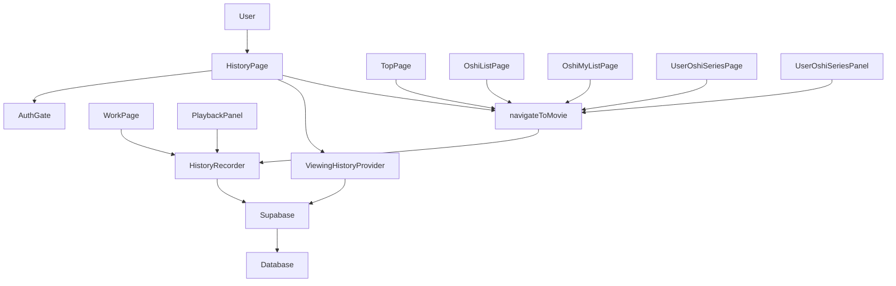
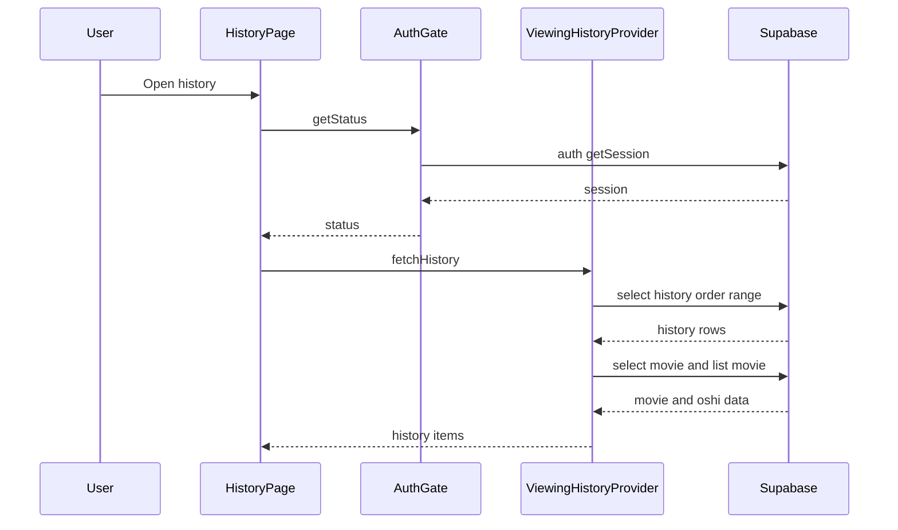
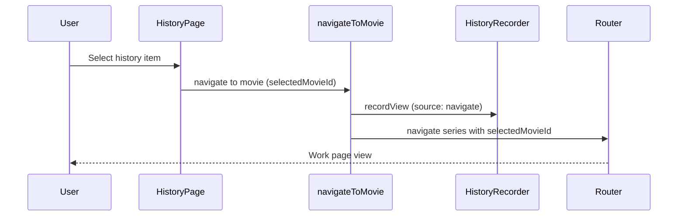
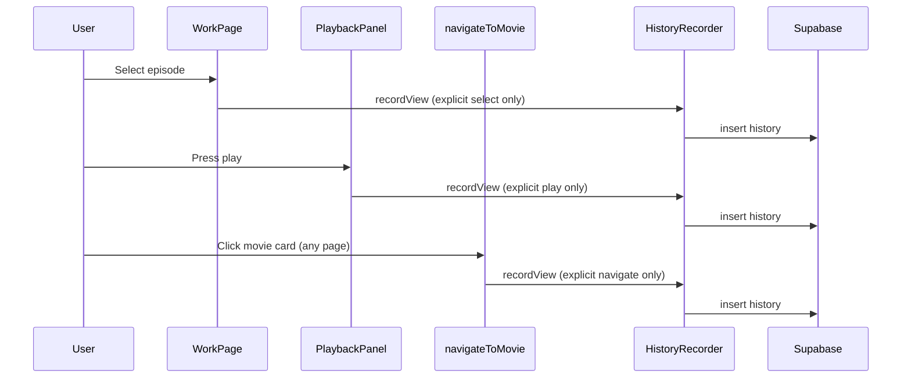
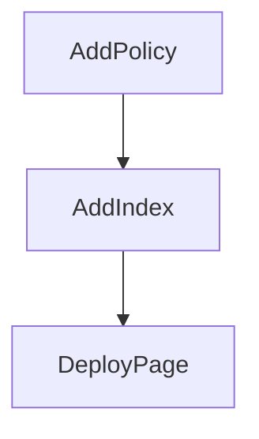

# Viewing History Page Design

## Overview
閲覧履歴ページは、ログイン済みユーザーが最近視聴した動画へ素早く戻れるようにするための機能である。履歴の取得・表示・遷移・記録という一連の行動を、既存のReactページとSupabaseデータプロバイダ構造に沿って拡張する。

対象ユーザーはログイン済みの視聴者であり、閲覧履歴の30件表示、推しバッジ/推し数の表示、履歴項目からの話数ページ遷移が主な利用フローになる。未ログイン時はログイン誘導を行い、履歴情報は表示しない。


### Goals
- ログイン済みユーザーの閲覧履歴30件を時系列で表示する
- 履歴項目から該当話数ページへ遷移できる
- 閲覧記録を指定タイミング（遷移・話数切替・再生開始）で残す
 - 履歴は「1回の操作＝1件」として記録する

### Non-Goals
- 履歴の削除や編集
- 履歴の共有・公開設定
- 履歴データの自動削除（表示対象外のみ）

## Requirements Traceability

| Requirement | Summary | Components | Interfaces | Flows |
| --- | --- | --- | --- | --- |
| 1.1 | 履歴一覧を表示 | HistoryPage, ViewingHistoryProvider | State | Flow A |
| 1.2 | `/history/`でアクセス | AppRouter, HistoryPage | State | Flow A |
| 1.3 | タイトル表示 | HistoryPage | State | Flow A |
| 1.4 | サムネイル表示 | HistoryPage | State | Flow A |
| 1.5 | 最終閲覧日時表示 | HistoryPage | State | Flow A |
| 1.6 | 新しい順に表示 | ViewingHistoryProvider | Service | Flow A |
| 1.7 | 直近30件のみ | ViewingHistoryProvider | Service | Flow A |
| 1.8 | 未ログイン時は表示しない | HistoryPage, AuthGate | State | Flow A |
| 1.9 | 推しバッジ状態表示 | HistoryPage, ViewingHistoryProvider | State | Flow A |
| 1.10 | 推し数表示 | HistoryPage, ViewingHistoryProvider | State | Flow A |
| 1.11 | clicked_atを基準に表示 | ViewingHistoryProvider | Service | Flow A |
| 1.12 | 本人履歴のみ表示 | ViewingHistoryProvider | Service | Flow A |
| 1.13 | 取得対象を本人に限定 | ViewingHistoryProvider | Service | Flow A |
| 2.1 | 空状態メッセージ表示 | HistoryPage | State | Flow A |
| 2.2 | 「閲覧履歴がありません」文言 | HistoryPage | State | Flow A |
| 2.3 | 空状態時は一覧を非表示 | HistoryPage | State | Flow A |
| 2.4 | トップページ導線 | HistoryPage | State | Flow A |
| 3.1 | 履歴項目から話数ページへ | HistoryPage | State | Flow B |
| 3.2 | 話数に紐づく遷移 | ViewingHistoryProvider, HistoryPage | Service | Flow B |
| 3.3 | 選択済み状態で遷移 | HistoryPage | State | Flow B |
| 3.4 | `/series/{seriesId}/?selectedMovieId={movieId}`形式 | HistoryPage | State | Flow B |
| 3.5 | movieからseries_id取得 | ViewingHistoryProvider | Service | Flow B |
| 4.1 | クリック遷移時に記録 | WorkPage, HistoryRecorder | Service | Flow C |
| 4.2 | 話数切替時に記録 | WorkPage, EpisodeListPanel, HistoryRecorder | Service | Flow C |
| 4.3 | 再生開始時に記録 | PlaybackPanel, HistoryRecorder | Service | Flow C |
| 4.4 | 再生ボタン押下を再生開始とする | PlaybackPanel | State | Flow C |
| 4.5 | 未ログイン時は記録しない | HistoryRecorder | Service | Flow C |
| 4.6 | 同一動画の複数履歴を保持 | HistoryRecorder | Service | Flow C |
| 4.7 | 本人履歴のみ作成 | HistoryRecorder | Service | Flow C |
| 5.1 | 未ログイン時はログイン誘導 | HistoryPage, AuthGate | State | Flow A |
| 5.2 | ログイン誘導中は一覧非表示 | HistoryPage | State | Flow A |
| 6.1 | マイページ導線表示 | UserPage | State | Flow D |
| 7.1 | 30件超は表示対象外 | ViewingHistoryProvider | Service | Flow A |
| 7.2 | データ自体は削除しない | ViewingHistoryProvider | Service | Flow A |
| 7.3 | 同一動画は時系列保持 | ViewingHistoryProvider, HistoryRecorder | Service | Flow A, Flow C |

## Architecture

### Existing Architecture Analysis (if applicable)
- ルーティングは`src/AppRouter.jsx`で定義し、ページ単位でデータプロバイダを注入する構成。
- 認証判定は`createAuthGate`と`resolveCurrentUserId`で行い、ページ側でリダイレクト制御する。
- Supabaseアクセスは`create*Provider`パターンで集約され、ページは`fetch`/`toggle`等のインタフェースを利用する。

### Architecture Pattern & Boundary Map
**Architecture Integration**:
- Selected pattern: Layered UI + Provider（既存のReactページ+データプロバイダ構成を踏襲）
- Domain/feature boundaries: UI表示、履歴取得、履歴記録を明確に分離
- Existing patterns preserved: `create*Provider`と`AuthGate`、Supabaseクライアント分離
- New components rationale: 履歴専用の取得/記録責務を追加するため
- Steering compliance: Vite + React + Supabase方針に準拠



### Technology Stack & Alignment

| Layer | Choice / Version | Role in Feature | Notes |
| --- | --- | --- | --- |
| Frontend | React 18.3.1, Vite 5.4.10 | 閲覧履歴ページとUI表示 | 既存構成を維持 |
| Routing | react-router-dom 6.30.1 | `/history/`ルート追加 | 既存ルーターを拡張 |
| Data / Storage | Supabase Postgres, @supabase/supabase-js 2.90.1 | 履歴取得・記録 | RLSポリシー追加が必要 |
| Infrastructure / Runtime | Node.js | ビルド/開発環境 | 既存環境に一致 |

## System Flows

### Flow A: 履歴ページ表示

- 未ログイン（AuthGateが`unauthenticated`）の場合はログイン画面（`/login`）へ誘導し、履歴一覧は表示しない。
- 履歴が空の場合は空状態のみを表示し、一覧はレンダリングしない。

### Flow B: 履歴項目からの遷移


### Flow C: 履歴記録


## Components & Interface Contracts

| Component | Domain/Layer | Intent | Req Coverage | Key Dependencies (P0/P1) | Contracts |
| --- | --- | --- | --- | --- | --- |
| HistoryPage | UI | 履歴一覧と空状態を表示 | 1.1-1.13, 2.1-2.4, 3.1-3.4, 5.1-5.2 | ViewingHistoryProvider (P0), AuthGate (P0) | State |
| ViewingHistoryProvider | Data | 履歴取得と表示用データ変換 | 1.6-1.13, 3.2, 3.5, 7.1-7.3 | Supabase (P0) | Service, State |
| HistoryRecorder | Data | 履歴記録の書き込み | 4.1-4.7, 7.3 | Supabase (P0) | Service |
| AppRouter | Routing | `/history/`ルート追加 | 1.2 | react-router-dom (P0) | State |
| UserPage | UI | マイページ導線に履歴リンク追加 | 6.1 | react-router-dom (P0) | State |
| WorkPage | UI | 話数切替時に履歴記録を呼び出す | 4.1-4.2 | HistoryRecorder (P0) | State |
| PlaybackPanel | UI | 再生ボタン押下で履歴記録 | 4.3-4.4 | HistoryRecorder (P0) | State |
| TopPage | UI | 動画カード遷移を共通化し履歴記録を行う | 4.1 | navigateToMovie (P0) | State |
| OshiListPage | UI | 動画カード遷移を共通化し履歴記録を行う | 4.1 | navigateToMovie (P0) | State |
| OshiMyListPage | UI | 動画カード遷移を共通化し履歴記録を行う | 4.1 | navigateToMovie (P0) | State |
| UserOshiSeriesPage | UI | 動画カード遷移を共通化し履歴記録を行う | 4.1 | navigateToMovie (P0) | State |
| UserOshiSeriesPanel | UI | 動画カード遷移を共通化し履歴記録を行う | 4.1 | navigateToMovie (P0) | State |
| navigateToMovie | UI Utils | 動画カード遷移を共通化し、遷移時に履歴記録を行う | 4.1 | HistoryRecorder, react-router-dom (P0) | State |

### Data Layer

#### ViewingHistoryProvider

| Field | Detail |
| --- | --- |
| Intent | 履歴30件を取得しUI表示用に整形する |
| Requirements | 1.6, 1.7, 1.11-1.13, 3.2, 3.5, 7.1-7.3 |

**Responsibilities & Constraints**
- `history`を`clicked_at`降順で30件取得
- `movie`と`list_movie`を参照してタイトル・サムネイル・推し数・推し状態を付与
- 推し数は`movie.favorite_count`を表示に利用する
- 推し判定は「デフォルトの1リストのみ」を対象とする
- 推し状態は`list`から取得したデフォルト`list_id`を基準に`list_movie`を参照し、対象`movie_id`が存在するかで判定する
- `list`作成はDBトリガーで必ず行う前提とし、`ViewingHistoryProvider`では作成しない
 - 未ログイン時は`auth_required`を返し、UI側でログイン画面へ誘導する
 - 推しバッジ表示はデフォルトリストのみの判定で統一する

**Dependencies**
- Inbound: HistoryPage — 取得結果の描画 (P0)
- Outbound: Supabase — `history`, `movie`, `list`, `list_movie`への参照 (P0)

**Contracts**: Service [x] / API [ ] / Event [ ] / Batch [ ] / State [x]

##### Service Interface
```typescript
type HistoryError = 'not_configured' | 'auth_required' | 'network' | 'unknown'

type HistoryItem = {
  historyId: number
  movieId: string
  seriesId: string | null
  title: string
  thumbnailUrl: string | null
  clickedAt: string
  favoriteCount: number
  isOshi: boolean
}

type HistoryFetchInput = {
  limit?: number
}

type Result<T, E> =
  | { ok: true; data: T }
  | { ok: false; error: E }

interface ViewingHistoryProvider {
  fetchHistory(input?: HistoryFetchInput): Promise<Result<HistoryItem[], HistoryError>>
}
```
- Preconditions:
- `supabaseClient`が有効である
- ログインセッションが取得できる
- Postconditions:
- `clickedAt`降順で最大30件が返る
- `movie`情報が取得できない場合は履歴対象から除外される
- Invariants:
- 返却される履歴はログインユーザー本人の`user_id`に限定される

**Implementation Notes**
- Integration: `list`はユーザーごとにデフォルト1件のみ取得し、その`list_id`で`list_movie`を参照する
- Integration: `history`取得後に`movie`と`list_movie`を`IN`条件で取得し、履歴順を保持して合成する
- Validation: `limit`は1-30に正規化する
- Risks: 既存データの`movie_id`が文字列の場合は移行で型変換が必要

#### HistoryRecorder

| Field | Detail |
| --- | --- |
| Intent | 閲覧操作を履歴として記録する |
| Requirements | 4.1-4.7, 7.3 |

**Responsibilities & Constraints**
- `clicked_at`を明示し、同一動画でも都度記録
- 未ログイン時は書き込みしない
- 任意ページからの動画カード遷移は`navigateToMovie`に集約して記録する
- 同一の「ユーザー操作」からの多重発火は抑制し、1回の操作につき履歴は1件のみ記録する
- 操作単位は「遷移」「話数切替」「再生開始」の3種類とし、それぞれの操作は単独で1件に集約する
- 明示操作のみ記録し、初回レンダリング時の自動選択・自動再生など暗黙挙動では記録しない
- 明示操作の定義は以下の3つに限定する
 - `navigateToMovie`を呼ぶクリック/タップ
 - `EpisodeListPanel`でユーザーが話数を選択したとき
 - `PlaybackPanel`で再生ボタンを押したとき
- URLパラメータ（`selectedMovieId`）や初期表示による選択は記録しない

**Dependencies**
- Inbound: WorkPage, PlaybackPanel, navigateToMovie, TopPage — 記録トリガー (P0)
- Outbound: Supabase — `history`書き込み (P0)

**Contracts**: Service [x] / API [ ] / Event [ ] / Batch [ ] / State [ ]

##### Service Interface
```typescript
type HistoryWriteError = 'not_configured' | 'auth_required' | 'network' | 'unknown'

type HistoryRecordInput = {
  movieId: string
  clickedAt: string
  source: 'navigate' | 'select' | 'play'
}

interface HistoryRecorder {
  recordView(input: HistoryRecordInput): Promise<Result<{ historyId?: number }, HistoryWriteError>>
}
```
- Preconditions:
- `movieId`が有効な文字列である
- ログイン済みで`user_id`を取得できる
- Postconditions:
- `history`に新規行が追加される
- Invariants:
- `user_id`は常にログインユーザー本人の値

**Implementation Notes**
- Integration: 書き込み後の戻り値は最小化し、履歴IDは必須にしない
- Validation: 同一操作内の二重発火はUI側で抑制する（例: `movieId + operation`単位で300msの抑止ウィンドウを設け、同一操作の多重発火を抑止する）
- Validation: `WorkPage`の初期選択や自動再生などの暗黙トリガーは除外し、明示操作のみ`recordView`を呼ぶ
- Risks: RLS設定不足の場合は`auth_required`相当で失敗する
 - Validation: 重複防止は`HistoryRecorder`内で中央抑止する（`movieId + source`単位で300-500msの抑止ウィンドウを持ち、同一操作の多重発火を必ず抑止する）
 - Integration: `recordView`失敗時でも遷移は継続する（記録は非ブロッキング）

#### navigateToMovie

| Field | Detail |
| --- | --- |
| Intent | 作品ページ遷移を共通化し、履歴記録を必ず行う |
| Requirements | 4.1, 3.3, 3.4 |

**Responsibilities & Constraints**
- `recordView`を`source: 'navigate'`で必ず実行してから遷移する
- `seriesId`と`movieId`がある場合は`/series/{seriesId}/?selectedMovieId={movieId}`で遷移する
- `movieId`が不明な場合は`selectedMovieId`を付与しない
- UI内の`/series/{id}/`リンクは原則すべて`navigateToMovie`に置き換える
- `navigateToMovie`はユーザーの明示操作（クリック/タップ）時のみ呼び出す
- `recordView`の成否にかかわらず遷移は継続する（未ログイン時は記録をスキップ）

**Dependencies**
- Inbound: TopPage, OshiListPage, OshiMyListPage, UserOshiSeriesPage, UserOshiSeriesPanel, HistoryPage (P0)
- Outbound: HistoryRecorder, react-router-dom (P0)

**Contracts**: Service [ ] / API [ ] / Event [ ] / Batch [ ] / State [x]

## Data Models

### Domain Model
- **HistoryEntry**: `userId`, `movieId`, `clickedAt`を持つ閲覧履歴エントリ
- **Movie**: `movieId`, `seriesId`, `title`, `thumbnailUrl`, `favoriteCount`
- 履歴は`Movie`に従属し、表示用に`Movie`情報を読み込む

### Logical Data Model
- **history**
  - `history_id` (PK)
  - `user_id` (uuid)
  - `movie_id` (uuid)
  - `clicked_at` (timestamptz)
  - `created_at` (timestamptz)
- **movie**
  - `movie_id` (uuid)
  - `series_id` (uuid)
  - `movie_title` (text)
  - `thumbnail_url` (text)
  - `favorite_count` (int)
- **list**
  - `list_id` (bigint, PK)
  - `user_id` (uuid)
  - `is_default` (boolean)
  - `created_at` (timestamptz)
- **list_movie**
  - `list_id` (bigint)
  - `movie_id` (uuid)

**Consistency & Integrity**
- 取得パスは`history.user_id`で絞り込み、`clicked_at`降順で限定する
- `history`へのINSERTは`auth.uid()`一致を必須とする
- 推し状態は`list`で取得したデフォルト`list_id`と`list_movie.list_id`の一致で判定する
- `history.movie_id`は`movie.movie_id`と同じ`uuid`型に統一する

### Physical Data Model
- **Indexes**
  - `history_user_clicked_idx` on `history(user_id, clicked_at desc)`
- **RLS**
  - INSERTポリシー: `with check (auth.uid() is not null and auth.uid() = user_id)`
  - SELECTポリシー: `user_id = auth.uid()` の本人のみ読取（Public readは要件に不整合）
  - `list` SELECTポリシー: `user_id = auth.uid()` の本人のみ読取
  - `list_movie` SELECTポリシー: 対応する`list`が本人所有である場合のみ読取

### Data Contracts & Integration
- **API Data Transfer**: Supabase SDK経由で`history`のSELECT/INSERTを実行
- **Cross-Service Data Management**: なし

## Error Handling

### Error Strategy
- `not_configured`: Supabase未設定時は画面に設定不足を通知
- `auth_required`: ログイン画面へ誘導
- `network`: リトライ可能な文言を表示
- `unknown`: 汎用エラーとして扱う

### Error Categories and Responses
- **User Errors**: 未ログイン → ログイン画面へ誘導
- **System Errors**: 通信失敗 → 再試行メッセージ
- **Business Logic Errors**: 該当データなし → 空状態メッセージ

### Monitoring
- ブラウザログでのエラー可視化を維持し、履歴記録失敗はUIに警告を表示

## Testing Strategy
- Unit Tests: `ViewingHistoryProvider.fetchHistory`の並び順と件数制限
- Unit Tests: `HistoryRecorder.recordView`の未ログイン時挙動
- Integration Tests: `/history/`表示時の空状態・一覧表示
- Integration Tests: `selectedMovieId`付き遷移の履歴記録
- E2E/UI Tests: 履歴項目クリックで`/series/{id}/?selectedMovieId={movieId}`へ遷移

## Optional Sections (include when relevant)

### Security Considerations
- 履歴は個人情報に準じるため、RLSで本人以外の閲覧・書き込みを禁止する
- 未ログイン時の履歴書き込みは`auth.uid()`チェックで拒否する

### Performance & Scalability
- 取得件数は30件固定で、`history(user_id, clicked_at desc)`索引を前提とする
- `IN`句で取得する`movie_id`は最大30件に限定

### Migration Strategy

- 既存の`history`ポリシーがPublic readのため、`user_id = auth.uid()`の本人のみ読取に変更する。
- `history.user_id`/`history.movie_id`は`uuid`型へ移行する（既存データはUUID形式であることを前提に型変換する）。
- `history_id`は`generated by default as identity`へ移行し、INSERT時のID指定を不要にする。
- ログインユーザー作成時に必ずデフォルト`list`を作成する運用前提とし、DBトリガーを追加する。
  - 具体SQL手順は`supabase/migrations/20260204140000_update_history_uuid_and_rls.sql`に定義する。
