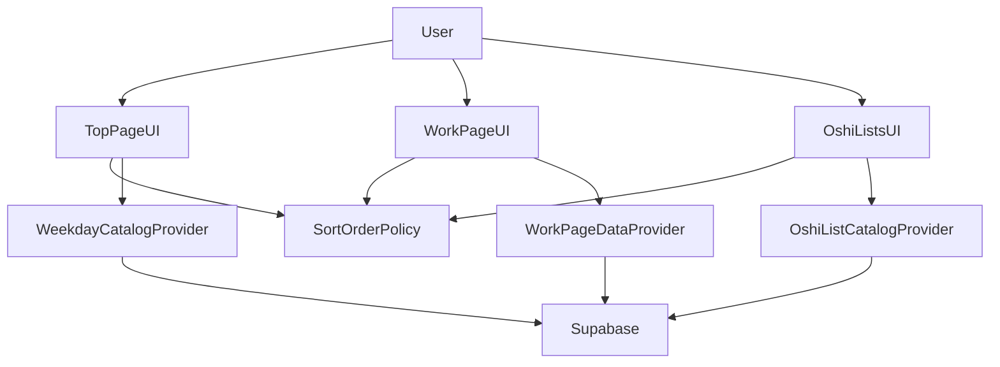
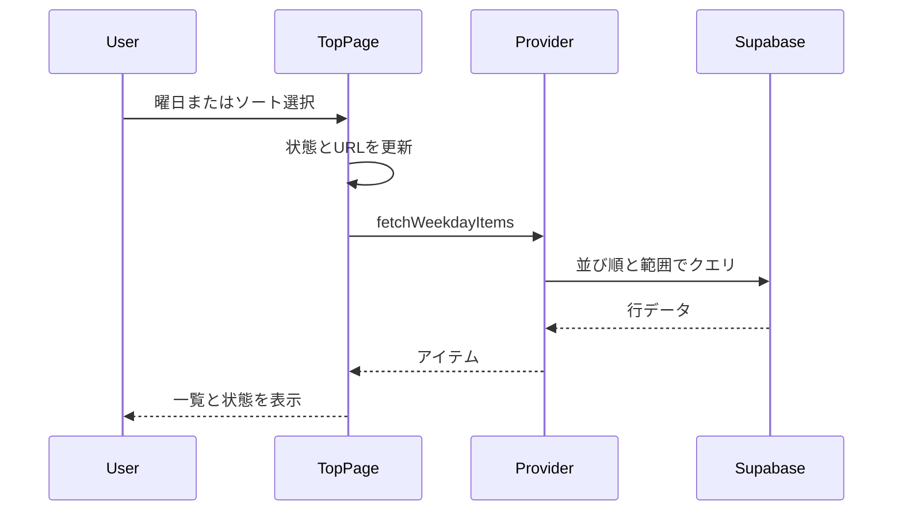
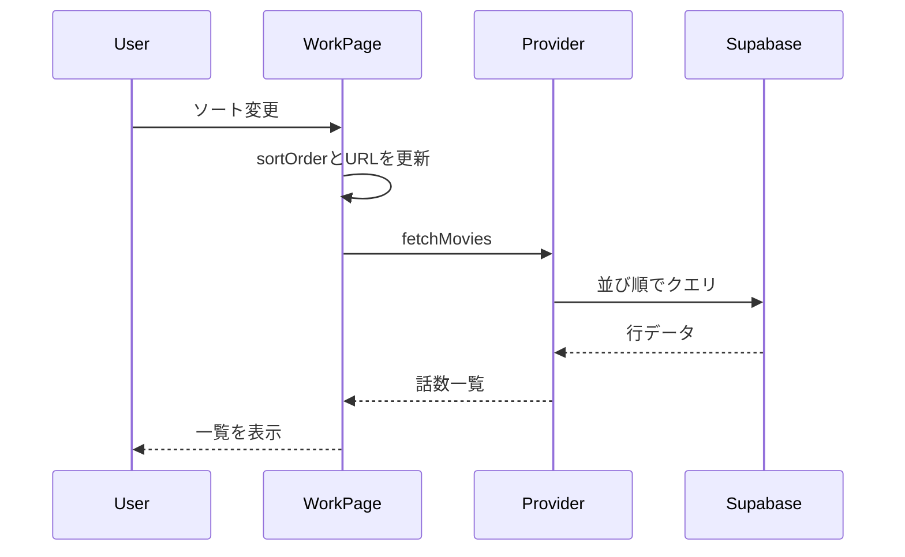

# 技術設計ドキュメント

## 概要
本機能は、トップページの曜日別フィルタを素早く切り替えられるUIと、トップページ・作品ページ・推しリスト一覧における「投稿日／人気」ソートの統一を提供する。利用者は一覧の見たい条件を即時に選べ、同一の操作概念で各ページを移動できる。

対象ユーザーは一般閲覧者およびログイン済みユーザーであり、一覧の発見性と行動導線を高めることが目的である。既存のReact + Supabase構成を維持し、データ取得の責務をデータプロバイダに集約する。

### 目標
- 曜日フィルタとソートを同時に扱える一貫したUIと状態管理を提供する
- `sortOrder` キーをページ間で統一し、URL・UI・内部ロジックで同一の意味を保持する
- 「最新100件」や人気順などの基準をサーバー側クエリで保証する

### 非目標
- 新しいバックエンドAPIやDBスキーマの追加
- ユーザー別のソート・フィルタ状態の永続化
- グローバル状態管理ストアの導入

## 要件トレーサビリティ

| 要件 | 概要 | コンポーネント | インターフェース | フロー |
| --- | --- | --- | --- | --- |
| 1.1 | 曜日選択で一覧を絞り込む | TopPage, WeekdayCatalogProvider | State | フロー A |
| 1.2 | フィルタ解除で全件表示 | TopPage, WeekdayCatalogProvider | State | フロー A |
| 1.3 | 選択中の曜日を表示 | TopPage | State | - |
| 1.4 | 同一曜日再選択で状態維持 | TopPage | State | - |
| 1.5 | 選択曜日の直近100件を表示 | WeekdayCatalogProvider | Service, State | フロー A |
| 1.6 | 全曜日の最新100件を表示 | WeekdayCatalogProvider | Service | フロー A |
| 1.7 | 最新100件は movie.update 降順 | WeekdayCatalogProvider | Service | フロー A |
| 2.1 | 投稿日順に並び替え | WeekdayCatalogProvider, WorkPageDataProvider | Service | フロー A, フロー B |
| 2.2 | 人気順に並び替え | WeekdayCatalogProvider, WorkPageDataProvider, OshiListCatalogProvider | Service | フロー A, フロー B |
| 2.3 | 未対応ソートのフォールバック | SortOrderPolicy | Service | - |
| 2.4 | 作品ページの人気は推し数 | WorkPageDataProvider | Service | フロー B |
| 2.5 | 投稿日は movie.update | WorkPageDataProvider, WeekdayCatalogProvider | Service | フロー A, フロー B |
| 2.6 | 人気は list_movie 件数 | WorkPageDataProvider, OshiListCatalogProvider | Service | フロー B |
| 3.1 | トップページに曜日切替 | TopPage | State | - |
| 3.2 | トップページに投稿日/人気切替 | TopPage, SortControl | State | フロー A |
| 3.3 | 推しリスト一覧に人気切替 | OshiListsPage | State | - |
| 3.4 | 作品ページに投稿日/人気切替 | WorkPage, SortControl | State | フロー B |
| 3.5 | 基準名と意味の統一 | SortOrderPolicy, SortControl | State | - |
| 3.6 | sortOrder キー統一 | SortOrderPolicy | State | - |
| 4.1 | フィルタ後にソート適用 | TopPage, WeekdayCatalogProvider | State | フロー A |
| 4.2 | ソート保持で曜日変更 | TopPage, SortOrderPolicy | State | フロー A |
| 4.3 | 両方の選択状態を表示 | TopPage | State | - |
| 5.1 | 空状態の表示 | TopPage | State | - |
| 5.2 | 件数変化時の整合更新 | TopPage | State | フロー A |
| 5.3 | 切替中は直前選択結果 | TopPage | State | フロー A |
| 6.1 | 既定ソートは人気 | SortOrderPolicy | State | - |
| 6.2 | 既定曜日は当日 | TopPage | State | - |
| 6.3 | 再読み込みで既定 | TopPage, SortOrderPolicy | State | - |

## アーキテクチャ

### 既存アーキテクチャ分析
- UI は React コンポーネントごとに状態と描画を保持する構成で、データ取得は各ページ専用の DataProvider に集約されている。
- URL パラメータは WorkPage が `sortOrder` を扱っており、検索パラメータを読む設計が既に存在する。
- Supabase 取得は各 DataProvider で `select` / `order` を使用しており、DB 側の `favorite_count` を信頼する前提がある。

### Architecture Pattern & Boundary Map（アーキテクチャパターンと境界）
**アーキテクチャ統合**:
- 採用パターン: UI State + Data Provider
- 境界: ページUIとデータ取得を分離し、ソート／フィルタの解釈は共通ポリシーに集約する。
- 既存パターン維持: ページ単位の DataProvider、Supabase クライアントの集中管理。
- 新規コンポーネント理由: `SortOrderPolicy` を新設し、URL・UI・データ取得の意味を統一するため。
- ステアリング準拠: React + Supabase の構成、相対インポート運用を維持。



### Technology Stack & Alignment（技術スタック整合）

| 層 | 選択 / バージョン | 役割 | 備考 |
| --- | --- | --- | --- |
| Frontend | React 18 (Vite) | UI 状態管理、フィルタ/ソート操作 | 既存構成を維持 |
| Routing | react-router-dom | `sortOrder` の URL 同期 | `useSearchParams` を利用 |
| Data Access | @supabase/supabase-js | フィルタ・ソート・件数制限クエリ | `order` + `range` を使用 |
| Data | Supabase Postgres | `movie` / `list` / `list_movie` の参照 | `favorite_count` を参照 |

## システムフロー

### フロー A: TopPage の曜日フィルタ + ソート切替

**主要判断**: ソートとフィルタを同時に適用し、未対応の `sortOrder` は既定値にフォールバックする。

### フロー B: WorkPage のソート切替


## Components & Interface Contracts（コンポーネントとインターフェース契約）

| コンポーネント | レイヤー | 目的 | 要件 | 主要依存関係 (P0/P1) | 契約 |
| --- | --- | --- | --- | --- | --- |
| SortOrderPolicy | UI/State | `sortOrder` の正規化と既定値提供 | 2.3, 3.5, 3.6, 6.1 | TopPage (P0), WorkPage (P0), OshiListsPage (P1) | State |
| TopPage | UI | 曜日フィルタ・ソート UI と一覧表示 | 1.1-1.7, 3.1-3.2, 4.1-4.3, 5.1-5.3, 6.2-6.3 | WeekdayCatalogProvider (P0), SortControl (P1) | State |
| SortControl | UI | 「投稿日／人気」切替ボタン | 2.1, 2.2, 3.2, 3.4 | SortOrderPolicy (P1) | State |
| WeekdayCatalogProvider | Data | TopPage 用の曜日別取得 | 1.1-1.7, 2.1-2.2, 4.1-4.2 | Supabase (P0) | Service |
| WorkPageDataProvider | Data | 作品ページのソート取得 | 2.1-2.6, 3.4 | Supabase (P0) | Service |
| OshiListCatalogProvider | Data | 推しリストの人気順取得 | 2.2, 3.3, 2.6 | Supabase (P0) | Service |
| OshiListsPage | UI | 人気順の切替 UI | 3.3, 3.5-3.6 | SortOrderPolicy (P1) | State |

### UI レイヤー

#### SortOrderPolicy

| 項目 | 詳細 |
| --- | --- |
| Intent | `sortOrder` の正規化と既定値の単一責務化 |
| 要件 | 2.3, 3.5, 3.6, 6.1 |

**責務と制約**
- `sortOrder` を `popular` / `latest` に正規化する
- 未対応値の場合は `popular` にフォールバックする
- URL で参照するキー名を `sortOrder` に統一する

**依存関係**
- 入力: TopPage — UI 状態初期化 (P0)
- 入力: WorkPage — URL 同期 (P0)
- 入力: OshiListsPage — ソート状態初期化 (P1)
- 出力: なし
- 外部: なし

**契約**: State [x]

##### 状態管理
- 状態モデル: `{ sortOrder: 'popular' | 'latest' }`
- 永続性と整合性: URL クエリに反映し、ページ間で意味を統一する
- 競合戦略: 画面内の単一状態、最後の操作を優先

**実装上の留意点**
- 統合: `useSearchParams` を使用して URL を更新する
- 検証: 許可値以外は `popular` に変換
- リスク: 既存の `favorite_desc` / `favorite_asc` との互換性が必要

#### TopPage

| 項目 | 詳細 |
| --- | --- |
| Intent | 曜日フィルタとソートを統合した一覧表示 |
| 要件 | 1.1-1.7, 3.1-3.2, 4.1-4.3, 5.1-5.3, 6.2-6.3 |

**責務と制約**
- 既定の曜日は JST の当日キーで初期化する
- 「すべて」タブを含め、再選択時は状態を維持する
- フィルタとソートの両方の選択状態を同時に表示する

**依存関係**
- 入力: User interactions — 曜日/ソート選択 (P0)
- 出力: WeekdayCatalogProvider — 一覧取得 (P0)
- 出力: SortOrderPolicy — sortOrder 正規化 (P1)
- 外部: react-router-dom — search params 同期 (P1)

**契約**: State [x]

##### 状態管理
- 状態モデル: `{ weekday: WeekdayKey, sortOrder: SortOrder, items: WorkItem[] }`
- 永続性と整合性: `sortOrder` は URL に反映、曜日はページ内状態
- 競合戦略: 直前操作の結果を表示し、取得中はローディング表示

**実装上の留意点**
- 統合: `WeekdayCatalogProvider.fetchWeekdayItems` を操作ごとに呼び出す
- 検証: 未知の曜日キーは `all` にフォールバック
- リスク: 連続切替時の再取得負荷

#### SortControl

| 項目 | 詳細 |
| --- | --- |
| Intent | 「投稿日／人気」選択 UI を共通化 |
| 要件 | 2.1, 2.2, 3.2, 3.4 |

**責務と制約**
- `popular` / `latest` の 2 値のみを扱う
- 現在選択中の項目を視覚的に区別する

**依存関係**
- 入力: TopPage, WorkPage — onChange (P0)
- 出力: SortOrderPolicy — 正規化 (P1)
- 外部: なし

**契約**: State [x]

##### 状態管理
- 状態モデル: `{ sortOrder: SortOrder }`
- 永続性と整合性: 親コンポーネントが URL 反映を担う
- 競合戦略: 単一選択

**実装上の留意点**
- 統合: 既存 `SortControl` のラベルと値を `popular` / `latest` に更新
- 検証: 想定外の値は `popular` に戻す
- リスク: 既存の `latest` / `oldest` 表記との混在

### データレイヤー

#### WeekdayCatalogProvider

| 項目 | 詳細 |
| --- | --- |
| Intent | TopPage 向けに曜日／ソート条件を反映した一覧を取得 |
| 要件 | 1.1-1.7, 2.1-2.2, 4.1-4.2 |

**責務と制約**
- `weekday` 指定時は `movie.weekday` でフィルタする
- `sortOrder` に応じて `update` または `favorite_count` で並び替える
- 必ず `range(0, 99)` を適用し 100 件に制限する

**依存関係**
- 入力: TopPage — フィルタ/ソート条件 (P0)
- 出力: Supabase `movie` テーブル (P0)
- 外部: supabase-js (P0)

**契約**: Service [x]

##### サービスインターフェース
```typescript
type SortOrder = 'popular' | 'latest'

type WeekdayKey = 'mon' | 'tue' | 'wed' | 'thu' | 'fri' | 'sat' | 'sun' | 'all'

type WorkItem = {
  id: string
  title: string
  popularityScore: number
  detailPath: string | null
  publishedAt: string | null
  weekday: WeekdayKey
  seriesId: string | null
}

type WeekdayListResult = {
  weekday: WeekdayKey
  items: WorkItem[]
}

type Result<T, E> = { ok: true; data: T } | { ok: false; error: E }

type WeekdayQuery = {
  weekday: WeekdayKey
  sortOrder: SortOrder
  limit: 100
}

interface WeekdayCatalogProvider {
  fetchWeekdayItems(query: WeekdayQuery): Promise<Result<WeekdayListResult, 'not_configured' | 'network' | 'unknown'>>
}
```
- 前提条件: `weekday` は既知キーまたは `all`
- 事後条件: `items.length <= 100` を保証
- 不変条件: `sortOrder` の意味は全ページで共通

**実装上の留意点**
- 統合: `order` + `range` によるサーバー側制限
- 検証: `weekday` が `all` の場合は `eq` フィルタを付けない
- リスク: `update` が null の行はソート結果が不定

#### WorkPageDataProvider

| 項目 | 詳細 |
| --- | --- |
| Intent | 作品ページにおけるエピソード取得とソート |
| 要件 | 2.1-2.6, 3.4 |

**責務と制約**
- `sortOrder = latest` は `movie.update` の降順
- `sortOrder = popular` は `movie.favorite_count` の降順
- 未対応 `sortOrder` は `popular` として扱う

**依存関係**
- 入力: WorkPage — `seriesId` と `sortOrder` (P0)
- 出力: Supabase `movie`, `list_movie` (P0)
- 外部: supabase-js (P0)

**契約**: Service [x]

##### サービスインターフェース
```typescript
interface WorkPageDataProvider {
  fetchMovies(seriesId: string, sortOrder: SortOrder): Promise<Result<WorkItem[], 'not_configured' | 'network' | 'unknown'>>
}
```
- 前提条件: `seriesId` が空でない
- 事後条件: `sortOrder` の意味に一致する並び順
- 不変条件: 「人気」は list_movie 件数に一致する `favorite_count` を参照

**実装上の留意点**
- 統合: `favorite_count` を `select` に追加し、`order` を切替
- 検証: `sortOrder` は `SortOrderPolicy` を通す
- リスク: favorite_count 更新遅延による並びの不一致

#### OshiListCatalogProvider

| 項目 | 詳細 |
| --- | --- |
| Intent | 推しリスト一覧を人気順で取得 |
| 要件 | 2.2, 2.6, 3.3 |

**責務と制約**
- `sortOrder = popular` の場合は `list.favorite_count` で降順
- `sortOrder = latest` は未対応のため `popular` にフォールバック

**依存関係**
- 入力: OshiListsPage — `sortOrder` (P1)
- 出力: Supabase `list` (P0)
- 外部: supabase-js (P0)

**契約**: Service [x]

##### サービスインターフェース
```typescript
interface OshiListCatalogProvider {
  fetchCatalog(query: { sortOrder: SortOrder }): Promise<Result<ListItem[], 'not_configured' | 'network' | 'unknown' | 'auth_required'>>
}
```
- 前提条件: 認証済みユーザーを取得済み
- 事後条件: `popular` の降順を保証
- 不変条件: `favorite_count` は user_list トリガーで更新される

**実装上の留意点**
- 統合: 既存 `favorite_desc`/`favorite_asc` を `popular` に整理
- 検証: 未対応値は `popular` に変換
- リスク: 既存 UI との表示整合

## データモデル

### ドメインモデル
- Entity: `Movie`（`movie_id`, `movie_title`, `update`, `favorite_count`, `weekday`）
- Entity: `List`（`list_id`, `favorite_count`, `can_display`）
- Value: `SortOrder`（`popular` / `latest`）
- Invariants: `favorite_count` は `list_movie` / `user_list` のトリガーで整合させる

### 論理データモデル
- `movie.weekday` は `mon`-`sun` の固定キー
- `movie.update` を投稿日として扱う
- `movie.favorite_count` は list_movie 件数を集計した値
- `list.favorite_count` は user_list 件数を集計した値

### データ契約と連携
- API Data Transfer: Supabase `movie`, `list` テーブルの `select` に必要列を明示
- Validation rules: `weekday` の値域制限、`sortOrder` の許可値

## エラーハンドリング

### エラー方針
- 取得失敗時は既存の `not_configured` / `network` / `unknown` を維持し、TopPage は空状態表示へフォールバックする。

### エラー区分と対応
- User Errors: 未対応 `sortOrder` → 既定ソートへフォールバック
- System Errors: Supabase 接続失敗 → エラー文言表示
- Business Logic Errors: 該当件数 0 → 空状態を明示

### 監視
- 新規追加なし。既存ログと UI 状態で観測する。

## テスト戦略

### ユニットテスト
- `SortOrderPolicy` の正規化ロジック（`popular` 以外の入力の扱い）
- `WeekdayCatalogProvider` のクエリ構築（`order` と `range` の適用）
- `WorkPageDataProvider` の人気順切替（`favorite_count` で order）

### 統合テスト
- TopPage の曜日切替とソート切替で同一 `sortOrder` が維持される
- WorkPage の URL `sortOrder` 更新と再読み込み時の復元
- OshiListsPage の人気順取得と表示順の確認

### E2E/UI テスト
- TopPage: 当日曜日が既定選択で表示される
- TopPage: 「すべて」選択で 100 件制限が維持される
- WorkPage: ソート切替がエピソード一覧に反映される

## 性能とスケーラビリティ
- TopPage は必ず 100 件に制限し、切替時に同範囲を取得する。
- `order` と `range` を組み合わせ、DB 側で結果を確定する。

## 参考資料（任意）
- 詳細な API 仕様と検証ログは `research.md` に記載。
