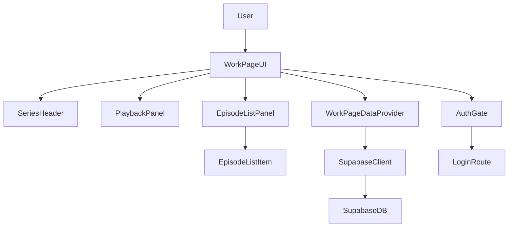
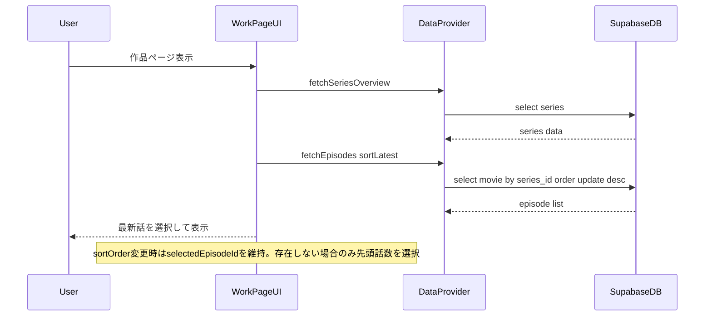
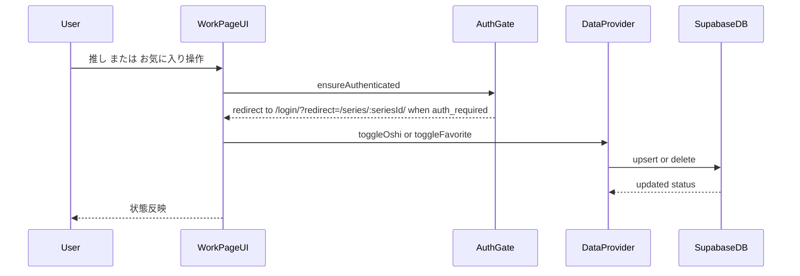
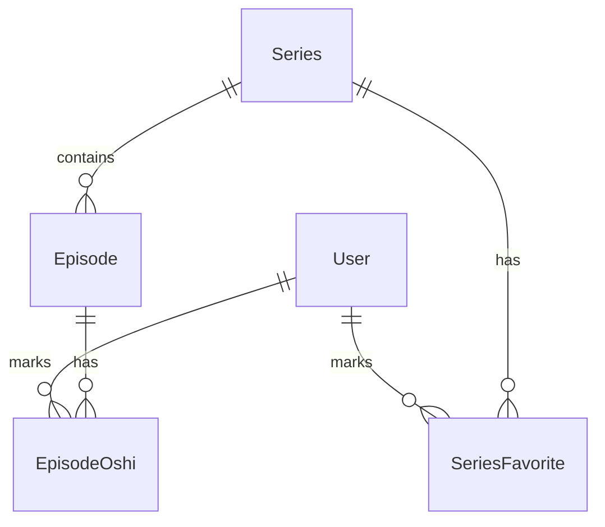
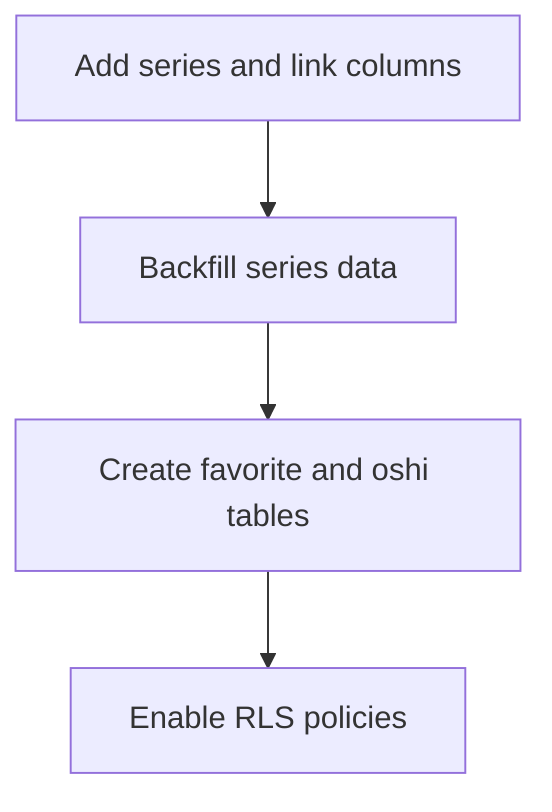

# Design Document

## Overview
本機能は、作品ページで動画再生領域と話数一覧を統合し、視聴対象の切り替え・推し/お気に入り操作・作品情報の提示を一貫した体験として提供する。閲覧ユーザーは作品ページで話数を選択し、最新話の再生を起点に連続視聴を行う。

対象ユーザーは閲覧ユーザーであり、作品ページ内で話数を選び、推しやお気に入りを記録するワークフローを持つ。既存のTopPageの状態分岐・データ取得パターンを踏襲しつつ、作品ページ専用のUIとデータ契約を設計する。

本機能は`/series/:seriesId/`ルートを追加し、作品情報・話数情報・ユーザー状態の表示を行うことで、現行のルーティングとSupabase連携に新たな表示面を追加する。最新話は`movie.update`の最も新しい日時で判定し、公開日も`movie.update`を正式な基準として運用する（`published_at`は追加しない）。公開日が更新に連動して変わる運用とし、メタ更新があれば公開日も更新されるものとする。`movie.update`が`null`の話数は一覧に表示し、「未設定」ラベルで扱い、ソートは常に末尾に配置する。

### Goals
- 作品ページで動画再生と話数一覧を統合した閲覧体験を提供する
- 最新話の自動選択とソート切り替えを実現する
- 推し/お気に入りの操作とログイン導線を設計上担保する

### Non-Goals
- 認証基盤そのものの実装
- 推しリスト管理ページやユーザー管理の機能拡張
- 作品ページ以外のルートのUI刷新

## Architecture

### Existing Architecture Analysis
- ルーティングは`src/AppRouter.jsx`で`/`と`/oshi-lists/`のみを扱う。
- `TopPage`は`dataProvider`を注入し、loading/error/emptyの状態分岐を明確に持つ。
- Supabase接続は`src/supabaseClient.js`で集約され、未設定時は無効化される。

### Architecture Pattern & Boundary Map
**Architecture Integration**:
- Selected pattern: UIコンテナ + データプロバイダ + 認証ガードの分離
- Domain/feature boundaries: 作品ページUI層、データ取得層、認証ガード層を分離
- Existing patterns preserved: データプロバイダ注入、状態分岐、BEM風CSS命名
- New components rationale: 作品ページ固有の責務を分離し、テスト可能性と拡張性を確保
- Steering compliance: React + Vite、Supabase接続集約、クライアント状態管理方針を維持



### Technology Stack

| Layer | Choice / Version | Role in Feature | Notes |
|-------|------------------|-----------------|-------|
| Frontend | React 18 + Vite | 作品ページUIと状態管理 | 既存構成を踏襲 |
| Routing | react-router-dom | `/series/:seriesId/` ルート | 既存ルーティングへ追加 |
| Data / Storage | Supabase PostgreSQL | 作品/話数/推し/お気に入りの永続化 | `movie`テーブルをエピソードとして流用 |
| Testing | Vitest + Testing Library | UI状態と契約の検証 | 既存テスト方針を踏襲 |

## System Flows





## Requirements Traceability

| Requirement | Summary | Components | Interfaces | Flows |
|-------------|---------|------------|------------|-------|
| 1.1 | 再生領域表示 | PlaybackPanel | State | Flow 1 |
| 1.2 | 最新話を初期選択 | WorkPageUI | State | Flow 1 |
| 1.3 | 最新話を初期表示 | PlaybackPanel | State | Flow 1 |
| 1.4 | 話数選択で再生切替 | WorkPageUI, PlaybackPanel | State | Flow 1 |
| 1.5 | 再生準備中表示 | PlaybackPanel | State | Flow 1 |
| 2.1 | 話数一覧表示 | EpisodeListPanel | State | Flow 1 |
| 2.2 | サムネ/タイトル/日付表示 | EpisodeListItem | State | Flow 1 |
| 2.3 | ソート選択UI | SortControl | State | Flow 1 |
| 2.4 | 初期ソート最新話 | WorkPageUI | State | Flow 1 |
| 2.5 | 最新話順表示 | WorkPageDataProvider | Service | Flow 1 |
| 2.6 | 古い順表示 | WorkPageDataProvider | Service | Flow 1 |
| 2.7 | 空状態表示 | EpisodeListPanel | State | Flow 1 |
| 3.1 | 作品タイトル表示 | SeriesHeader | State | Flow 1 |
| 3.2 | タイトル読み込み状態 | SeriesHeader | State | Flow 1 |
| 4.1 | スター表示 | FavoriteStarButton | State | Flow 2 |
| 4.2 | お気に入り登録 | WorkPageDataProvider | Service | Flow 2 |
| 4.3 | 未ログイン誘導 | AuthGate | Service | Flow 2 |
| 4.4 | 登録済み表示 | FavoriteStarButton | State | Flow 2 |
| 5.1 | 話数選択の反映 | EpisodeListPanel | State | Flow 1 |
| 5.2 | 再生内容更新 | PlaybackPanel | State | Flow 1 |
| 5.3 | 選択状態保持 | EpisodeListPanel | State | Flow 1 |
| 6.1 | 話数タイトル表示 | EpisodeListItem | State | Flow 1 |
| 6.2 | 公開日表示 | EpisodeListItem | State | Flow 1 |
| 6.3 | 公開日未設定表示 | EpisodeListItem | State | Flow 1 |
| 7.1 | 話数数表示 | EpisodeListPanel | State | Flow 1 |
| 7.2 | 話数数更新 | WorkPageUI | State | Flow 1 |
| 8.1 | 済表示 | OshiBadgeButton | State | Flow 2 |
| 8.2 | 推表示 | OshiBadgeButton | State | Flow 2 |
| 8.3 | 推し登録 | WorkPageDataProvider | Service | Flow 2 |
| 8.4 | 未ログイン誘導 | AuthGate | Service | Flow 2 |
| 8.5 | 推から済へ切替 | OshiBadgeButton | State | Flow 2 |
| 8.6 | 一覧で識別 | EpisodeListItem | State | Flow 1 |

## Components and Interfaces

### Component Summary
| Component | Domain/Layer | Intent | Req Coverage | Key Dependencies (P0/P1) | Contracts |
|-----------|--------------|--------|--------------|--------------------------|-----------|
| WorkPageUI | UI | 作品ページの統合状態管理 | 1.2, 2.4, 5.2, 7.2 | WorkPageDataProvider P0, AuthGate P0 | State |
| SeriesHeader | UI | 作品タイトルと状態表示 | 3.1, 3.2 | WorkPageUI P0 | State |
| PlaybackPanel | UI | 再生領域の表示 | 1.1, 1.3, 1.4, 1.5 | WorkPageUI P0 | State |
| EpisodeListPanel | UI | 話数一覧と総数 | 2.1, 2.7, 5.1, 5.3, 7.1 | WorkPageUI P0 | State |
| EpisodeListItem | UI | 話数カード表示 | 2.2, 6.1, 6.2, 6.3, 8.6 | EpisodeListPanel P0 | State |
| SortControl | UI | ソート切替 | 2.3 | EpisodeListPanel P0 | State |
| FavoriteStarButton | UI | お気に入り操作 | 4.1, 4.4 | WorkPageUI P0, AuthGate P0 | State |
| OshiBadgeButton | UI | 推し操作 | 8.1, 8.2, 8.5 | EpisodeListItem P0, AuthGate P0 | State |
| WorkPageDataProvider | Data | 作品/話数/状態の取得更新 | 2.5, 2.6, 4.2, 8.3 | SupabaseClient P0 | Service |
| AuthGate | UI/Service | 認証ガードとログイン導線 | 4.3, 8.4 | Router P0 | Service |

### UI Layer

#### WorkPageUI

| Field | Detail |
|-------|--------|
| Intent | 作品ページの状態統合とデータ取得を統括する |
| Requirements | 1.2, 2.4, 5.2, 7.2 |

**Responsibilities & Constraints**
- 作品情報・話数一覧・選択中話数の統合状態を保持する
- 初期表示で最新話を選択し、未取得時はローディングを表示する
- ソート変更時に一覧と選択状態の整合を保つ
  - ソート変更時は`selectedEpisodeId`が新しい並びに存在する場合は維持し、存在しない場合のみ`sortOrder`に従って先頭話数を選択する
- ログイン復帰時は`redirect`パラメータから`seriesId`/`selectedEpisodeId`/`sortOrder`を復元し、操作継続可能な状態に戻す
- `auth_required`を受け取った場合は、即時に`AuthGate.redirectToLogin`を呼び出す

**Dependencies**
- Inbound: Router — `seriesId`の受け取り (P0)
- Outbound: WorkPageDataProvider — 作品/話数取得 (P0)
- Outbound: AuthGate — ログイン導線 (P0)

**Contracts**: State [x]

##### State Management
- State model:
  - `series`: SeriesDetail | null
  - `episodes`: EpisodeSummary[]
  - `selectedEpisodeId`: string | null
  - `sortOrder`: 'latest' | 'oldest'
  - `loading`: { series: boolean, episodes: boolean }
  - `error`: { series?: DataError, episodes?: DataError }
- Persistence & consistency: UIメモリ内のみ
- Concurrency strategy: 連続リクエスト時は最後の結果のみ反映

**Implementation Notes**
- Integration: `TopPage`のdataProvider注入パターンを踏襲
- Validation: `seriesId`未指定時はNotFound扱い
- Risks: 取得失敗時のUI分岐が増える

#### SeriesHeader

| Field | Detail |
|-------|--------|
| Intent | 作品タイトルとお気に入り状態を表示する |
| Requirements | 3.1, 3.2 |

**Implementation Notes**
- Integration: `series`のローディング/失敗状態を表示
- Validation: 作品情報が未取得の場合はスケルトン表示
- Risks: タイトル未取得時の表示揺れ

#### PlaybackPanel

| Field | Detail |
|-------|--------|
| Intent | 選択話数の再生領域を表示する |
| Requirements | 1.1, 1.3, 1.4, 1.5 |

**Implementation Notes**
- Integration: `selectedEpisodeId`の変更で再生対象を更新
- Validation: `episode.url`未設定時は代替表示
- Risks: 再生準備中表示の時間閾値が未定

#### EpisodeListPanel

| Field | Detail |
|-------|--------|
| Intent | 話数一覧と総数、ソート操作を提供する |
| Requirements | 2.1, 2.7, 5.1, 5.3, 7.1 |

**Implementation Notes**
- Integration: 総数は`episodes.length`を基準
- Validation: 一覧が空の場合は空状態を表示
- Risks: 大量件数時の描画負荷

#### EpisodeListItem

| Field | Detail |
|-------|--------|
| Intent | 話数のサムネイルとメタ情報を表示する |
| Requirements | 2.2, 6.1, 6.2, 6.3, 8.6 |

**Implementation Notes**
- Integration: 公開日未設定の表示ラベルを統一
- Validation: サムネイル欠損時はプレースホルダ
- Validation: `publishedAt`が`null`の話数は一覧に表示し、「未設定」ラベルで表示する
- Risks: 日付フォーマットの統一ルールが未定

#### SortControl

| Field | Detail |
|-------|--------|
| Intent | 話数の並び順を切り替える |
| Requirements | 2.3 |

**Implementation Notes**
- Integration: `sortOrder`状態を更新
- Validation: 初期値は`latest`
- Risks: 選択話数がソート後の一覧に存在しない場合のみ先頭話数を選択する

#### FavoriteStarButton

| Field | Detail |
|-------|--------|
| Intent | 作品のお気に入り登録状態を表示し切り替える |
| Requirements | 4.1, 4.4 |

**Implementation Notes**
- Integration: 操作時に`AuthGate`を経由
- Validation: 未ログイン時はログイン誘導
- Risks: 認証方式決定に伴う契約変更

#### OshiBadgeButton

| Field | Detail |
|-------|--------|
| Intent | 話数の推し登録状態を表示し切り替える |
| Requirements | 8.1, 8.2, 8.5 |

**Implementation Notes**
- Integration: 操作時に`AuthGate`を経由
- Validation: 状態変更後にバッジを更新
- Risks: 推し状態の同期遅延

### Data Layer

#### WorkPageDataProvider

| Field | Detail |
|-------|--------|
| Intent | 作品/話数/推し/お気に入りの取得と更新を提供する |
| Requirements | 2.5, 2.6, 4.2, 8.3 |

**Responsibilities & Constraints**
- Supabaseから作品情報と話数一覧を取得
- ソート順に応じて`movie.update`で並び替えた結果を返す
- 推し/お気に入りの登録状態を更新する
- 認証が必要な操作は`auth_required`を返し、`AuthGate`に委譲する
- 未ログイン時の`isFavorited`/`isOshi`は常に`false`として返す

**Dependencies**
- Inbound: WorkPageUI — 取得/更新の依頼 (P0)
- Outbound: SupabaseClient — データアクセス (P0)
- External: SupabaseDB — 作品/話数/状態テーブル (P0)

**Contracts**: Service [x]

##### Service Interface
```typescript
type SortOrder = 'latest' | 'oldest'

type DataError =
  | { type: 'not_configured' }
  | { type: 'network' }
  | { type: 'not_found' }
  | { type: 'unknown' }

type AuthError = { type: 'auth_required' }

type Result<T> = { ok: true; data: T } | { ok: false; error: DataError | AuthError }

type SeriesDetail = {
  id: string
  title: string
  favoriteCount: number
  isFavorited: boolean
}

type EpisodeSummary = {
  id: string
  title: string
  thumbnailUrl: string | null
  publishedAt: string | null
  videoUrl: string | null
  isOshi: boolean
}

interface WorkPageDataProvider {
  fetchSeriesOverview(seriesId: string): Promise<Result<SeriesDetail>>
  fetchEpisodes(seriesId: string, sortOrder: SortOrder): Promise<Result<EpisodeSummary[]>>
  toggleSeriesFavorite(seriesId: string): Promise<Result<{ isFavorited: boolean }>>
  toggleEpisodeOshi(episodeId: string): Promise<Result<{ isOshi: boolean }>>
}
```
- Preconditions:
  - `seriesId`と`episodeId`は必須
  - 認証が必要な操作は`auth_required`を返す
- Postconditions:
  - `fetch`系はソート済みの結果を返す
  - 最新話は`movie.update`が最も新しい話数として扱う（同日複数話は時間が新しい方を優先）
  - `publishedAt`は`movie.update`をそのままマッピングする
  - `movie.update`が`null`の話数は返却し、「未設定」として扱う
  - `toggle`系は最新の状態を返す
- Invariants:
  - `publishedAt`未設定は`null`で統一

**Implementation Notes**
- Integration: `supabaseClient`未設定時は`not_configured`を返す
- Validation: 取得失敗時は`DataError`で統一
- Risks: 既存`movie`テーブル命名との整合

#### AuthGate

| Field | Detail |
|-------|--------|
| Intent | ログイン必須操作のガードと遷移契約を提供する |
| Requirements | 4.3, 8.4 |

**Responsibilities & Constraints**
- 未ログイン時に`/login/`への遷移を促す（新規ルートとして追加）
- 認証状態の判定はSupabase Authを前提とする
- `auth_required`のハンドリングは`AuthGate`に集約する

**Dependencies**
- Inbound: WorkPageUI — 認証ガードの呼び出し (P0)
- Outbound: Router — `/login/`遷移 (P0)

**Contracts**: Service [x]

##### Service Interface
```typescript
type AuthStatus = { isAuthenticated: boolean }

type AuthGateResult =
  | { ok: true; status: AuthStatus }
  | { ok: false; error: { type: 'auth_required' } }

interface AuthGate {
  getStatus(): AuthGateResult
  redirectToLogin(reason: 'favorite' | 'oshi'): void
}
```
- Preconditions:
  - 画面初期化後に認証状態を取得済みである
- Postconditions:
  - 未ログイン時はログイン導線を提示する
- Invariants:
  - ログイン導線は`/login/`に統一
  - 未ログイン時は常に`/login/`へ遷移する

**Implementation Notes**
- Integration: 認証取得は暫定的にSupabase Authを前提とし、`/login/`ルートは最小のダミー実装でも良い
- Integration: 認証実装が無い場合は常に未ログインとして扱う
- Integration: `/login/`へ遷移する際は`redirect`に`/series/:seriesId/`と`selectedEpisodeId`/`sortOrder`を含める
- Validation: 認証取得失敗時は未ログイン扱い
- Risks: 認証方式決定に伴う契約変更

## Data Models

### Domain Model
- **Series**: 作品の集約ルート。タイトルとお気に入り数を保持する。Supabaseで管理する。
- **Episode**: 作品に属する話数。公開日、動画URLを持つ。既存`movie`をエピソードとして扱う。
- **SeriesFavorite**: ユーザーと作品のお気に入り関係。
- **EpisodeOshi**: ユーザーと話数の推し関係。



### Logical Data Model
**Structure Definition**:
- `Series` 1対多 `Episode`
- `User` 1対多 `SeriesFavorite`
- `User` 1対多 `EpisodeOshi`
- `Episode` は`Series`に必ず属する

**Consistency & Integrity**:
- `Episode`の公開日は未設定を許容する
- `SeriesFavorite`と`EpisodeOshi`はユーザー単位で一意

### Physical Data Model
**Relational**:
- `series`
  - `series_id` uuid PK
  - `title` text not null
  - `favorite_count` integer not null default 0
- `movie`（既存、エピソードとして利用）
  - `movie_id` uuid PK
  - `movie_title` text not null
  - `url` text
  - `thumbnail_url` text
  - `update` timestamptz
  - `series_id` uuid FK -> series.series_id
  - サムネイルは`movie.thumbnail_url`を参照する
- `series_favorite`
  - `series_id` uuid FK
  - `user_id` uuid FK
  - `created_at` timestamptz
  - unique `(series_id, user_id)`
- `episode_oshi`
  - `movie_id` uuid FK
  - `user_id` uuid FK
  - `created_at` timestamptz
  - unique `(movie_id, user_id)`

### Data Contracts & Integration
**API Data Transfer**
- `SeriesDetail`と`EpisodeSummary`をUIに返却
- `publishedAt`は`movie.update`由来のISO文字列、未設定は`null`
- `thumbnailUrl`は`movie.thumbnail_url`由来、未設定は`null`

## Error Handling

### Error Strategy
- 取得失敗は`DataError`に正規化し、UIは状態表示で回復可能にする
- 認証が必要な操作は`auth_required`としてログイン導線を提示する

### Error Categories and Responses
- **User Errors**: 未ログイン → ログイン導線表示
- **System Errors**: Supabase未設定/ネットワーク → エラーメッセージ表示
- **Business Logic Errors**: 作品未検出 → NotFound表示

### Monitoring
- UIイベントログは必要最小限とし、将来的に`supabase`のログに統合する

## Testing Strategy

- Unit Tests: データプロバイダの`sortOrder`処理、エラー正規化、`auth_required`分岐
- Integration Tests: `/series/:seriesId/`表示、最新話の初期選択、ソート切替の反映
- E2E/UI Tests: 話数選択→再生更新、未ログイン時の推し/お気に入り誘導

## Optional Sections

### Security Considerations
- 推し/お気に入り更新は認証済みユーザーのみ許可
- `series_favorite`と`episode_oshi`はユーザー単位のRLSポリシーを前提

### Performance & Scalability
- 話数ソートはDB側の`order`を優先し、必要に応じてページングを導入
- サムネイルは遅延読み込みを検討

### Migration Strategy



## Supporting References (Optional)
- 追加なし
